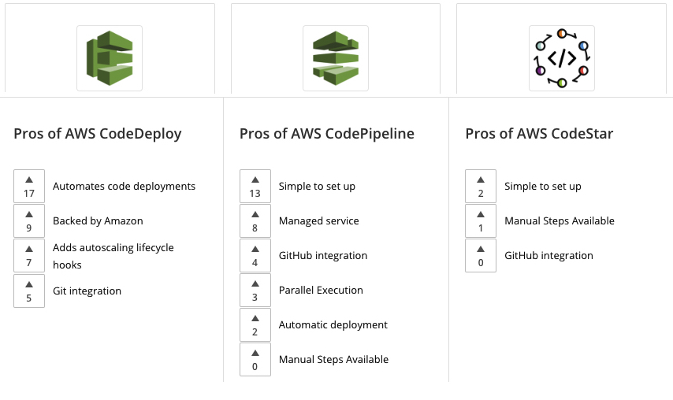

## About

CodeBuild is a fully managed service that assembles source code, runs unit tests, & also generates artefacts ready to deploy.

- [Documentation ](https://aws.amazon.com/codebuild/)
- [User Guide](https://docs.aws.amazon.com/codebuild/?id=docs_gateway)

CodeBuild is a code creation service that also produces code artefacts upon request.

CodeBuild is an alternative to other build tools such as Jenkins.

CodeBuild is integrated with KMS for encryption of build artifacts, IAM for build permissions, VPC for network security, and CloudTrail for logging API calls.

CodeBuild is a fully managed build service to compile source code, run unit tests and produce artifacts that are ready for deployment. Not the best fit for serverless template deployment or serverless application initialization.

### buildspec.yml

Build instructions can be defined in the code (**buildspec.yml**).

### CodeBuild Local Build

In case you need to do deep troubleshooting beyond analyzing log files.

Can run CodeBuild locally on your computer using Docker.

Leverages the CodeBuild agent.

## Price

[Current price](https://aws.amazon.com/codebuild/pricing/)

You pay based on the time it takes to complete the builds.

## Lab

cicd-aws-code-services
Chapters:
1. Logging in to the Amazon Web Services Console
2. Creating an AWS CodeCommit Repository
3. Committing Code to Your AWS CodeCommit Repository
4. Building and Testing with AWS CodeBuild
5. Deploying with AWS CodeDeploy
6. Automating Your Deployment with AWS CodePipeline
7. Following the Continuous Deployment Pipeline
8. Recovering Automatically from a Failed Deployment
9. Using AWS CodeDeploy Blue/Green Deployments in Your Pipeline

## Questions

### Q1

**You are creating a few test functions to demonstrate the ease of developing serverless applications. You want to use the command line to deploy AWS Lambda functions, an Amazon API Gateway, and Amazon DynamoDB tables.**

**What is the easiest way to develop these simple applications?**

1. Install AWS SAM CLI and run “sam init \[options\]” with the templates’ data. 
2. Use AWS step function visual workflow and insert your templates in the states
3. Save your template in the Serverless Application Repository and use AWS SAM

Explanation

AWS SAM - AWS Serverless Application Model 

[https://aws.amazon.com/serverless/sam/](https://aws.amazon.com/serverless/sam/)

<mark style="color:white">1</mark> 

