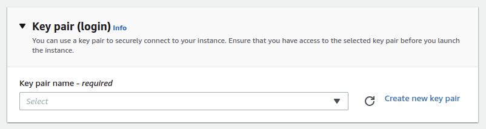
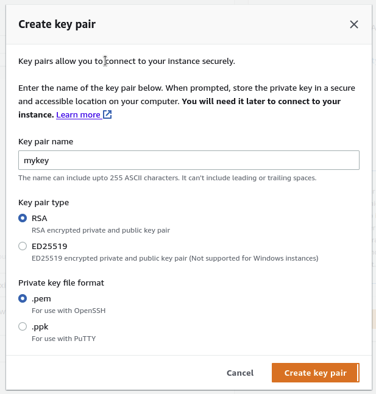

## About

- [AWS EC2](https://aws.amazon.com/ec2/)
- [AWS EC2 User Guide](https://docs.aws.amazon.com/ec2/?id=docs_gateway)

Amazon Elastic Compute Cloud (EC2) - one of the most popular AWS services. 

Allows:
- to run different types of cloud instances and pay-per-use models.
- to control computing resources at the operating system level
- working in an Amazon computing environment. 

## Digest

- EC2 & EBS
- EC2 (Elastic Compute Cloud) Instance
- EBS (Elastic Block Store) - Persistent storage volume
- AMI (Amazon Machine Image) - Packages OS and additional installations in a reusable template
- Instance and Instance Types: General Purpose (t-type and m-type), Compute Optimized(c-type), GPU Graphics, GPU Compute, Memory Optimized(r, × and z-type), and Storage Optimized(d, h and i-type)
- Purchasing Options: On Demand, Reserved, Scheduled, Spot, Dedicated Instance and Dedicated Host
- Spot: Partial hours are not billed if terminated by AWS EC2
- Secure login information for your instances using key pairs
- Placement group: Cluster and Spread

**For root:**

- General purpose SSD (balances price & performance)
- Provisioned OPS SD (Highest performance for mission critical low-latency or high throughput workloads)
- Magnetic HDD (previous generation)

**For other:**

- Throughput Provisioned HDD (low cost for frequently accessed, throughput intensive workloads)
- Cold HDD (lowest cost for less frequently workloads)
- Instance Store - temporary storage volume in which data is deleted when you STOP or TERMINATE your instance


## Price

**Pricing models:** 
- On Demand - pay a fixed rate by the hour/second with no commitment. You can provision and terminate it at any given time. 
- Reserved - you get capacity reservation, basically purchase an instance for a fixed time of period. The longer, the cheaper. 
- Spot - Enables you to bid whatever price you want for instances or pay the spot price. Dedicated Hosts - physical EC2 server dedicated for your use.

[Current price](https://aws.amazon.com/ec2/pricing/)

## Practice



### TL;DR 

1. Choose a region close to you 
2. Go to EC2 service
3. Click on "Instances" in the menu and click on "Launch instances"
4. Choose image: Amazon Linux 2
5. Choose instance type: t2.micro 
6. Make sure "Delete on Termination" is checked in the storage section
7. Under the "User data" field the following:

```sh
yum update -y
yum install -y httpd
systemctl start httpd
systemctl enable httpd
echo "<h1>Hello from web!</h1>" > /var/www/html/index.html
```

8. Add tags with the following keys and values:
  * key "Type" and the value "web"
  * key "Name" and the value "web-1"
9. In the security group section, add a rule to accept HTTP traffic (TCP) on port 80 from anywhere
10. Click on "Review" and then click on "Launch" after reviewing.
11. If you don't have a key pair, create one and download it.
12. Now HTTP traffic (port 80) should be accepted from anywhere

### Create an EC2 Instance

Go to [EC2 page](https://us-west-2.console.aws.amazon.com/ec2/v2/home?region=us-west-2) -> Launch Instance


#### EC2 image

Choose the image we want


#### Create keys

Let's create a key to use to connect to the instance externally



Enter any name you want. Leave all other parameters by default



After the key is created it will start automatic downloading. You need it to connect to EC2 from your local terminal

#### Network Settings

Under **Network Settings** I leave **Allow SSH traffic from** 


#### Create

Click **Launch Instance**

The Instance has been created and is available for connection


### Connecting to EC2 from the terminal

Connect to EC2 from a local terminal

Let's move previously created and downloaded <mark>mykey</mark> key to home folder of current user and give permissions to file `CHMOD 400`

```bash
cd ~
cd Downloads/
mv mykey.pem $HOME
cd ..
chmod 400 mykey.pem 
```


To connect, we need a public iPv4 address. Find it on the instance page


Connect with the command `ssh`.

```bash
ssh -i mykey.pem ec2-user@52.24.109.78
```


## Questions

### Q1

**A company is migrating a legacy application to Amazon EC2. The application uses a username and password stored in the source code to connect to a MySQL database. The database will be migrated to an Amazon RDS for MySQL DB instance. As part of the migration, the company wants to implement a secure way to store and automatically rotate the database credentials.**

**Which approach meets these requirements?**
1. Store the database credentials in environment variables in an Amazon Machine Image (AMI). Rotate the credentials by replacing the AMI.
2. Store the database credentials in AWS Systems Manager Parameter Store. Configure Parameter Store to automatically rotate the credentials.
3. Store the database credentials in environment variables on the EC2 instances. Rotate the credentials by relaunching the EC2 instances.
4. Store the database credentials in AWS Secrets Manager. Configure Secrets Manager to automatically rotate the credentials

<details>
<summary>Explanation</summary>
<div>

[AWS Secrets Manager](https://aws.amazon.com/secrets-manager/)

Secrets Manager offers [secret rotation](https://aws.amazon.com/blogs/security/rotate-amazon-rds-database-credentials-automatically-with-aws-secrets-manager/)

<mark style="color:white">4</mark> 

</div>
</details>

### Q2

**An organization needs to provision a new Amazon EC2 instance with a persistent block storage volume to migrate data from its on-premises network to AWS. The required maximum performance for the storage volume is 64,000 IOPS.**

**In this scenario, which of the following can be used to fulfill this requirement?**

1. Directly attach multiple Instance Store volumes in an EC2 instance to deliver maximum IOPS performance.
2. Launch a Nitro-based EC2 instance and attach a Provisioned IOPS SSD EBS volume (io1) with 64,000 IOPS.
3. Launch an Amazon EFS file system and mount it to a Nitro-based Amazon EC2 instance and set the performance mode to Max I/O.
4. Launch any type of Amazon EC2 instance and attach a Provisioned IOPS SSD EBS volume (io1) with 64,000 IOPS.

<details>
<summary>Explanation</summary>
<div>

An Amazon EBS volume is a durable, block-level storage device that you can attach to your instances. After you attach a volume to an instance, you can use it as you would use a physical hard drive. EBS volumes are flexible.

The AWS Nitro System is the underlying platform for the latest generation of EC2 instances that enables AWS to innovate faster, further reduce the cost of the customers, and deliver added benefits like increased security and new instance types.

Amazon EBS is a persistent block storage volume. It can persist independently from the life of an instance. Since the scenario requires you to have an EBS volume with up to 64,000 IOPS, you have to launch a Nitro-based EC2 instance.

[Amazon EBS volume types](https://docs.aws.amazon.com/AWSEC2/latest/UserGuide/ebs-volume-types.html#EBSVolumeTypes_piops)

<mark style="color:white">2</mark> 

</div>
</details>

### Q3

**A Database Specialist manages an EBS-Optimized Amazon RDS for MySQL DB instance with Provisioned IOPS storage. The users recently raised a database IO latency issue during peak hours when it was always under a heavy workload. Upon review, the Specialist noticed that the RDS DB instance was barely using the maximum IOPS configured but was fully utilizing the maximum bandwidth for the required throughput. CloudWatch metrics showed that CPU and Memory utilization were at optimum levels.**

**Which action should the Database Specialist take to fix the performance issue?**

1. Change the underlying EBS storage type of the instance to General Purpose (SSD).
2. Modify the DB instance to an EBS-Optimized instance class with higher maximum bandwidth.
3. Disable EBS optimization on the MySQL DB instance to allow higher maximum bandwidth.
4. Modify the DB instance to increase the size and corresponding Provisioned IOPS allocated to the storage.

<details>
<summary>Explanation</summary>
<div>

Amazon RDS volumes are built using Amazon EBS volumes, except for Amazon Aurora, which uses an SSD-backed virtualized storage layer purpose-built for database workloads. RDS currently supports both magnetic and SSD-based storage volume types. There are two supported Amazon EBS SSD-based storage types, Provisioned IOPS (called io1) and General Purpose (called gp2).

Provisioned IOPS storage is a storage type that delivers predictable performance and consistently low latency. If your workload is I/O constrained, using Provisioned IOPS SSD storage can increase the number of I/O requests that the system can process concurrently.

Provisioned IOPS SSD storage provides a way to reserve I/O capacity by specifying IOPS. However, as with any other system capacity attribute, its maximum throughput under load is constrained by the resource that is consumed first. That resource might be network bandwidth, CPU, memory, or database internal resources.

EBS–optimized instances deliver dedicated bandwidth to Amazon EBS. When attached to an EBS–optimized instance, Provisioned IOPS SSD (io1) volumes are designed to achieve their provisioned performance, 99.9% of the time. Choose an EBS–optimized instance that provides more dedicated Amazon EBS throughput than your application needs; otherwise, the connection between Amazon EBS and Amazon EC2 can become a performance bottleneck.

<mark style="color:white">2</mark> 

</div>
</details>


### Q4

**A developer deployed an application to an Amazon EC2 instance. The application needs to know the public IPv4 address of the instance.**

**How can the application find this information?**

1. Query the instance metadata from http://169.254.169.254/latest/meta-data/.
1. Query the instance user data from http://169.254.169.254/latest/user-data/.
1. Query the Amazon Machine Image (AMI) information from http://169.254 169.254/latest/meta-data/ami/.
1. Check the hosts file of the operating system.

<details>
<summary>Explanation</summary>
<div>

<mark style="color:white">1</mark> 

</div>
</details>


### Q5

**You are configuring a Jenkins project that is installed on an Amazon [EC2](../ec2) instance running a Windows operating system. You want this Jenkins project to integrate with AWS CodePipeline.**

**Which actions should you take to make this function perform correctly? (2 answers)**

1. Restart all Amazon [EC2](../ec2) instances that are running a Windows operating system.
2. Provide the IAM user credentials to integrate AWS CodePipeline.
3. Fill out the required fields for your proxy host.
4. Modify the PATH variable to include the directory where you installed Jenkins on all Amazon [EC2](../ec2) instance that are running a Windows operating system.

<details>
<summary>Explanation</summary>
<div>

[https://docs.aws.amazon.com/codepipeline/latest/userguide/tutorials-four-stage-pipeline.html](https://docs.aws.amazon.com/codepipeline/latest/userguide/tutorials-four-stage-pipeline.html)

<mark style="color:white">2, 3</mark> 
</div>
</details>

## Resources
 
- [EC2 Linux Hands-On Lab](https://catalog.us-east-1.prod.workshops.aws/workshops/8efd4edb-2b91-49fd-b1b8-3e3b5e71aa03/en-US/ec2/ec2linux)
- [EB FAQ](https://aws.amazon.com/ebs/faqs/)
- [EC2 Digest](https://tutorialsdojo.com/amazon-elastic-compute-cloud-amazon-ec2/)
- [EB Digest](https://tutorialsdojo.com/amazon-ebs/)

### Community posts

- https://dev.to/romankurnovskii/aws-ec2-cheat-sheet-2mhp