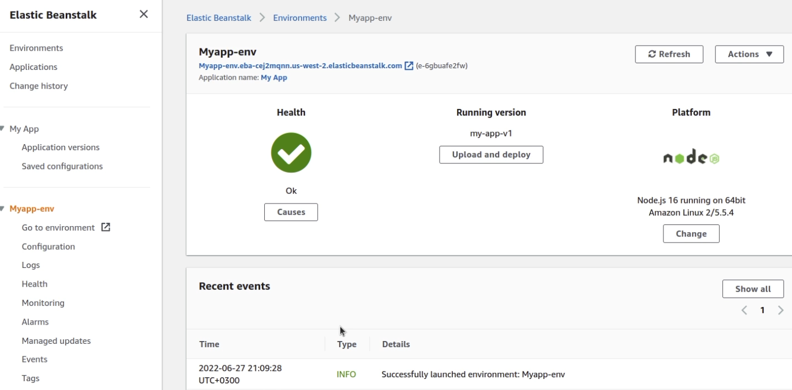
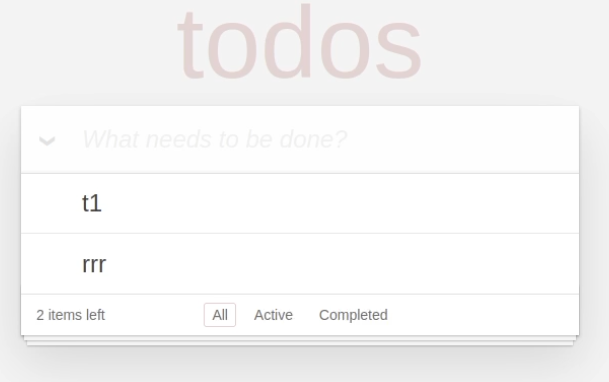
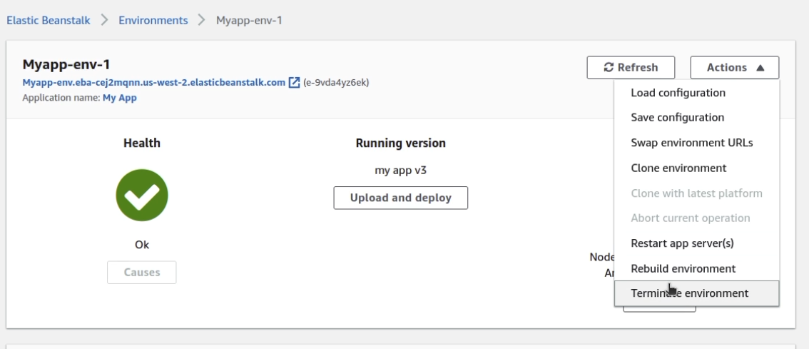

## About

- [AWS Elastic Beanstalk](https://aws.amazon.com/elasticbeanstalk/)
- [AWS Elastic Beanstalk User Guide](https://docs.aws.amazon.com/elasticbeanstalk/?id=docs_gateway)

AWS Elastic Beanstalk is an easy-to-use service for deploying and scaling web applications and services developed with Java, .NET, PHP, Node.js, Python, Ruby, Go, and Docker on familiar servers such as Apache, Nginx, Passenger, and IIS.

Deploying **new application** versions **to existing** resources in AWS Elastic Beanstalk happens **much faster** (typically under a minute) and once again is mostly dependent on the size of the new application version.

## Digest

## Price

There is no additional charge for AWS Elastic Beanstalk. Only the AWS resources required to store and run applications are charged.

## Components

### Configuration Template

This is the template that provides the baseline for creating a new, unique, environment configuration. 

### Platform

Culmination of components in which you can build your application upon using Elastic Beanstalk. These are comprised of the OS of the instance, the programming language, the server type (web or application), and components of Elastic Beanstalk

### Environment Configurations

An environment configuration is a collection of parameters and settings that dictate how an environment will have its resources provisioned by Elastic Beanstalk and how these resources will behave.

### Environment

An environment refers to an application version that has been deployed on AWS resources. These resources are configured and provisioned by AWS Elastic Beanstalk. At this stage the application is deployed as a solution and becomes operational within your environment. 

The “environment” is comprised of ALL the resources created by Elastic Beanstalk and not just an EC2 instance with your uploaded code.

### Environment Tier

Reflects on how Elastic Beanstalk provisions resources based on what the application is designed to do. If the application manages and handles HTTP requests, then the app will be run in a web server environment. 

### Applications

An application is a collection of different elements, such as environments, environment configurations, and application versions. 

You can have multiple application versions held within an application.

### Application Version

An application version is a very specific reference to a section of deployable code. The application version will point typically to simple storage service (S3) where the deployable code may reside.

## Practice



### Controlled deployment with AWS Elastic Beanstalk

Lab [Controlled deployment with AWS Elastic Beanstalk](https://cloudacademy.com/lab/run-controlled-deploy-aws-elastic-beanstalk/?context_resource=lp&context_id=4364)

In this lab, we will deploy several application version updates in a load-balanced, auto-scaling environment. 

The first update is deployed using a simple deployment. The second update is deployed using a `blue-green' deployment, where a separate environment is created to run the new version of the application, and the DNS switch switches incoming traffic to the new environment.

The final deployment architecture will look like this

#### Loading the application

In this review, I'm using the code that Cloudacademy provided me, but I have a ready-made launch script that you can download from Elastic Beanstalk: [download](./files/nodejs.zip)

##### Create

Go to **Elastic Beanstalk** page and click `Create Application`.

##### Set Name

Specify a name for the new application

##### Choose platform

Under `Platform` choose the desired platform of the application. In our case - `Node.js`.

##### Download source code

Under `Source code origin` specify the version of the application and download the archive with the application.  [Example](./files/nodejs.zip)

##### Application Configuration

Change the preset `Configuration` to `Custom configuration`:

Click **Edit** under **Rolling updates and deployments**

In the default configuration, updates are distributed to all instances at the same time. This leads to application downtime, which is unacceptable for production environments.

We will set `Rolling` and `Batch size` to 30%

##### Network

Back in the main application form, click **Edit** in the **Network** configuration.

On the **Modify network** form, configure the following values, then **Save**. 

**VPC**: Select VPC with CIDR block **10.0.0.0/16**. This will not be the default VPC.
**Load balancer settings**:
    **Load balancer subnets**: Select subnets with CIDR blocks **10.0.100.0/24 **(**us-west-2a**)and **10.0.101.0/24** (**us-west-2b**). These are public subnets. The application load balancer requires at least two subnets in different availability zones
**Instance settings**:
    * **Instance subnets**: Select a subnet with CIDR block **10.0.1.0/24**. This is a private subnet.

##### Confirmation.

Press `Create app`.

The app creation process takes from 5 minutes.

Then go to Dasboard

This concludes the loading phase of the app in Elastic Beanstalk. Next, let's break down how to switch the downloading of the new version of the application to the clients.

#### Downloading version 2 of the app

##### Downloading version 2.0

Press `Upload and deploy` and download the updated code. For example, you can change the text in the same source code for comparison.

Specify new version and publication settings

#### Version comparison

Now we can compare both versions by following the links. In my case the applications look like this

#### Changing the url of the apps
Now let's swap the apps around. So that a user who previously went to one address will now see the 2nd version of the app.

Under `Actions`, click on `Swap environment URLs` and then select the app you want to swap

##### Removing Elastic Beanstalk resources

Elastic Beanstalk runs EC2 instances as well as other services to deploy applications. But you can remove all services from a single window.

1. go to the Applications section
2. Select an application.f
3. Click on Actions -> Terminate environment Translated with www.DeepL.com/Translator (free version)

## Questions

### Q1

**You are building a web application that will run in an AWS ElasticBeanstalk environment. You need to add and configure an Amazon ElastiCache cluster into the environment immediately after the application is deployed.**

**What is the most efficient method to ensure that the cluster is deployed immediately after the EB application is deployed?**

1. Use the AWS Management Console to create and configure the cluster.
1. Create a cron job to schedule the cluster deployment using the **_aws cloudformation deploy_** command
1. Create a configuration file with the .config extension and place it into the .ebextensions folder in the application package.
1. Build an AWS Lambda function that polls to the ElasticBeanstalk environment deployments and create and configure the Amazon ElastiCache cluster.
  

Explanation

[[AWS Secrets Manager](https://docs.aws.amazon.com/elasticbeanstalk/latest/dg/environment-resources.html)](https://docs.aws.amazon.com/elasticbeanstalk/latest/dg/environment-resources.html)

<mark style="color:white">3</mark> 

### Q2

**Emily is building a web application using AWS ElasticBeanstalk. The application uses static images like icons, buttons and logos. Emily is looking for a way to serve these static images in a performant way that will not disrupt user sessions.**

**Which of the following options would meet this requirement?**

1. Use an Amazon Elastic File System (EFS) volume to serve the static image files.
2. Configure the AWS ElasticBeanstalk proxy server to serve the static image files.
3. Use an Amazon S3 bucket to serve the static image files.
4. Use an Amazon Elastic Block Store (EBS) volume to serve the static image files.
  

Explanation

https://docs.aws.amazon.com/elasticbeanstalk/latest/dg/environment-cfg-staticfiles.html

An Amazon S3 bucket would work, but the AWS ElasticBeanstalk proxy server would need to route the requests to the static files to a different place anytime they need to be shown.

<mark style="color:white">2</mark> 

## Resources

- [https://docs.aws.amazon.com/elasticbeanstalk/latest/dg/tutorials.html](https://docs.aws.amazon.com/elasticbeanstalk/latest/dg/tutorials.html)

### Community posts