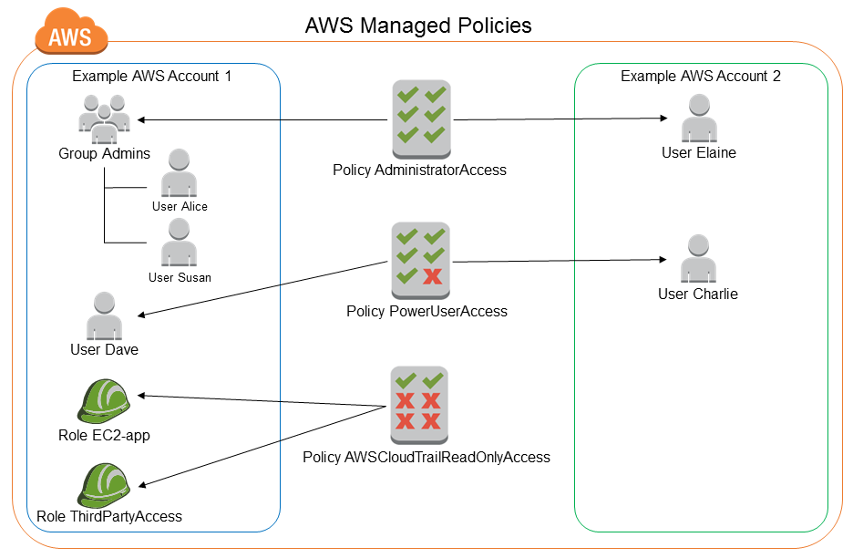
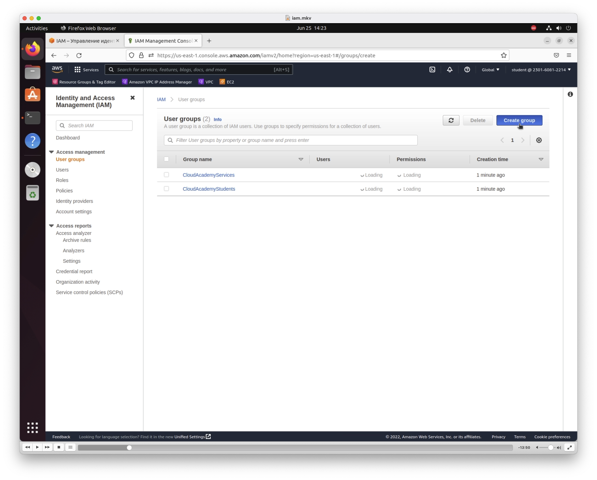
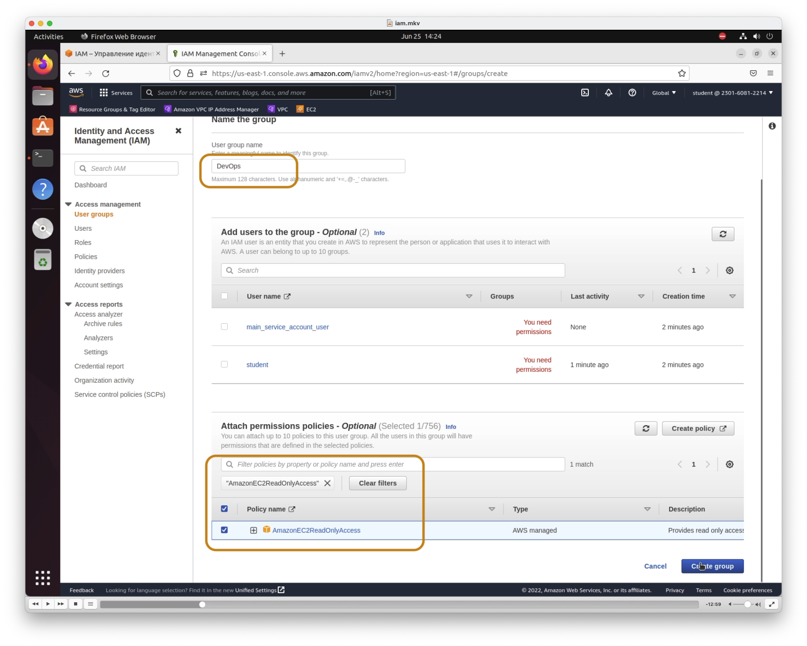
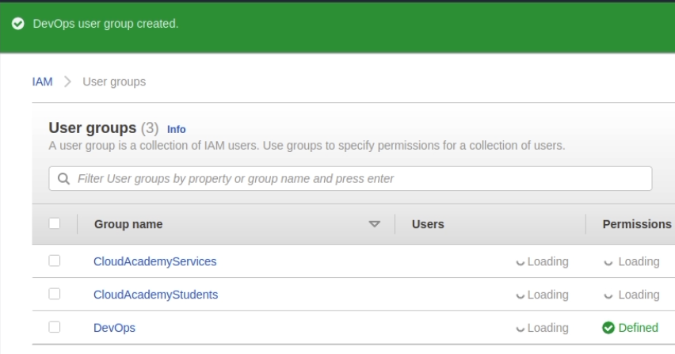
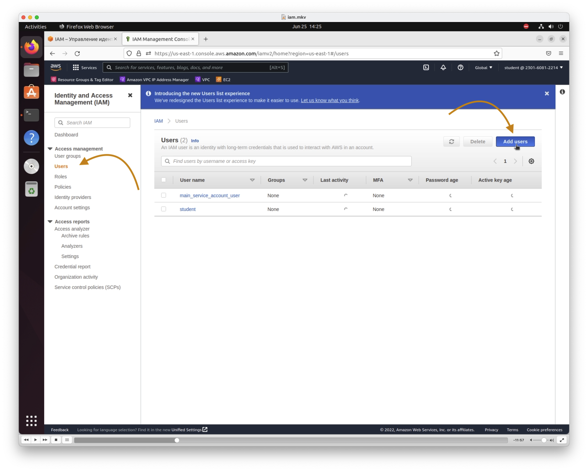
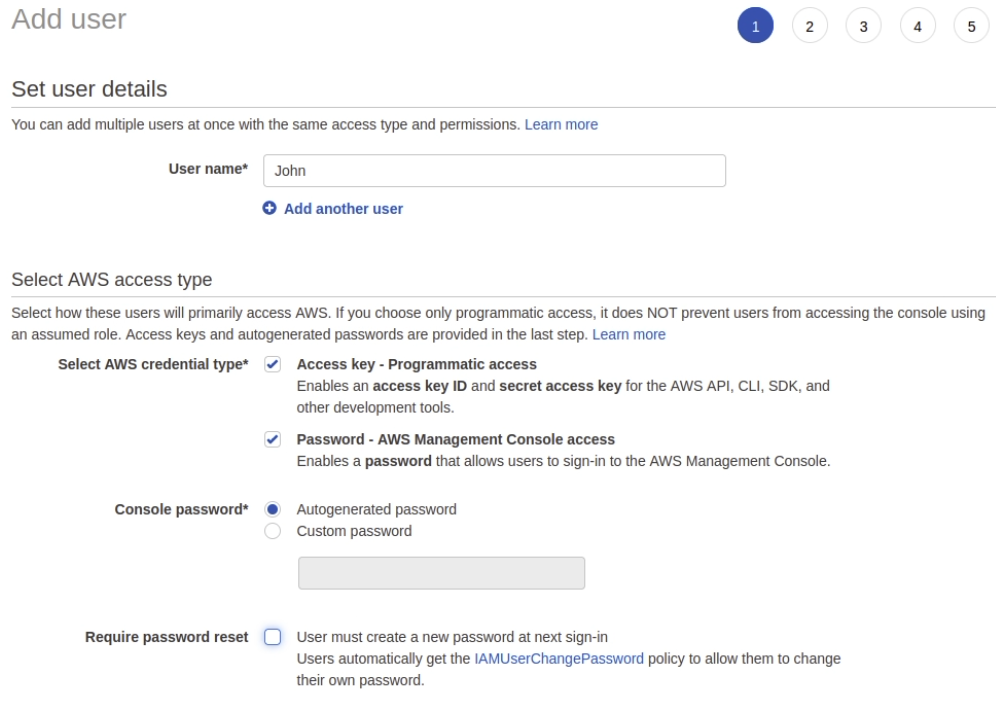
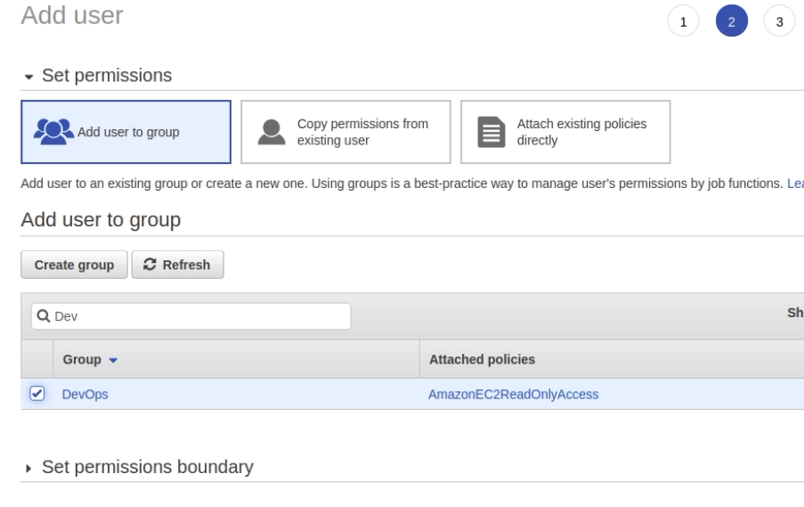
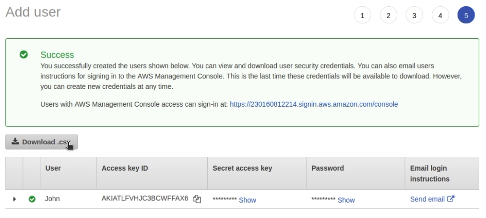
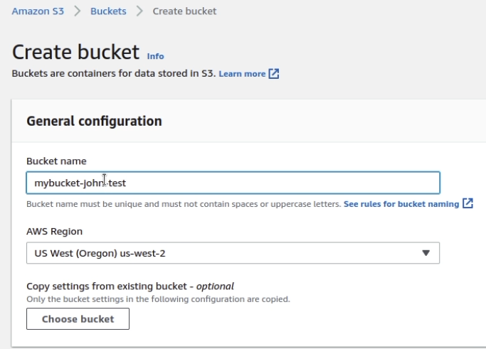

## About

IAM - AWS Identity and Access Management

- [AWS IAM](https://aws.amazon.com/iam/)
- [AWS IAM User Guide](https://docs.aws.amazon.com/iam/?id=docs_gateway)

AWS Identity and Access Management (IAM) allows to securely control user access to AWS services and resources. 

Designed for organizations with **multiple users or systems** that use AWS products such as Amazon EC2, Amazon RDS, and AWS Management Console. 

With IAM, you can centrally manage users, security credentials such as access keys, and permissions that control user access to AWS resources.

There are three ways IAM authenticates a principal: 

- User Name/Password
- Access Key
- Access Key/Session Token

## Digest

- IAM consists of the following:
  - Users
  - Groups
  - Roles
  - Policy Documents
- IAM is Global. It doesn't apply to any specific region.
- There is no charge to use IAM.
- IAM is compliant with Payment Card Industry (PCI) Data Security Standard (DSS)
- The "root account" has complete Admin access.
- **Don't use "root account"** for everyday use. Instead, create users. A new user will have NO permissions by default. Grant least privilege needed for their job.
- New user will be assigned with password, Access Key ID & Secret Access Keys. The password will be used to login to AWS management console. Access Key ID & Secret Access Key will be used to login via the APIs and CLI
- Always setup MFA on your root account.
- Use Groups to assign permissions to IAM users
- Use Roles to Delegate permissions. Role is more secure than creating individual user. Roles gives temporary credentials for access; whereas User has long term credentials.
- Create and customize [password rotation policies](https://docs.aws.amazon.com/IAM/latest/UserGuide/id_credentials_passwords_account-policy.html)
- Policies can be attached to users, groups and roles. Use AWS defined policies, assign permissions wherever possible. Policy is defined in JSON format and contains version, statements, - effect, action, resource, principal, and condition.
- STS [Security Token Service](https://docs.aws.amazon.com/STS/latest/APIReference/welcome.html) provides temporary security credentials to the trusted users. STS is global and there is no charge to use it.
- Digest: https://tutorialsdojo.com/aws-identity-and-access-management-iam/
- IAM best practices - Question might ask you to identify best practices among the given choices. https://docs.aws.amazon.com/IAM/latest/UserGuide/best-practices.html
- Difference between when to use Role and User.
- IAM Policy Simulator - service for testing and troubleshooting IAM Policies. [Details](https://docs.aws.amazon.com/IAM/latest/UserGuide/access_policies_testing-policies.html)

## Practice



Go to [IAM page](https://us-east-1.console.aws.amazon.com/iam/home#/)

### Creating IAM groups

On the **User Groups** page, click **Create group**

1. Specify the name of the group. Mine is: **DevOps**.
2. Add permission to view EC2: **AmazonEC2ReadOnlyAccess**.
3. create

The group was created

### Creating IAM users

On the **Users** page, click **Create user**

Type in user name (login)

### Permissions
Add user to the group

### Tags
Skip section or put tags. It is useful and popular to set tags for resources in companies with a lot of connected AWS resources

### Login/Password
At the last step, download the `.csv` file with login, keys and password. You will need the password later to log in as this user.
On this page there is a link to log in. We will use it in the next step

### Logging in as a new user

#### Checking privileges.
This user has access to view EC2 instances. Let's check whether or not the S3 garbage cans have access.

Let's try to create an S3 bucket

After trying to create a recycle bucket, we get a window indicating no permissions

## Questions

### Q1

**A client has contracted you to review their existing AWS environment and recommend and implement best practice changes. You begin by reviewing existing users and Identity Access Management. You found out improvements that can be made with the use of the root account and Identity Access Management.**

**What are the best practice guidelines for use of the root account?**

1. Never use the root account.
2. Use the root account only to create administrator accounts.
3. Use the root account to create your first IAM user and then lock away the root account.
4. Use the root account to create all other accounts, and share the root account with one backup administrator.

Explanation

<a href="http://docs.aws.amazon.com/IAM/latest/UserGuide/best-practices.html#lock-away-credentials" target="_blank">lock-away-credentials</a>

<mark style="color:white">1</mark> 

### Q2

**Your organization has an AWS setup and planning to build Single Sign-On for users to authenticate with on-premise Microsoft Active Directory Federation Services (ADFS) and let users log in to the AWS console using AWS STS Enterprise Identity Federation.**

**Which of the following services do you need to call from AWS STS service after you authenticate with your on-premise?**

1. AssumeRoleWithSAML
2. GetFederationToken
3. AssumeRoleWithWebIdentity
4. GetCallerIdentity

Explanation

<a href="https://docs.aws.amazon.com/STS/latest/APIReference/API_AssumeRoleWithSAML.html" target="_blank">https://docs.aws.amazon.com/STS/latest/APIReference/API_AssumeRoleWithSAML.html</a>
<a href="https://docs.aws.amazon.com/IAM/latest/UserGuide/id_roles_providers_saml.html" target="_blank">https://docs.aws.amazon.com/IAM/latest/UserGuide/id_roles_providers_saml.html</a>

<mark style="color:white">1</mark> 

### Q3

**Alice is building a mobile application. She planned to use Multi-Factor Authentication (MFA) when accessing some AWS resources.**

**Which of the following APIs will be leveraged to provide temporary security credentials?**

1. AssumeRoleWithSAML
2. GetFederationToken
3. GetSessionToken
4. AssumeRoleWithWebIdentity

Explanation

https://docs.aws.amazon.com/STS/latest/APIReference/API_GetSessionToken.html

(AssumeRoleWithWebIdentity)[https://docs.aws.amazon.com/STS/latest/APIReference/API_AssumeRoleWithWebIdentity.html] - does not support MFA

<mark style="color:white">3</mark> 

### Q4

**A leading insurance firm has several new members in its development team. The solutions architect was instructed to provision access to certain IAM users who perform application development tasks in the VPC.**

**The access should allow the users to create and configure various AWS resources, such as deploying Windows EC2 servers. In addition, the users should be able to see the permissions in AWS Organizations to view information about the user’s organization, including the master account email and organization limitations.**

**Which of the following should the solutions architect implement to follow the standard security advice of granting the least privilege?**

1. Attach the PowerUserAccess AWS managed policy to the IAM users.
2. Attach the AdministratorAccess AWS managed policy to the IAM users.
3. Create a new IAM role and attach the SystemAdministrator AWS managed policy to it. Assign the IAM Role to the IAM users.
4. Create a new IAM role and attach the AdministratorAccess AWS managed policy to it. Assign the IAM Role to the IAM users.

Explanation

AWS managed policies for job functions are designed to closely align to common job functions in the IT industry. You can use these policies to easily grant the permissions needed to carry out the tasks expected of someone in a specific job function. 

These policies consolidate permissions for many services into a single policy that’s easier to work with than having permissions scattered across many policies.

For Developer Power Users, you can use the AWS managed policy name: PowerUserAccess if you have users who perform application development tasks. This policy will enable them to create and configure resources and services that support AWS aware application development. 

The first statement of this policy uses the NotAction element to allow all actions for all AWS services and for all resources except AWS Identity and Access Management and AWS Organizations. The second statement grants IAM permissions to create a service-linked role. 

This is required by some services that must access resources in another service, such as an Amazon S3 bucket. It also grants Organizations permissions to view information about the user’s organization, including the master account email and organization limitations.

<mark style="color:white">1</mark> 

### Q5

**A company has 100 AWS accounts that are consolidated using AWS Organizations. The accountants from the finance department log in as IAM users in the TD-Finance AWS account. The finance team members need to read the consolidated billing information in the TD-Master AWS master account that pays the charges of all the member (linked) accounts. The required IAM access to the AWS billing services has already been provisioned in the master account.**

**The Security Officer should ensure that the finance team must not be able to view any other resources in the master account.**

**Which of the following grants the finance team the necessary permissions for the above requirement?**

1. Set up an IAM group for the finance users in the TD-Finance account then attach a ViewBilling permission and AWS managed ReadOnlyAccess IAM policy to the group.
2. Set up individual IAM users for the finance users in the TD-Master account then attach the AWS managed ReadOnlyAccess IAM policy to the group with cross-account access.
3. Set up an AWS IAM role in the TD-Finance account with the ViewBilling permission then grant the finance users in the TD-Master account the permission to assume that role.
4. Set up an IAM role in the TD-Master account with the ViewBilling permission then grant the finance users in the TD-Finance account the permission to assume the role.

Explanation

You can use the consolidated billing feature in AWS Organizations to consolidate billing and payment for multiple AWS accounts or multiple Amazon Internet Services Pvt. Ltd (AISPL) accounts. Every organization in AWS Organizations has a master (payer) account that pays the charges of all the member (linked) accounts.

- ModifyAccount – Allow or deny IAM users permission to modify Account Settings.
- ModifyAccount – Allow or deny IAM users permission to modify Account Settings.
- ModifyBilling – Allow or deny IAM users permission to modify billing settings.
- ModifyPaymentMethods – Allow or deny IAM users permission to modify payment methods.
- ViewAccount – Allow or deny IAM users permission to view account settings.
- ViewBilling – Allow or deny IAM users permission to view billing pages in the console.
- ViewPaymentMethods – Allow or deny IAM users permission to view payment methods.
- ViewUsage – Allow or deny IAM users permission to view AWS usage reports.

Use policies to grant permissions to perform an operation in AWS. When you use an action in a policy, you usually allow or deny access to the API operation or CLI command with the same name. However, in some cases, a single action controls access to more than one operation.

<mark style="color:white">4</mark> 

## Resources
 
- [Security best practices in IAM](https://docs.aws.amazon.com/IAM/latest/UserGuide/best-practices.html)
- [IAM Hands-On Lab](https://catalog.us-east-1.prod.workshops.aws/workshops/8efd4edb-2b91-49fd-b1b8-3e3b5e71aa03/en-US/iam)
- [IAM Workshops](https://workshops.aws/categories/IAM)
- [Security workshop](https://awssecworkshops.com/getting-started/)
- [tutorialsdojo digest](https://tutorialsdojo.com/aws-identity-and-access-management-iam/)

### Community posts

- https://dev.to/romankurnovskii/aws-iam-cheet-sheet-3if4