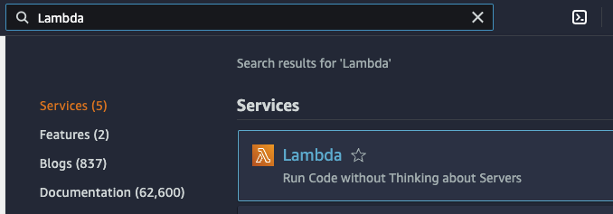
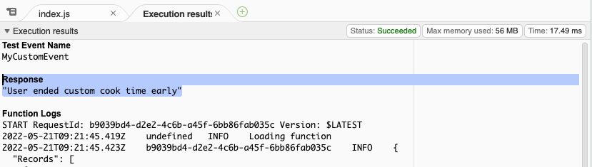

## About

- [AWS Lambda](https://aws.amazon.com/lambda/)
- [AWS Lambda User Guide](https://docs.aws.amazon.com/lambda/?id=docs_gateway)

AWS Lambda is a [serverless computing service](https://aws.amazon.com/serverless/) that runs program code in response to certain events and is responsible for automatically allocating the necessary computing resources.

AWS Lambda automatically runs program code in response to [various events](http://docs.aws.amazon.com/lambda/latest/dg/intro-core-components.html#intro-core-components-event-sources), such as HTTP requests through [Amazon API Gateway](https://aws.amazon.com/api-gateway/), changing objects in [Amazon Simple Storage Service](https://aws.amazon.com/s3/) garbage cans (Amazon S3), updating tables in [Amazon DynamoDB](https://aws.amazon.com/dynamodb/) or changing states in [AWS Step Functions](https://aws.amazon.com/step-functions/).

Supports for Java, Go, PowerShell, Node.js, C#, Python and Ruby. It also provides a Runtime API which allows you to use any **additional programming languages** to author your functions. A runtime is a program that runs a Lambda function's handler method when the function is invoked. You can include a runtime in your function's deployment package in the form of an executable file named bootstrap


When you [publish a version](https://docs.aws.amazon.com/lambda/latest/dg/configuration-versions.html), AWS Lambda makes a snapshot copy of the Lambda function code (and configuration) in the $LATEST version. A published version is immutable.

**Lambda execution role** is an IAM role that grants the function permission to access AWS services and resources. Under Attach permissions policies, choose the AWS managed policies `AWSLambdaBasicExecutionRole` and `AWSXRayDaemonWriteAccess`.

[AWS managed policies for Lambda features](https://docs.aws.amazon.com/lambda/latest/dg/lambda-intro-execution-role.html#permissions-executionrole-features)

## Digest

- Types of lambda invocation
  - RequestResponse.
  - Event.
  - Dryrun.
- Lambda execution context is a temporary runtime environment that initializes any external dependencies of our Lambda function code, such as database connections or HTTP endpoints
- Lambda **Environment variables** are variables that enable you to dynamically pass settings to your function code and libraries, without making changes to your code. Environment variables are key-value pairs that you create and modify as part of your function configuration.
- Lambda concurrent executions = (invocations per second) x (average execution duration in seconds). Concurrency limit of lambda execution, Default 1000 Reserved - 900 unreserved 100. Will get **throttled** if it exceeds **concurrency limit**
- **AWS_PROXY** in API gateway is primarily used for Lambda proxy integration.
- A Lambda **authorizer** is an API Gateway feature that uses a Lambda function to control access to your API. Lambda authorizer can be used for custom authorization scheme. 2 types:
  - Token based.
  - Request parameter based Lambda authorizer.
- Lambda deployment configuration:
  - HalfAtATime
  - Canary
  - Linear. 
- AWS Lambda compute platform deployments cannot use an in-place deployment type
- Increasing memory in lambda will increase CPU in lambda
- Lambda Versioning: 
  - By default, each AWS Lambda function has a single current version of the code. Clients of Lambda function can call a specific version or at the latest implementation
- Lambda Alias: You can create one or more aliases for our AWS Lambda function. A Lambda alias is like a pointer to a specific Lambda function version. Users can access the function version using the alias ARN
- Lambda@Edge is a feature of Amazon CloudFront that lets you run code closer to users of your application, which improves performance and reduces latency
- Lambda Layer - Layer is a ZIP archive that contains libraries, a custom runtime, or other dependencies. With layers, you can use libraries in your function without needing to include them in your deployment package
- **Amazon DynamoDB** is integrated with AWS Lambda so that you can trigger pieces of code that automatically respond to events in DynamoDB Streams. AWSLambdaDynamoDBExecutionRole is required to enable Lambda to work with DynamoDB
- **API Gateway** - Stage variables are name-value pairs that you can define as configuration attributes associated with a deployment stage of a REST API.
- Integrating **Cloud Watch Events** with lambda can be used for **scheduling events**
- If there is an incompatible output returned from a Lambda proxy integration backend, it will return 502
- To **resolve lambda throttled** exception when using Cognito events, perform retry on sync. 
- Lambda Event hook running order:
  -  start -> BeforeAllowTraffic -> AllowTraffic -> After AllowTraffic -> End
- AWS Lambda runs function code securely within a VPC b default. To enable your Lambda function to access resources inside your private VPC, you must provide additional VPC-specific configuration information that includes VPC subnet IDs and security group IDs. AWS
- Lambda uses this information to set up elastic network interfaces ([ENIs](https://docs.aws.amazon.com/AWSEC2/latest/UserGuide/using-eni.html)) that enable your function to connect securely to other resources within your private VPC
- Lambda **Asynchronous invocation** can be triggered by Amazon Simple Storage Service, Amazon Simple Notification Service, Amazon Simple Email Service, AWS CloudFormation, Amazon CloudWatch Logs, Amazon CloudWatch Events, AWS CodeCommit, AWS Config.
- Lambda Limits: https://docs.aws.amazon.com/lambda/latest/dg/gettingstarted-limits.html
- Lambda provides 500 MB of additional disk space as a workspace.
- Lambda logs all stout for a lambda function to CloudWatch Logs. Any additional logging calls used in the function will also be sent to CloudWatch Logs.
- To connect to a VPC, lambda **function execution role** must have the following permissions: ec2:Create Networkinterface, ec2:DescribeNetworkinterfaces, ec2:Delete Networkinterface. These permissions are included in the AWSLambdaVPCAccessExecutionRole managed policy
- When lambda execution is hit by concurrency limit, you need to request AWS to increase concurrency limit
- For stream-based services like Dynamo b streams, that don't invoke Lambda functions directly, the event source mapping configuration should be made on the Lambda side.
- A deployment package is a ZIP archive that contains your function code and dependencies.
- You can unload the package directly to lambda. Or you can use an Amazon S3 bucket and then upload it to lambda. If the deployment package is larger than 50 MB. you must use Amazon 53
- Lambda can incur a first run penalty also called **cold starts.** Cold starts can cause slower than expected behavior on infrequently run functions or functions with high concurrency demands


## Price

[Price](https://aws.amazon.com/lambda/pricing/)

Price x86
- 0.000016667 USD per gigabyte-second
- 0,20 USD per 1 million requests

Arm price
- 0,0000133334 USD for each gigabyte-second
- 0,20 USD for 1 million queries

## Practice



In the AWS Management Console search bar, type Lambda and select Lambda under "****Services****":



[https://us-west-2.console.aws.amazon.com/lambda/home?region=us-west-2#](https://us-west-2.console.aws.amazon.com/lambda/home?region=us-west-2#)

On page **Functions** click **Create a function**


**Author from scratch** is selected and enter the following values in the bottom form:

- **Function name**: *MyCustomFunc
- **Runtime**: Node.js 16.X

I select this section because I use the cloudacademy account. This role gives you permission to create functions

- **Permissions**: **Change default execution role**.
    - **Execution Role**: Select **Use an existing role**.
    - **Existing role**: Select the role beginning with **cloudacademylabs-LambdaExecutionRole**


### Create function

I'm writing a function to view the log, I'll add a print to the terminal. And I'll also add processing of the message I receive (In the next step in the testing section)

The function takes as an object `event` which contains an array of Records. On the 1st (0) position the object `Sns` (name of the service SNS Notifications).

In the object itself there will be 2 values:

- cook_secs - cooking time (microwave)
- req_secs - cooking time (prepare)

```js
console.log('Loading function');
exports.handler = function(event, context) {
  console.log(JSON.stringify(event, null, 2));
  const message = JSON.parse(event.Records[0].Sns.Message);
  if (message.cook_secs < message.req_secs) {
    if (message.pre) {
      context.succeed("User ended " + message.pre + " preset early");
    }
    else  {
      context.succeed("User ended custom cook time early");
    }
  }
  context.succeed();
};
```

### Deploy


### Test

This functionality allows you to test how the function reacts to certain events. Let's try to add an event from SNS Notifications. 

Let's choose from the list


We get a template in which we make some changes, adjust the field `Message` - the one that we will process in our function.

Field `Message` - string, so our object will need to be wrapped in quotes

To make the handler understand that we put quotation marks inside quotation marks, we must put a special symbol `\` before the quotation mark.

Finally we update one line and save it - **Create**


Now we click the **Test** button.

Since `cook_secs` in our event was less than `req_secs`, the function printed the first condition, and below in **Function Logs** we see the message that we print when we initialize the `Loading function`




## Questions

### Q1

**When working with a published version of the AWS Lambda function, you should note that the _____.**

1. Use the AWS Management Console to create and configure the cluster.
1. Create a cron job to schedule the cluster deployment using the `_aws cloudformation deploy_` command
1. Create a configuration file with the .config extension and place it into the .ebextensions folder in the application package.
1. Build an AWS Lambda function that polls to the ElasticBeanstalk environment deployments and create and configure the Amazon ElastiCache cluster.
  
<details>
<summary>Explanation</summary>
<div>

[AWS Secrets Manager](https://docs.aws.amazon.com/elasticbeanstalk/latest/dg/environment-resources.html)

<mark style="color:white">C</mark> 

</div>
</details>


### Q2

**A developer is building a streamlined development process for Lambda functions related to S3 storage.The developer needs a consistent, reusable code blueprint that can be easily customized to manage Lambda function definition and deployment, the S3 events to be managed and the Identity Access Management (IAM) policies definition.**

**Which of the following AWS solutions offers is best suited for this objective?**

1. [AWS Software Development Kits (SDKs)](https://aws.amazon.com/developer/tools/)
2. [AWS Serverless Application Model (SAM)](https://aws.amazon.com/serverless/sam/) templates
3. [AWS Systems Manager](https://aws.amazon.com/systems-manager/)
4. [AWS Step Functions](/en/tags/step-functions/)

<details>
<summary>Explanation</summary>
<div>

[Serverless Application Model](https://docs.aws.amazon.com/serverless-application-model/latest/developerguide/what-is-sam.html)

<mark style="color:white">2</mark> 

</div>
</details>

### Q3

**A developer is adding sign-up and sign-in functionality to an application. The application is required to make an API call to a custom analytics solution to log user sign-in events**

**Which combination of actions should the developer take to satisfy these requirements? (Select TWO.)**

1. Use Amazon Cognito to provide the sign-up and sign-in functionality
2. Use AWS IAM to provide the sign-up and sign-in functionality
3. Configure an AWS Config rule to make the API call triggered by the post-authentication event
4. Invoke an Amazon API Gateway method to make the API call triggered by the post-authentication event
5. Execute an AWS Lambda function to make the API call triggered by the post-authentication event

<details>
<summary>Explanation</summary>
<div>

Amazon Cognito adds user sign-up, sign-in, and access control to web and mobile applications quickly and easily. Users can also create an AWS Lambda function to make an API call to a custom analytics solution and then trigger that function with an Amazon Cognito post authentication trigger.

<mark style="color:white">1, 5</mark> 
</div>
</details>


### Q4

**A developer is designing a web application that allows the users to post comments and receive a real-time feedback.**

**Which architectures meet these requirements? (Select TWO.)**

1. Create an AWS AppSync schema and corresponding APIs. Use an [Amazon DynamoDB](../dynamodb) table as the data store.
2. Create a WebSocket API in Amazon API Gateway. Use an [AWS Lambda](../lambda) function as the backend and an [Amazon DynamoDB](../dynamodb) table as the data store
3. Create an AWS Elastic Beanstalk application backed by an Amazon RDS database. Configure the application to allow long-lived TCP/IP sockets.
4. Create a GraphQL endpoint in Amazon API Gateway. Use an [Amazon DynamoDB](../dynamodb) table as the data store.
5. Enable WebSocket on Amazon CloudFront. Use an [AWS Lambda](../lambda) function as the origin and an Amazon Aurora DB cluster as the data store

<details>
<summary>Explanation</summary>
<div>

[AWS AppSync](https://aws.amazon.com/appsync/) simplifies application development by letting users create a flexible API to securely access, manipulate, and combine data from one or more data sources. AWS AppSync is a managed service that uses GraphQL to make it easy for applications to get the exact data they need. 

AWS AppSync allows users to build scalable applications, including those requiring [real-time updates](https://docs.aws.amazon.com/appsync/latest/devguide/real-time-data.html), on a range of data sources, including Amazon DynamoDB. In [Amazon API Gateway](../api-gateway), users can [create a WebSocket API](https://docs.aws.amazon.com/apigateway/latest/developerguide/apigateway-websocket-api.html) as a stateful frontend for an AWS service (such as [AWS Lambda](../lambda) or DynamoDB) or for an HTTP endpoint. 

The WebSocket API invokes the backend based on the content of the messages it receives from client applications. Unlike a REST API, which receives and responds to requests, a WebSocket API supports two-way communication between client applications and the backend.

<mark style="color:white">1, 2</mark> 

</div>
</details>

### Q5

**A food delivery company is building a feature that requests reviews from customers after their orders are delivered. The solution should be a short-running process that can message customers simultaneously at various contact points including email, text, and mobile push notifications.**

**Which approach best meets these requirements?**

1. Use EventBridge with Kinesis Data Streams to send messages. 
2. Use a Step Function to send [SQS](../sqs) messages.
3. Use a [Lambda function](../lambda) to send [SNS](../sns) messages.
4. Use AWS Batch and [SNS](../sns) to send messages.

<details>
<summary>Explanation</summary>
<div>

[https://docs.aws.amazon.com/sns/latest/dg/welcome.html](https://docs.aws.amazon.com/sns/latest/dg/welcome.html)

<mark style="color:white">3</mark> 
</div>
</details>

## Resources

### Community posts
