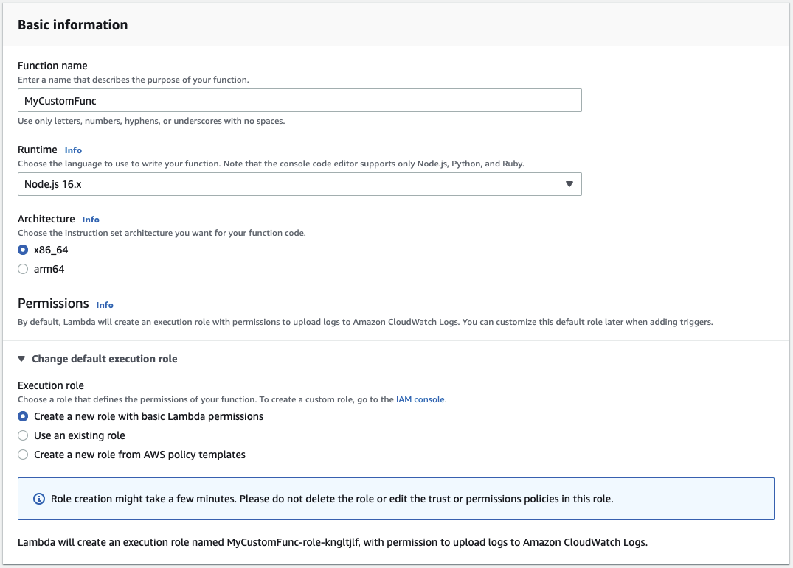

## About

- [AWS Lambda](https://aws.amazon.com/lambda/)
- [AWS Lambda User Guide](https://docs.aws.amazon.com/lambda/?id=docs_gateway)

AWS Lambda is a [serverless computing service](https://aws.amazon.com/serverless/) that runs program code in response to certain events and is responsible for automatically allocating the necessary computing resources.

AWS Lambda automatically runs program code in response to [various events](http://docs.aws.amazon.com/lambda/latest/dg/intro-core-components.html#intro-core-components-event-sources), such as HTTP requests through [Amazon API Gateway](https://aws.amazon.com/api-gateway/), changing objects in [Amazon Simple Storage Service](https://aws.amazon.com/s3/) garbage cans (Amazon S3), updating tables in [Amazon DynamoDB](https://aws.amazon.com/dynamodb/) or changing states in [AWS Step Functions](https://aws.amazon.com/step-functions/).

Supports for Java, Go, PowerShell, Node.js, C#, Python and Ruby


When you [publish a version](https://docs.aws.amazon.com/lambda/latest/dg/configuration-versions.html), AWS Lambda makes a snapshot copy of the Lambda function code (and configuration) in the $LATEST version. A published version is immutable.

**Lambda execution role** is an IAM role that grants the function permission to access AWS services and resources. Under Attach permissions policies, choose the AWS managed policies `AWSLambdaBasicExecutionRole` and `AWSXRayDaemonWriteAccess`.

[AWS managed policies for Lambda features](https://docs.aws.amazon.com/lambda/latest/dg/lambda-intro-execution-role.html#permissions-executionrole-features)

## Price

[Price](https://aws.amazon.com/lambda/pricing/)

Price x86
- 0.000016667 USD per gigabyte-second
- 0,20 USD per 1 million requests

Arm price
- 0,0000133334 USD for each gigabyte-second
- 0,20 USD for 1 million queries

## Practice

In the AWS Management Console search bar, type Lambda and select Lambda under "****Services****":


[https://us-west-2.console.aws.amazon.com/lambda/home?region=us-west-2#](https://us-west-2.console.aws.amazon.com/lambda/home?region=us-west-2#)

On page **Functions** click **Create a function**


**Author from scratch** is selected and enter the following values in the bottom form:

- **Function name**: *MyCustomFunc
- **Runtime**: Node.js 16.X

I select this section because I use the cloudacademy account. This role gives you permission to create functions

- **Permissions**: **Change default execution role**.
    - **Execution Role**: Select **Use an existing role**.
    - **Existing role**: Select the role beginning with **cloudacademylabs-LambdaExecutionRole**



### Create function

I'm writing a function to view the log, I'll add a print to the terminal. And I'll also add processing of the message I receive (In the next step in the testing section)

The function takes as an object `event` which contains an array of Records. On the 1st (0) position the object `Sns` (name of the service SNS Notifications).

In the object itself there will be 2 values:

- cook_secs - cooking time (microwave)
- req_secs - cooking time (prepare)

```js
console.log('Loading function');
exports.handler = function(event, context) {
  console.log(JSON.stringify(event, null, 2));
  const message = JSON.parse(event.Records[0].Sns.Message);
  if (message.cook_secs < message.req_secs) {
    if (message.pre) {
      context.succeed("User ended " + message.pre + " preset early");
    }
    else  {
      context.succeed("User ended custom cook time early");
    }
  }
  context.succeed();
};
```

### Deploy


### Test

This functionality allows you to test how the function reacts to certain events. Let's try to add an event from SNS Notifications. 

Let's choose from the list


We get a template in which we make some changes, adjust the field `Message` - the one that we will process in our function.

Field `Message` - string, so our object will need to be wrapped in quotes

To make the handler understand that we put quotation marks inside quotation marks, we must put a special symbol `\` before the quotation mark.

Finally we update one line and save it - **Create**


Now we click the **Test** button.

Since `cook_secs` in our event was less than `req_secs`, the function printed the first condition, and below in **Function Logs** we see the message that we print when we initialize the `Loading function`


## Questions

### Q1

**When working with a published version of the AWS Lambda function, you should note that the _____.**

- A. Use the AWS Management Console to create and configure the cluster.
- B. Create a cron job to schedule the cluster deployment using the `_aws cloudformation deploy_` command
- C. Create a configuration file with the .config extension and place it into the .ebextensions folder in the application package.
- D. Build an AWS Lambda function that polls to the ElasticBeanstalk environment deployments and create and configure the Amazon ElastiCache cluster.
  
<details>
<summary>Explanation</summary>
<div>

[AWS Secrets Manager](https://docs.aws.amazon.com/elasticbeanstalk/latest/dg/environment-resources.html)

<mark style="color:white">C</mark> 

</div>
</details>


### Q2

**A developer is building a streamlined development process for Lambda functions related to S3 storage.The developer needs a consistent, reusable code blueprint that can be easily customized to manage Lambda function definition and deployment, the S3 events to be managed and the Identity Access Management (IAM) policies definition.**

**Which of the following AWS solutions offers is best suited for this objective?**

1. [AWS Software Development Kits (SDKs)](https://aws.amazon.com/developer/tools/)
2. [AWS Serverless Application Model (SAM)](https://aws.amazon.com/serverless/sam/) templates
3. [AWS Systems Manager](https://aws.amazon.com/systems-manager/)
4. [AWS Step Functions](/en/tags/step-functions/)

<details>
<summary>Explanation</summary>
<div>

[Serverless Application Model](https://docs.aws.amazon.com/serverless-application-model/latest/developerguide/what-is-sam.html)

<mark style="color:white">2</mark> 

</div>
</details>


