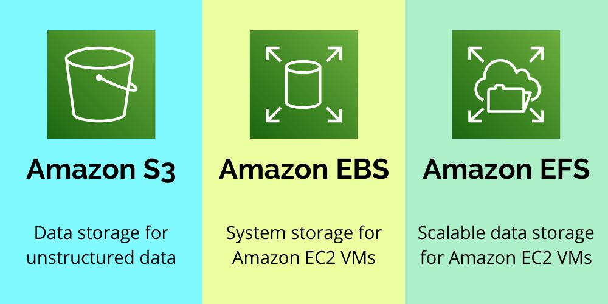

## About

Amazon S3 (Simple Storage Service) provides object storage through a web service interface.

- [Amazon S3](https://aws.amazon.com/s3/)
- [Amazon S3 User Guide](https://docs.aws.amazon.com/s3/?id=docs_gateway)

## Price

Pay only for what you use. There is no minimum charge.

[Price](https://aws.amazon.com/s3/pricing/)

## S3 | EFS | EBS

- Amazon **S3** is an object storage designed for storing large numbers of user files and backups. 
  - Good for storing backups and other static data	
  - Can be publicly accessible
  - Web interface
  - Object Storage
  - Scalable
  - Slower than EBS and EFS

- Amazon **EBS** ([Amazon Elastic Block Store](https://aws.amazon.com/ebs/)) is block storage for Amazon EC2 compute instances - it is similar to hard drives attached to your computers or laptops, but in a virtualized environment. 
  - Is meant to be EC2 drive	
  - Accessible only via the given EC2 Machine
  - File System interface
  - Block Storage
  - Hardly scalable
  - Faster than S3 and EFS

- Amazon **EFS** ([Amazon Elastic File System](https://aws.amazon.com/efs/)) provides scalable network file storage for Amazon EC2 cloud computing service users. 
  - Good for applications and shareable workloads
  - Accessible via several EC2 machines and AWS services
  - Web and file system interface
  - Object storage
  - Scalable
  - Faster than S3, slower than EBS
  - 
## Features

* Amazon S3 allows people to store objects (files) in “buckets” (directories)
* Buckets must have a globally unique name
    * Naming convention:
        * No uppercase
        * No underscore
        * 3-63 characters long
        * Not an IP
        * Must start with lowercase letter or number
* Objects
    * Objects (files) have a Key. The key is the FULL path:
        * <my_bucket>/my_file.txt
        * <my_bucket>/my_folder/another_folder/my_file.txt
    * There’s no concept of “directories” within buckets (although the UI will trick you to think otherwise)
    * Just keys with very long names that contain slashes (“/“)
    * Object Values are the content of the body:
        * Max Size is 5TB
        * If uploading more than 5GB, must use “multi-part upload”
    * Metadata (list of text key / value pairs - system or user metadata)
    * Tags (Unicode key / value pair - up to 10) - useful for security / lifecycle
    * Version ID (if versioning

### Versioning

* It is enabled at the bucket level
* Same key overwrite will increment the “version”: 1, 2, 3
* It is best practice to version your buckets
    * Protect against unintended deletes (ability to restore a version)
    * Easy roll back to previous versions
* Any file that is not version prior to enabling versioning will have the version “null”

### Encryption for Objects

* There are 4 methods of encrypt objects in S3
    * SSE-S3: encrypts S3 objects
        * Encryption using keys handled & managed by AWS S3
        * Object is encrypted server side
        * AES-256 encryption type
        * Must set header: “x-amz-server-side-encryption”:”AES256”
    * SSE-KMS: encryption using keys handled & managed by KMS
        * KMS Advantages: user control + audit trail
        * Object is encrypted server side
        * Maintain control of the rotation policy for the encryption keys
        * Must set header: “x-amz-server-side-encryption”:”aws:kms”
    * SSE-C: server-side encryption using data keys fully managed by the customer outside of AWS
        * Amazon S3 does not store the encryption key you provide
        * HTTPS must be used
        * Encryption key must be provided in HTTP headers, for every HTTP request made
    * Client Side Encryption
        * Client library such as the amazon S3 Encryption Client
        * Clients must encrypt data themselves before sending to S3
        * Clients must decrypt data themselves when retrieving from S3
        * Customer fully manages the keys and encryption cycle

### Encryption in transit (SSL)

* exposes:
    * HTTP endpoint: non encrypted
    * HTTPS endpoint: encryption in flight
* You’re free to use the endpoint your ant, but HTTPS is recommended
* HTTPS is mandatory for SSE-C
* Encryption in flight is also called SSL / TLS

### Security

By default, all S3 objects are private

A user who does not have AWS credentials or permission to access an S3 object can be granted temporary access by using a presigned URL. A **presigned URL** is generated by an AWS user who has access to the object. The generated URL is then [given to the unauthorized user](https://docs.aws.amazon.com/AmazonS3/latest/userguide/ShareObjectPreSignedURL.html)

* User based
    * IAM policies - which API calls should be allowed for a specific user from IAM console
* Resource based
    * Bucket policies - bucket wide rules from the S3 console - allows cross account
    * Object Access Control List (ACL) - finer grain
    * Bucket Access Control List (ACL) - less common
* Networking
    * Support VPC endpoints (for instances in VPC without www internet)
* Logging and Audit:
    * S3 access logs can be stored in other S3 buckets
    * API calls can be logged in [AWS CloudTrail](https://aws.amazon.com/cloudtrail/)
* User Security:
* MFA (multi factor authentication) can be required in versioned buckets to delete objects
* Signed URLs: URLS that are valid only for a limited time (ex: premium video services for logged in users)

### Bucket Policies

* JSON based policies
    * Resources: buckets and objects
    * Actions: Set of API to Allow or Deny
    * Effect: Allow / Deny
    * Principal: The account or user to apply the policy to
* Use S3 bucket for policy to:
    * Grant public access to the bucket
    * Force objects to be encrypted at upload
    * Grant access to another account (Cross Account)

### Websites

* S3 can host static website sand have them accessible on the world wide web
* The website URL will be:
    * `<bucket-name>.s3-website.<AWS-region>.amzonaws.com`
    * OR
    * `<bucket-name>.s3-website.<AWS-region>.amazonaws.com`
* If you get a 403 (forbidden) error, make sure the bucket policy allows public reads!

### CORS

* If you request data from another S3 bucket, you need to enable CORS
* Cross Origin Resource Sharing allows you to limit the number of websites that can request your files in S3 (and limit your costs)
* This is a popular exam question

### Consistency Model

* Read after write consistency for PUTS of new objects
    * As soon as an object is written, we can retrieve itex: (PUT 200 -> GET 200)
    * This is true, except if we did a GET before to see if the object existedex: (GET 404 -> PUT 200 -> GET 404) - eventually consistent
* Eventual Consistency for DELETES and PUTS of existing objects
    * If we read an object after updating, we might get the older versionex: (PUT 200 -> PUT 200 -> GET 200 (might be older version))
    * If we delete an object, we might still be able to retrieve it for a short timeex: (DELETE 200 -> GET 200)

### Performance

* Faster upload of large objects (>5GB), use multipart upload
    * Parallelizes PUTs for greater throughput
    * Maximize your network bandwidth
    * Decrease time to retry in case a part fails
* Use CloudFront to ache S3 objects around the world (improves reads)
* S3 Transfer Acceleration (uses edge locations) - just need to change the endpoint you write to, not the code
* If using SSE-KMS encryption, you may be limited to your AWS limits for KMS usage (~100s - 1000s downloads / uploads per second)

## Questions

### Q1

**Developer wants to implement a more fine-grained control of developers S3 buckets by restricting access to S3 buckets on a case-by-case basis using S3 bucket policies.**

**Which methods of access control can developer implement using S3 bucket policies? (Choose 3 answers)**

1. Control access based on the time of day
2. Control access based on IP Address
3. Control access based on Active Directory group
4. Control access based on CIDR block

Explanation

https://docs.aws.amazon.com/AmazonS3/latest/userguide/using-iam-policies.html

CIDRs - A set of Classless Inter-Domain Routings 

https://docs.aws.amazon.com/AmazonS3/latest/userguide/access-control-block-public-access.html

<mark style="color:white">1, 2, 4</mark> 

### Q2

**To ensure that an encryption key was not corrupted in transit, <abbr title="Amazon Elastic Transcoder is media transcoding in the cloud. It is designed to be a highly scalable, easy to use and a cost effective way for developers and businesses to convert (or “transcode”) media files from their source format into versions that will playback on devices like smartphones, tablets and PCs.">Elastic Transcoder</abbr>  uses a(n) ____ digest of the decryption key as a checksum.**

1. BLAKE2
2. SHA-1
3. SHA-2
4. MD5

Explanation

https://docs.aws.amazon.com/elastictranscoder/latest/developerguide/job-settings.html

MD5 digest (or checksum) 

<mark style="color:white">4</mark> 

### Q3

**Dan is responsible for supporting your company’s AWS infrastructure, consisting of multiple EC2 instances running in a VPC, DynamoDB, SQS, and S3. You are working on provisioning a new S3 bucket, which will ultimately contain sensitive data.**

**What are two separate ways to ensure data is encrypted in-flight both into and out of S3? (Choose 2 answers)**

1. Use the encrypted SSL/TLS endpoint.
2. Enable encryption in the bucket policy.
3. Encrypt it on the client-side before uploading.
4. Set the server-side encryption option on upload.

Explanation

https://docs.aws.amazon.com/AmazonS3/latest/userguide/UsingEncryption.html

<mark style="color:white">1, 3</mark> 

### Q4

**A company has an application that writes files to an Amazon S3 bucket. Whenever there is a new file, an S3 notification event invokes an AWS Lambda function to process the file. The Lambda function code works as expected. However, when a developer checks the Lambda function logs, the developer finds that multiple invocations occur for every file.**

**What is causing the duplicate entries?**

1. The S3 bucket name is incorrectly specified in the application and is targeting another S3 bucket.
1. The Lambda function did not run correctly, and Lambda retried the invocation with a delay.
1. Amazon S3 is delivering the same event multiple times.
1. The application stopped intermittently and then resumed, splitting the logs into multiple smaller files.

Explanation

<mark style="color:white">1</mark> 

