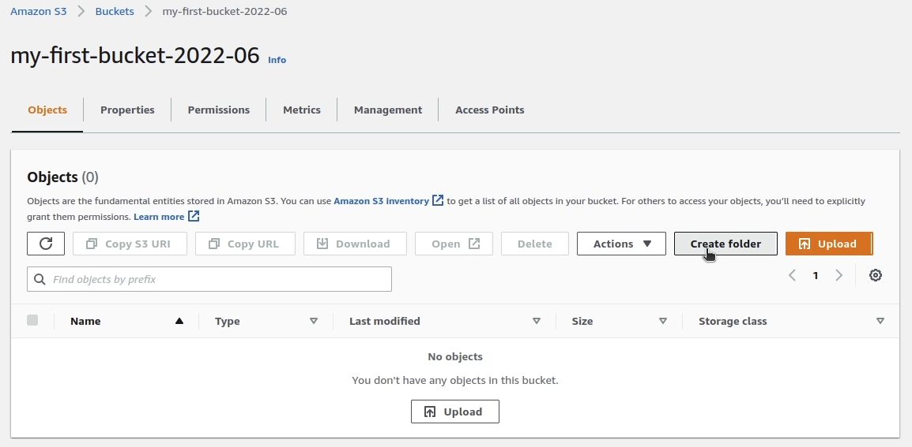

## Creating a Folder inside an Amazon S3 Bucket

### Introduction

The AWS S3 console allows you to create folders for grouping objects. This can be a very helpful organizational tool. However, in Amazon S3, buckets and objects are the primary resources. A folder simply becomes a prefix for object key names that are virtually archived into it.

### Instructions

1. Return to the **Buckets** menu by [clicking here](https://s3.console.aws.amazon.com/s3/home?region=us-west-2), and click on the `calabs-bucket` you created earlier. (_Reminder_: Your bucket name will differ slightly.)

2. Click **Create folder**:

1. In the **Folder name** textbox, enter _cloudfolder_:

4. Scroll to the bottom and click **Create folder**:

The folder is created inside your S3 bucket:
