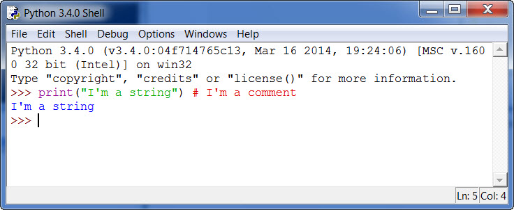

# Глава 1 - Программирование IDLE

## Использование IDLE

Python поставляется с собственным редактором кода: **IDLE** (Integrated Development and Learning Environment). Существует предание, что название IDLE происходит от имени Эрика Айдла, актера из *"Монти Пайтона"*. IDE - это редактор для программистов, который обеспечивает цветную подсветку ключевых слов языка, автозаполнение, "экспериментальный" отладчик и множество других интересных вещей. Вы можете найти IDE к большинству популярных языков, а некоторые IDE работают с несколькими языками. IDLE - это своего рода легкая IDE, но в ней есть все перечисленные элементы. Она позволяет программисту писать на Python и отлаживать свой код довольно просто. Причина, по которой я называю её "легким", заключается в том, что отладчик очень базовый. В нем отсутствуют другие функции, которые программисты, имеющие опыт работы с такими продуктами, как *Visual Studio*, пропустят. Вам также будет интересно узнать, что IDLE был создан с помощью Tkinter, набора инструментов графического интерфейса Python, который поставляется вместе с Python.

Чтобы открыть IDLE, вам нужно найти его, и вы увидите что-то вроде этого:


Да, это оболочка Python, в которой вы можете набирать короткие сценарии и сразу же видеть их вывод, и даже взаимодействовать с кодом в реальном времени. Компиляция кода не требуется, так как Python является интерпретируемым языком и выполняется в интерпретаторе Python. Давайте сейчас напишем вашу первую программу. Введите следующее после командной строки (>>>) в IDLE:

```sh
print("Hello from Python!")
```

Вы только что написали свою первую программу! Все, что делает ваша программа, это записывает строку на экран, но позже вы увидите как это полезно. Обратите внимание, что оператор **print** изменился в Python 3.x. В Python 2.x вы бы написали вышеописанное следующим образом:

```sh
print "Hello from Python!"
```

В Python 3 оператор **print** превратился в **функцию print**, поэтому скобки необходимы. Что такое функции, вы узнаете в главе 10.

Если вы хотите сохранить свой код в файл, зайдите в меню Файл и выберите Новое окно (или нажмите CTRL+N). Теперь вы можете набрать свою программу и сохранить ее здесь. Главное преимущество использования оболочки Python заключается в том, что вы можете экспериментировать с небольшими фрагментами кода, сразу видеть как он себя поведёт, прежде чем поместите его в реальную программу. Экран редактора кода выглядит немного иначе, чем на скриншоте IDLE выше:


Теперь мы уделим немного времени рассмотрению других полезных возможностей IDLE.

Python поставляется с большим количеством модулей и пакетов, которые можно импортировать для добавления новых возможностей. Например, вы можете импортировать модуль **math** для всех видов хороших математических функций, таких как квадратные корни, косинусы и т.д. В меню **File** вы найдете **Path Browser**, который пригодится для того, чтобы понять, где Python ищет импорт модулей. Python сначала ищет в том же каталоге, что и запущенный скрипт, чтобы узнать, есть ли там файл, который нужно импортировать. Затем он проверяет предопределенный список других мест. Вы можете добавлять и удалять эти места. Браузер путей покажет вам, где эти файлы находятся на вашем жестком диске, если вы что-то импортировали. Мой Path Browser выглядит следующим образом:


Далее находится **Class Browser**, который поможет вам ориентироваться в коде. Честно говоря, было бы логичнее назвать этот пункт меню "Браузер модулей", так как это гораздо ближе к тому, что вы будете делать на самом деле. В действительности это то, что не очень полезно для вас сейчас, но будет полезно в будущем. Когда у вас много строк кода в одном файле это очень поможет, дав "древовидный" интерфейс. Обратите внимание, что вы не сможете загрузить Class Browser, пока не сохраните свою программу.

Меню **Edit** содержит типичные функции, такие как Копировать, Вырезать, Вставить, Отменить, Повторить и Выбрать все. Оно также содержит различные способы поиска кода и поиска и замены. Наконец, в меню Правка есть несколько пунктов, которые показывают вам различные вещи, такие как выделение круглых скобок или отображение списка автозаполнения.

Меню **Формат** содержит множество полезных функций. В нем есть несколько полезных пунктов, позволяющих делать **отступы** и **вычеты** * в коде, а также комментировать код. Это довольно полезно при тестировании кода. Комментирование кода может быть очень полезным, когда у вас много кода и вам нужно выяснить, почему он работает неправильно. Комментирование части кода и повторный запуск скрипта могут помочь вам понять, где вы ошиблись. Вы просто медленно продвигаетесь по пути, не комментируя ничего, пока не найдете ошибку. Это напомнило мне о том, что вы, возможно, заметили, что на главном экране IDLE есть меню **Debugger**.

Это удобно для отладки, но только в окне **Shell**. К сожалению, вы не можете использовать отладчик в главном меню редактирования. Однако вы можете запустить модуль с включенной отладкой так, чтобы иметь возможность взаимодействовать с объектами вашей программы. Это будет полезно, например, в циклах, где вы пытаетесь определить текущее значение элемента внутри цикла. Если вы используете tkinter для создания пользовательского интерфейса (UI), вы можете не включать вызов **mainloop()** (который может блокировать UI), чтобы иметь возможность отлаживать пользовательский интерфейс. Наконец, если при запущенном отладчике возникает исключение, вы можете дважды щелкнуть по нему, чтобы перейти непосредственно к коду, в котором произошло исключение.

Если вам нужен более универсальный отладчик, вам следует либо найти другую IDE, либо попробовать отладчик Python, находящийся в библиотеке **pdb**.

### Что такое комментарии?

Комментарий - это способ оставить неисполняемый код, который документирует то, что вы делаете в своем коде. Каждый язык программирования использует различные символы для обозначения начала и конца комментария. Как выглядят комментарии в Python? Комментарий - это все, что начинается с восьмеричного символа (т.е. знака хеша или фунта). Ниже приведен пример некоторых комментариев в действии:

```python
# This is a comment before some code
print("Hello from Python!")
print("Winter is coming") # this is an in-line comment
```

Комментарии можно писать в строке сами по себе или после оператора, как, например, во втором операторе **print** выше. Интерпретатор Python игнорирует комментарии, поэтому вы можете писать в них все, что захотите. Большинство программистов, с которыми я встречался, не очень часто используют комментарии. Однако я настоятельно рекомендую использовать комментарии не только для себя, но и для всех остальных, кому в будущем придется поддерживать или улучшать ваш код. Я понял, что собственные комментарии полезны, когда вернулся к сценарию, который я написал 6 месяцев назад. Обнаружив, что работаю с не закомментированным кодом, я жалел, что не написал комментариев раньше, чтобы быстрее разобраться в коде сейчас.

Примерами хороших комментариев могут быть пояснения к сложным утверждениям кода или добавление пояснений к аббревиатурам в коде. Иногда вам нужно оставить комментарий, чтобы объяснить, почему вы сделали что-то определенным образом, потому что это просто не очевидно*.

Теперь нам нужно вернуться к рассмотрению опций меню IDLE:

В меню **Run** есть несколько удобных опций. С его помощью можно вызвать оболочку Python Shell, проверить код на наличие ошибок или запустить его. В меню Options не так много пунктов. В нем есть пункт Настроить, который позволяет изменить цвет подсветки кода, шрифт и сочетания клавиш. Кроме того, есть опция Code Context, которая полезна тем, что помещает в окно редактирования накладку, показывающую, в каком классе или функции вы сейчас находитесь. Мы будем объяснять функции и классы в конце первой части. Вы увидите как эта функция полезна, когда у в функции много кода, а название прокручивается за пределы верхней части экрана. При включенной опции этого не произойдет. Конечно, если функция слишком велика, чтобы поместиться на одном экране, то, возможно, она стала слишком длинной и пора разбить её на несколько функций. Еще один интересный пункт в диалоге настроек находится на вкладке **General**, где вы можете добавить другую документацию. Это означает, что вы можете добавить URL-адреса к документации сторонних разработчиков, например, SQLAlchemy или pillow, и получить ее в IDLE. Чтобы получить доступ к новой документации, просто перейдите в меню Help.

Меню **Windows** показывает список открытых в данный момент окон и позволяет переключаться между ними.

Последнее, но не менее важное меню - это меню **Help**, где вы можете узнать об IDLE, получить помощь по работе с самой IDLE или загрузить локальную копию документации по Python. Документация объясняет, как работает каждый элемент Python, и является довольно исчерпывающей в своем охвате. Меню Help, вероятно, наиболее полезно тем, что вы можете получить доступ к документации, даже если вы не подключены к Интернету. Вы можете искать в документации, находить HOWTO, читать о любой из встроенных библиотек и узнавать столько нового, что у вас голова начнет кружиться.

## Другие советы

Когда вы увидите примеры кода в следующих главах, вы можете написать и запустить их в IDLE. Я писал все свои программы в IDLE первые пару лет своей жизни программиста на Python и был вполне доволен этим. Однако существует множество бесплатных IDE для Python и несколько IDE, за которые нужно платить. Если вы хотите обойтись дешевой, вам стоит обратить внимание на Eclipse+PyDev, Editra или даже Notepad++. Для платной IDE я бы рекомендовал IDE от WingWare или, возможно, PyCharm. Они имеют гораздо больше возможностей, таких как интеграция с репозиториями кода, лучшие отладчики, помощь в рефакторинге и т.д.

В этой книге мы будем использовать IDLE в наших примерах, потому что она поставляется вместе с Python и обеспечивает общий тестовый стенд. Я по-прежнему считаю, что IDLE имеет лучшую, наиболее последовательную подсветку кода из всех IDE, которые я использовал. Подсветка кода важна, на мой взгляд, потому что она помогает избежать использования одного из ключевых слов Python (или встроенных модулей) для имени переменной. Если вам интересно, вот список этих ключевых слов:

```sh
and       del       from      not       while
as        elif      global    or        with
assert    else      if        pass      yield
break     except    import    print
class     exec      in        raise
continue  finally   is        return
def       for       lambda    try
```

Давайте посмотрим, что произойдет, когда мы напечатаем несколько вещей на языке Python:



Как вы можете видеть, IDLE все кодирует цветом. Ключевое слово имеет пурпурный цвет, строка текста - зеленый, комментарий - красный, а вывод функции печати - синий.

## Подведение итогов

В этой главе мы узнали, как использовать интегрированную среду разработки Python, IDLE. Мы также узнали, что такое комментарии и как их использовать. На данном этапе вы должны быть достаточно знакомы с IDLE, чтобы использовать ее в остальных частях этой книги. Существует множество других интегрированных сред разработки (IDE) для Python. Есть бесплатные, такие как PyDev и Editra, а есть и такие, за которые нужно платить, например, WingWare и PyCharm. Существуют также плагины для обычных текстовых редакторов, которые тоже позволяют писать на Python. Я думаю, что IDLE хорош для начала, но если у вас уже есть любимый редактор, не стесняйтесь, продолжайте использовать его.

На данный момент мы готовы двигаться дальше и начать изучать различные типы данных Python. В следующей главе мы начнем со строк.
