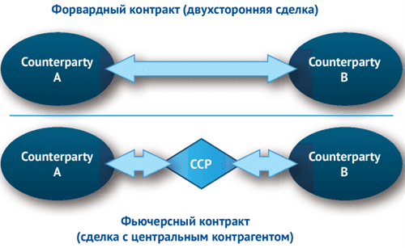

## Валютные форварды

Валютные форварды (forward contracts) - это договоры, в рамках которых две стороны соглашаются на обмен активами (обычно это валюты, сырьевые товары или финансовые инструменты) на определенную дату в будущем по заранее оговоренной цене. Это финансовый инструмент, который используется компаниями и инвесторами для защиты от рисков колебаний курсов валют.

Например, если компания знает, что ей нужно купить определенную сумму валюты на будущее время для оплаты поставок, она может заключить валютный форвард, чтобы зафиксировать курс обмена на определенный период времени. Таким образом, она может избежать потерь от колебаний курса валют и защитить свою операционную прибыль.

Форварды являются одним из инструментов хеджирования рисков и используются для защиты от потенциальных потерь, связанных с колебаниями цен на активы.

Например, компания, занимающаяся импортом товаров, может заключить форвардный контракт на покупку валюты по фиксированной цене, чтобы защитить себя от возможного увеличения стоимости валюты в будущем.

Форварды и фьючерсы относятся к группе финансовых инструментов, но они имеют некоторые отличия.

## Фьючерсы

Фьючерсы - это стандартизованные контракты на покупку или продажу определенного актива, например, валюты, акций, сырья, в определенное время в будущем по заранее оговоренной цене. Фьючерсы торгуются на биржах и обычно имеют строгие правила в отношении размера контракта, срока исполнения, стоимости и способа расчета.

### Особенности

- **Стандартизация:** все фьючерсы имеют одинаковый размер, срок действия, тип и спецификацию актива, на который они ссылаются.
- **Кредитный риск:** каждая сторона должна обеспечить свои обязательства по фьючерсному контракту, что означает, что обе стороны могут быть подвержены кредитному риску, если одна из них не исполнит свои обязательства.
- Маржинальное финансирование: для уменьшения кредитного риска стороны должны вносить маржу (внесение определенного денежного залога) в течение срока действия контракта.
- **Ликвидность:** фьючерсы торгуются на биржах, что обеспечивает высокую ликвидность контрактов и возможность быстрой покупки или продажи актива по рыночной цене.
- **Спекулятивные операции:** фьючерсы могут использоваться не только для защиты от рисков, но и для спекулятивных операций с целью получения прибыли от изменения цен активов.

## Форварды

Форварды - это договоренности о покупке или продаже определенного актива в будущем по заранее оговоренной цене. Они не стандартизованы и заключаются напрямую между двумя контрагентами. Форварды обычно не торгуются на биржах и могут иметь различные условия, например, размер контракта, дата исполнения и расчета.

Форвардные контракты могут быть настроены индивидуально для каждой стороны, в отличие от **фьючерсов**, которые стандартизированы и **торгуются на биржах**. Также, в отличие от фьючерсов, **форварды** не имеют стандартных условий исполнения и могут быть заключены на **любой актив** и на **любой период времени**.

Таким образом, форварды и фьючерсы имеют некоторые сходства, но их различия заключаются в **степени стандартизации**, **регулирования** и **доступности** для обычных инвесторов.
