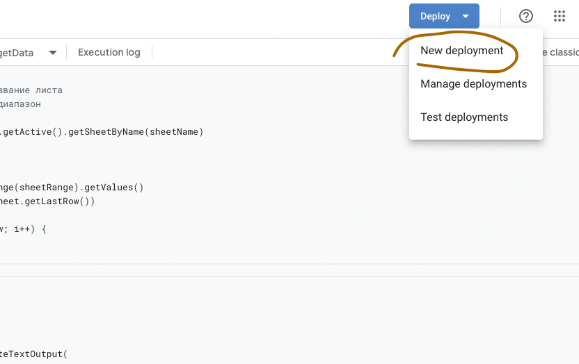
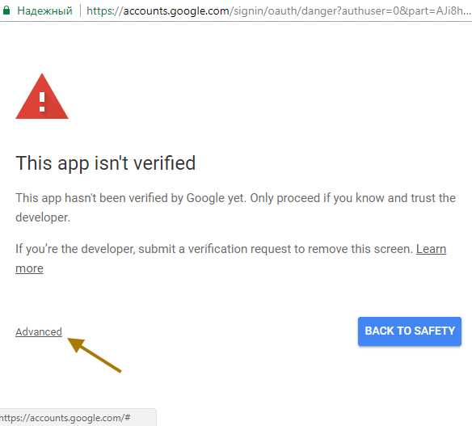

## Задача

Есть таблица google. Необходимо конвертировать ее в JSON и не делать каждый раз ручной экспорт.

## **Условия**

- таблица закрыта для общего просмотра
- json отображение читать по ссылке

## План

Использовать [webapps](https://developers.google.com/apps-script/guides/web) от google. Парсить google таблицу и выдавать готовый url с json.

## Подготовка

1. Открываем Таблицу Google
2. Extensions → Apps Script


## Создаем скрипт

Как работает endpoint. [Документация](https://developers.google.com/apps-script/guides/web?hl=en#request_parameters)

Когда пользователь посещает приложение или программа отправляет приложению HTTP-запрос GET, Apps Script запускает функцию doGet(e). 

Когда отправляется приложению HTTP-запрос POST, вместо этого Apps Script запускает doPost(e). 

В обоих случаях аргумент e представляет собой параметр события, который может содержать информацию о любых параметрах запроса. 

Дополнительные условия в запрос сейчас посылать не буду.

Итого функция с получением массива и функция с выдачей результата:

```js
const sheetName = 's1' // название листа
const sheetRange = 'A:J' // диапазон

const sheet = SpreadsheetApp.getActive().getSheetByName(sheetName)

function getData(){
  const result = []
  const values = sheet.getRange(sheetRange).getValues()
  const lastRow = parseInt(sheet.getLastRow())

  for (let i = 1; i < lastRow; i++) {
    result.push(values[i])
  }

  return result
}

function doGet() {
  const data = getData()
  return ContentService.createTextOutput(
    JSON.stringify(
      {'result': data}
    )
  ).setMimeType(ContentService.MimeType.JSON)
}
```

## Публикуем приложение






## Результат

