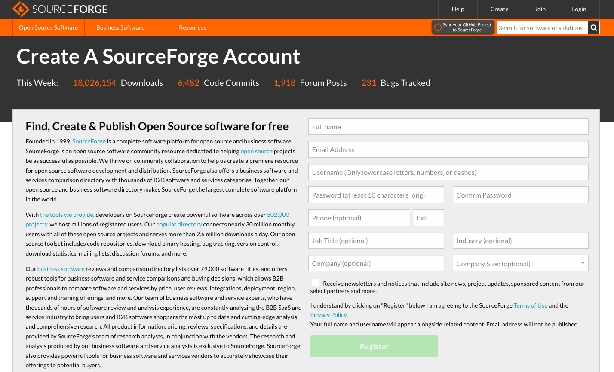
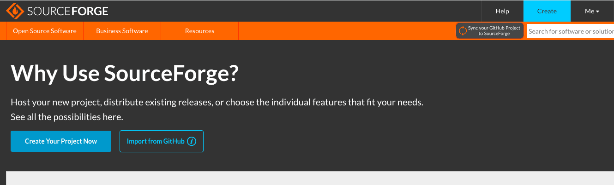
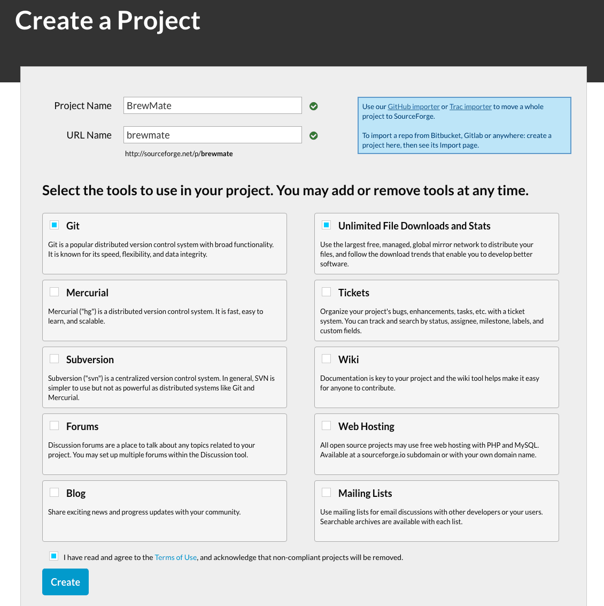
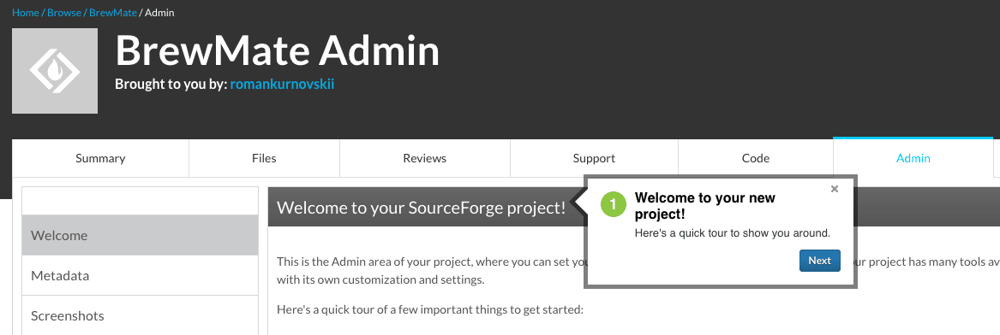
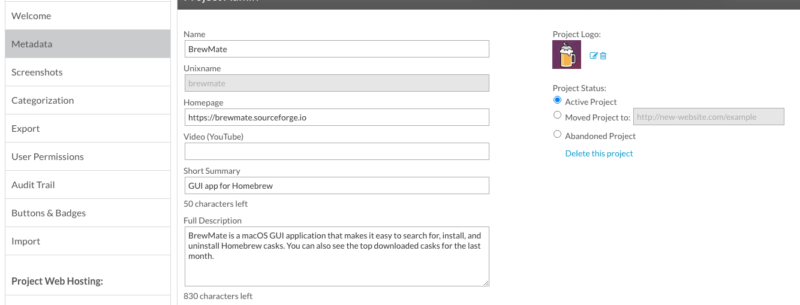
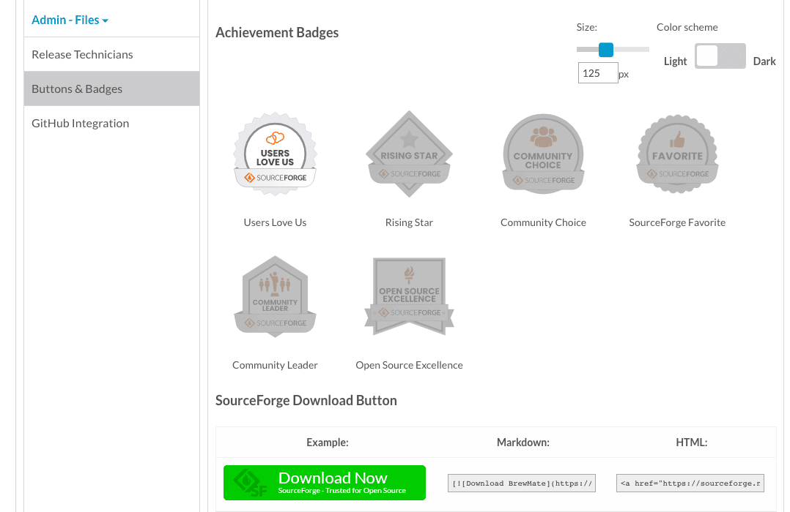
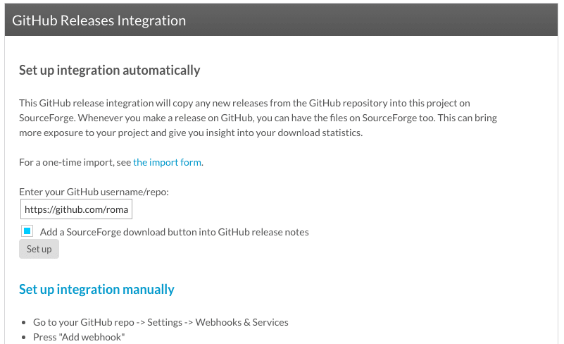
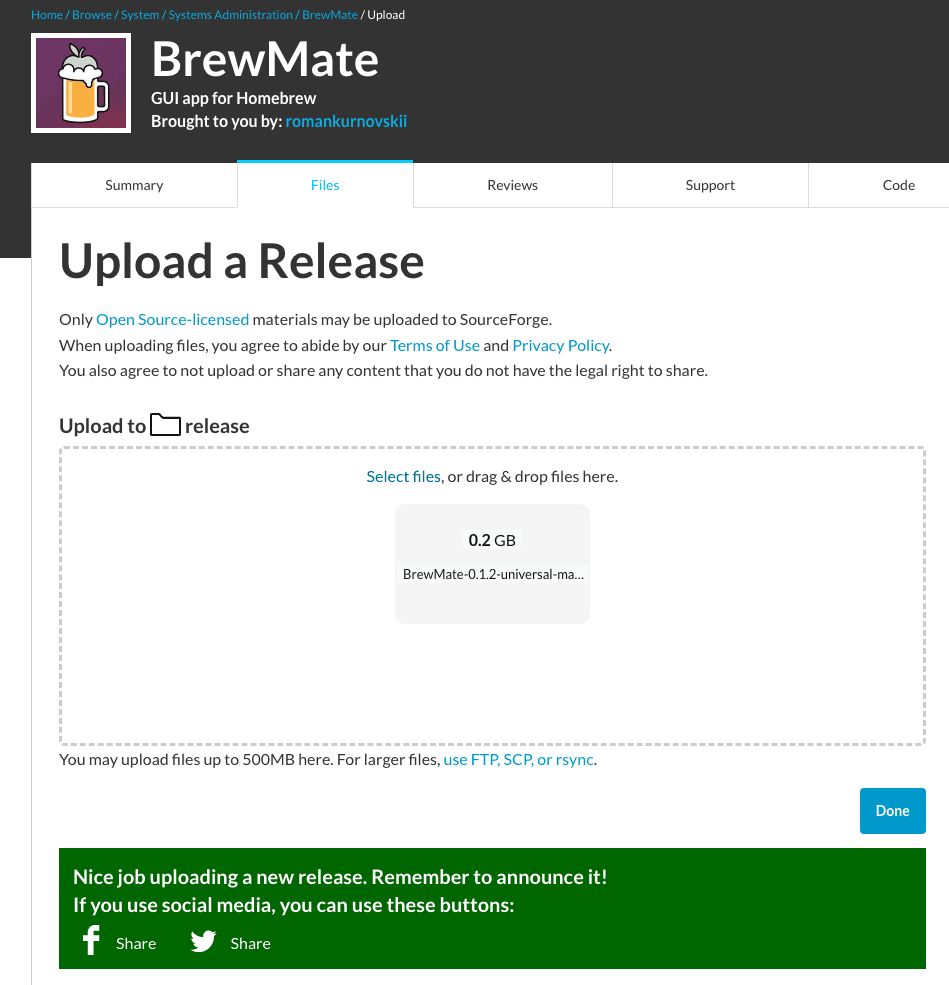

## Step 1: Create a SourceForge account

1. Go to the SourceForge website at https://sourceforge.net/
1. Click on the "Join" button in the top-right corner.
2. Fill in the required fields, such as username, email, and password, then click "Register"
3. You'll receive a confirmation email from SourceForge. Click on the link provided to confirm your account.



## Step 2: Start a new project

1. Log in to your SourceForge account.
1. Click on the "Create" button in the top-right corner of the page.
Select "Create Your Project Now" from the dropdown menu.




## Step 3: Configure your project

1. Enter a unique name for your project in the "Project Name" field. This name will also serve as your project's URL.



2. Provide a Phone number if required. You will get a pin for verification. 
3. Next you will see a quick tour that could help you to fulfill all the required fields.



1. Provide a brief description of your project in the "Short Summary" field.
1. Upload Project Logo
1. Click "Save".


1. Fill other fields from left sidebar menu.



2. Choose an appropriate "License" for your open-source project from the dropdown menu. If you're unsure which license to choose, you can refer to the Open Source Initiative's list of approved licenses (https://opensource.org/licenses).
3. Select the "Programming Language" and "Operating System" that your project is built for.
4. Add any relevant "Tags" to help users find your project.
5. Click the "Create" button at the bottom of the form to create your project.

## Step 4: Configure your project's Source Control Management (SCM)

SourceForge supports several SCM options, including Git, Mercurial, and Subversion. Choose the one that best suits your needs.

1. Go to your project's main page.
1. Click on the "Buttons & Badges" link in the left side bar.

3. Click "GitHub Integration".
4. Enter your GitHub username/repo.
5. Click "Set up" or choose "Set up integration manually".


## Step 5: Set up release files (optional)

If you want to provide compiled binaries or other release files for users to download, follow these steps:

1. Go to your project's main page.
1. Click on the "Files" tab in the top navigation bar.
1. Click on the "Add Folder" button to create a new folder for your release files (e.g., "v1.0").
1. Click on the newly created folder and then click the "Upload" button.
1. Select the release files you want to upload, and click "Open" to start the upload process.


## Summary

Now we have a project page on SourceForge.

Here is a button for download:
```
[](https://sourceforge.net/projects/brewmate/files/latest/download)
```

Project url: https://sourceforge.net/projects/brewmate/
