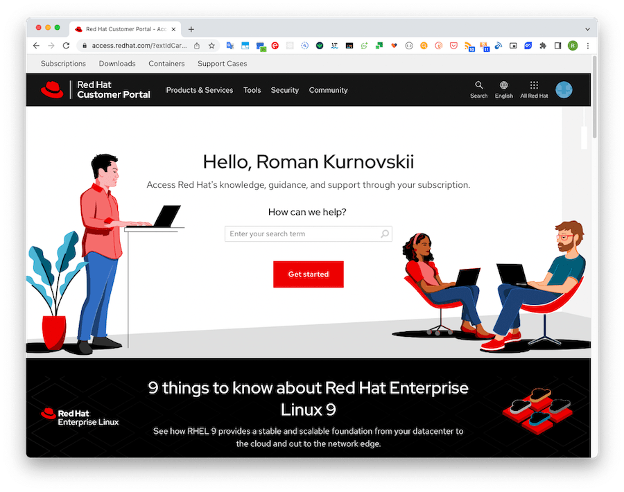
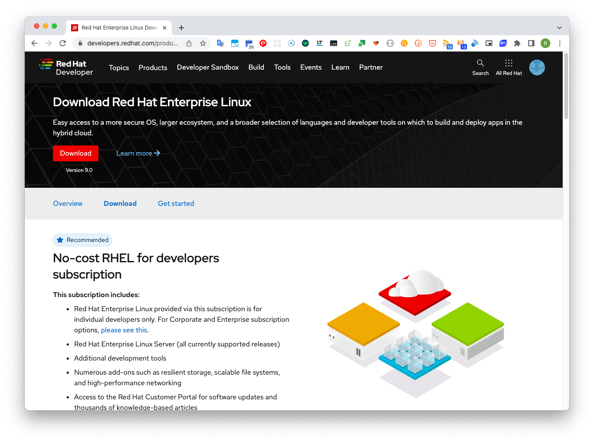
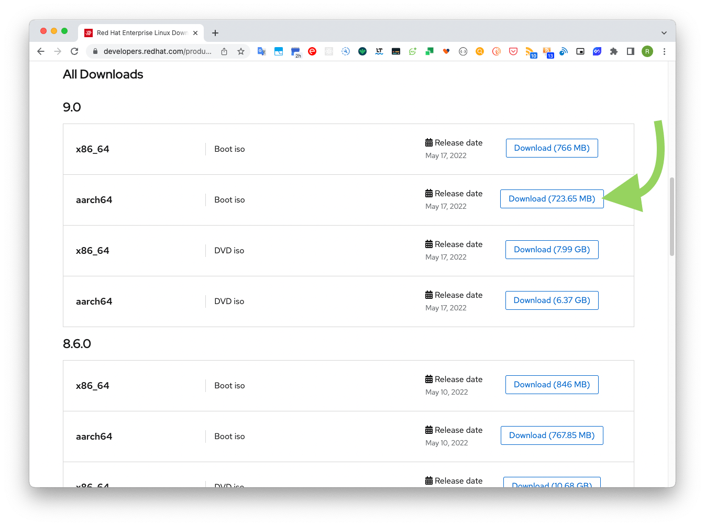
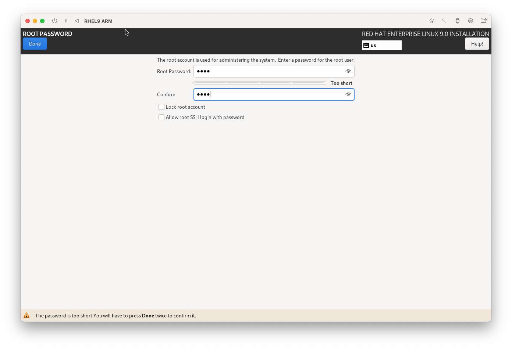
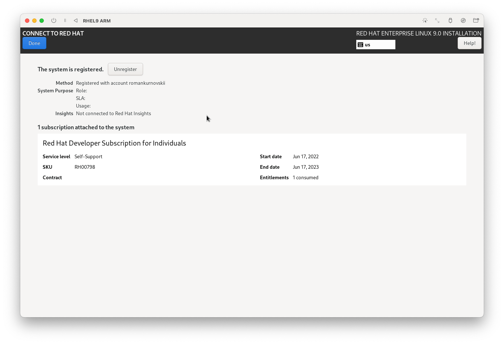
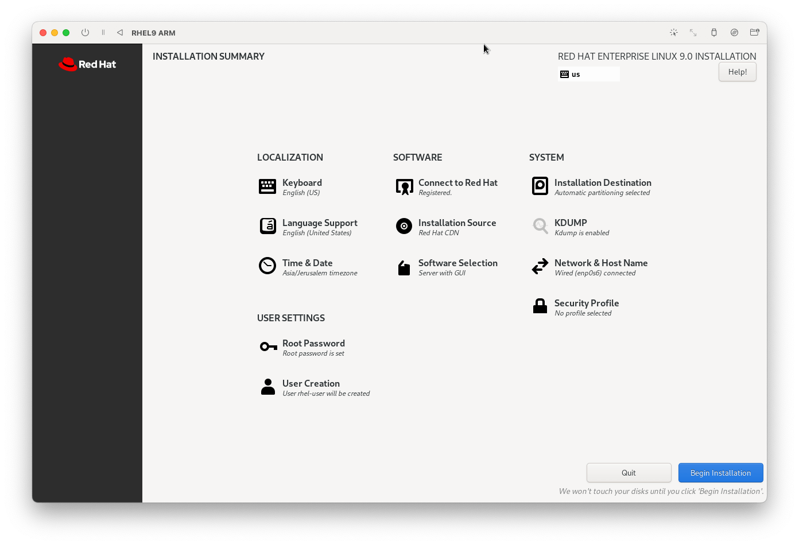
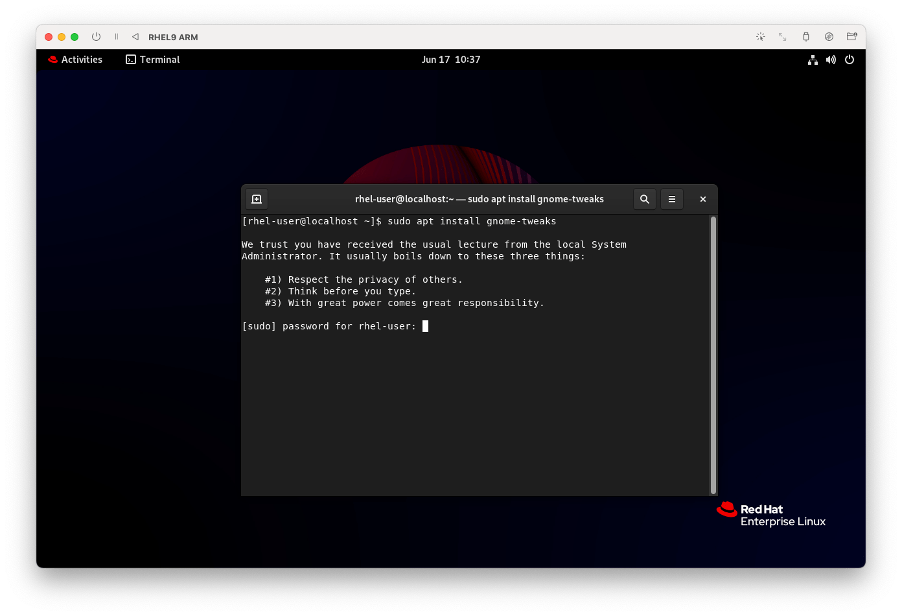
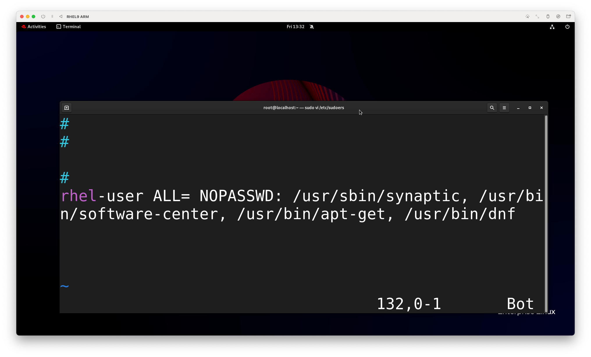
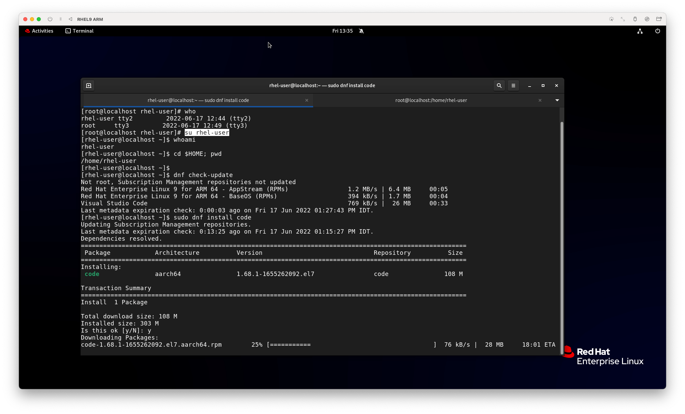
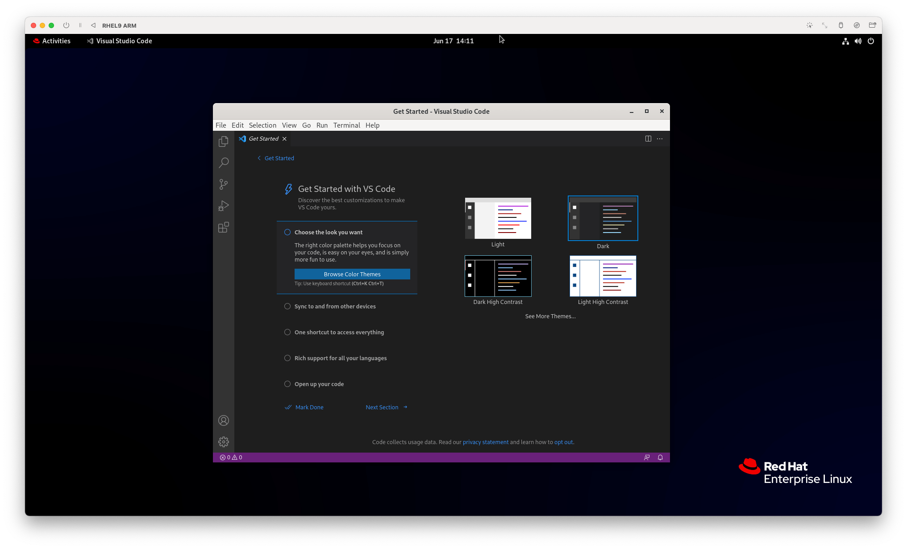

Red Hat Enterprise Linux 9 (RHEL 9), codenamed Plow, has gone public (GA). Red Hat announced it on May 18, 2022. It replaced the beta version, which had been in existence since November 3, 2021.

RHEL 9 is the first few releases in the Red Hat family. It is the first major release since IBM acquired Red Hat in July 2019, and the first major release since abandoning the CentOS project in favor of CentOS Stream, which is now RHEL's predecessor.

RHEL 9 is the latest major version of RHEL and comes with a 5.14 kernel, lots of new software packages and a host of improvements. It emphasizes security, stability, flexibility and reliability.

## Description.
RHEL 9 ships with new versions of software including Python 3.9. Node.JS 16, GCC 11, Perl 5.32, Ruby 3.0, PHP 8.0, and many more.

## Preparing for installation

### Registration on the Red Hat portal

Red Hat Developer Subscription is a free Red Hat Developer Program offer designed for individual developers who want to take full advantage of Red Hat Enterprise Linux.

It gives developers access to all versions of Red Hat Enterprise Linux, as well as other Red Hat products such as add-ons, software updates and security bugs.

First of all, make sure you have an active Red Hat account. If you don't already have an account, go to the [Red Hat Customer Portal](https://access.redhat.com/), click on "Register" and fill out your information to create a Red Hat account.


### Downloading the installation image
After creating a Red Hat account, you can start downloading RHEL 9. To download Red Hat Enterprise Linux 9 **absolutely free**, go to [Red Hat Developer Portal ](https://developers.redhat.com/products/rhel/overview) and log in with your account credentials.


Then go to the [download RHEL 9](https://developers.redhat.com/products/rhel/download) page and click on the download button shown below.

I'm using a MacBook M1, so I download the RHEL 9 image for the M1 processor aarch64


### Virtual machine
I use the free [UTM virtual machine](https://mac.getutm.app/) as a virtual machine to install RHEL 9. You can install using [Homebrew](https://romankurnovskii.com/posts/mac-setup-development/#homebrew) by running the command `brew install --cask utm`.

## Installing Red Hat Enterprise Linux 9

### Setting up the UTM virtual machine
In UTM click `Create a New Virtual Machine` -> Virtualize


Choose the downloaded RHEL 9 image and click `Continue`.


### Main Setup Menu


The marked fields need to be filled in

Create Root Password

**User Creation**. Create the user you want to log in with.


**Connect to Red Hat**. Here we will use the account created above. 

Here you will enter your account data and click Register.

Press Done

Under **Installation Destination** choose your default drive.

We can now continue with the installation. A ***Begin installation*** button will appear on the main screen  


After installation is complete, we will have to reboot the system. 

Sometimes rebooting will unload the installation image again. It's necessary to either disable the disk in the installer setup or reboot the UTM.


## Running Red Hat Enterprise Linux 9


Enter your password and see the RHEL 9 desktop


To access the applications, click the **Activities** button in the upper left corner

## Configuring Red Hat Enterprise Linux 9

### Checking the ROOT user
In a Linux system users belong to different groups which have certain rights. If during the installation process we did not check the checkbox to make the user an administrator, by default he will not be able to install some system programs. 

Exit and log in as root (the same user we created earlier on the main screen). Press ***Log out***


Now log in as **root**. The user may not be listed. Press **Not listed** and enter the account data. 


Open terminal and check


### Configuring system settings

#### Button to minimize the application
The first thing that seems unusual about using the GUI is that there are no buttons to minimize windows


Install the necessary package
```
yum install gnome-tweaks -y
```

After installation, the Tweaks application will appear. Find it by searching.

There are many other tweaks in the app as well. We will show you the minimize buttons for the applications.

Let's go to **Windows titlebars** and set the Maximize, Minimize options


#### User access to install applications

To avoid constantly switching to a root user to install applications, we can give the normal user access to install applications.
We will continue to do this as ***root***.
Open /etc/sudoers and add the user

```
sudo vi /etc/sudoers
```

Add user data to the end of the file. My user name: ***rhel-user***

```
rhel-user ALL= NOPASSWD: /usr/sbin/synaptic, /usr/bin/software-center, /usr/bin/apt-get, /usr/bin/dnf
```



Let's install ***Visual Studio Code*** as a normal user
Installation consists of the following steps:
1. adding the desired repository. Rights to add the repository (changing the files in the directory is still only for ***root*** user)
2. Downloading and installing.

First step is done as root user
Go to [https://code.visualstudio.com/docs/setup/linux](https://code.visualstudio.com/docs/setup/linux)

Copy the code and run it in the terminal

```
sudo rpm --import https://packages.microsoft.com/keys/microsoft.asc
sudo sh -c 'echo -e "[code]\nname=Visual Studio Code\nbaseurl=https://packages.microsoft.com/yumrepos/vscode\nenabled=1\ngpgcheck=1\ngpgkey=https://packages.microsoft.com/keys/microsoft.asc" > /etc/yum.repos.d/vscode.repo'
```

- Switch to user ***rhel-user***. This can also be done in the terminal.
- Updating the repositories
- Install VSCode

```
su rhel-user
dnf check-update

sudo dnf install code
```






## References
- [https://developers.redhat.com/products/rhel/getting-started](https://developers.redhat.com/products/rhel/getting-started)
- [https://www.redhat.com/sysadmin/install-linux-rhel-9](https://www.redhat.com/sysadmin/install-linux-rhel-9)