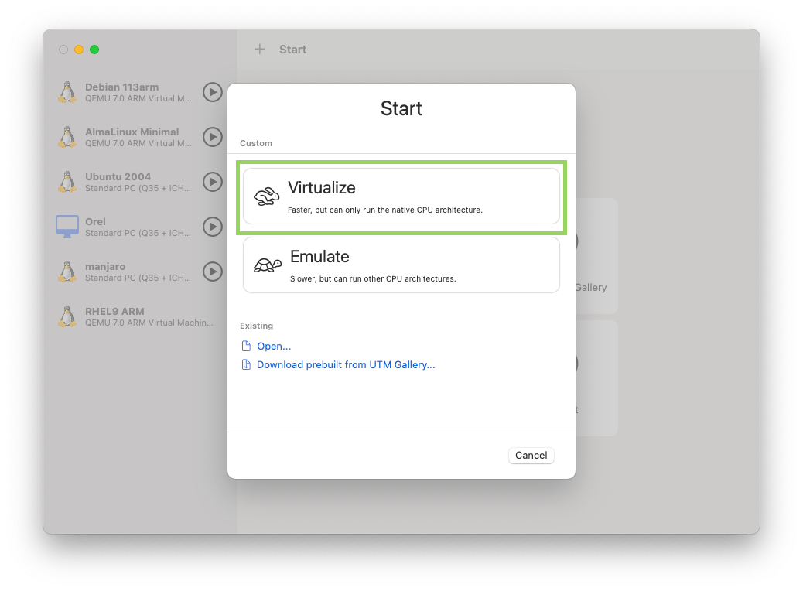
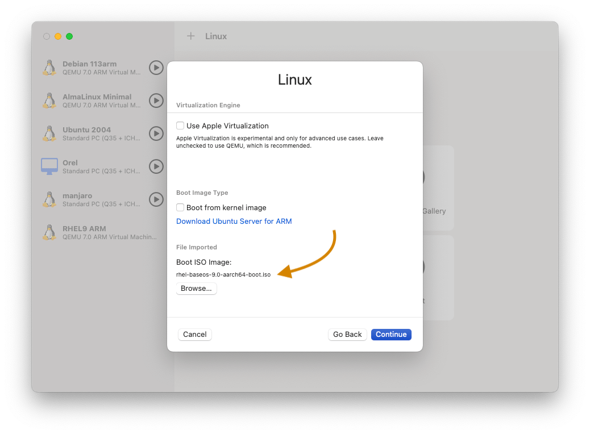
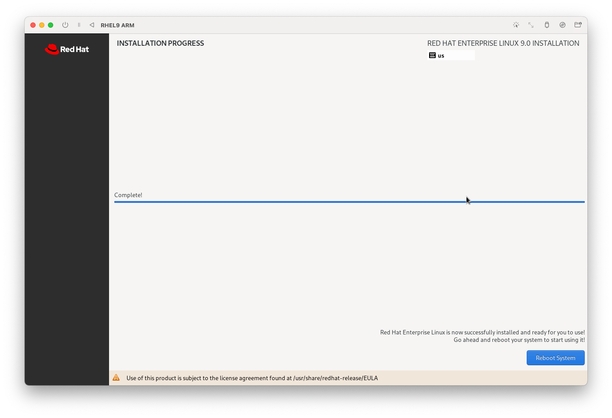
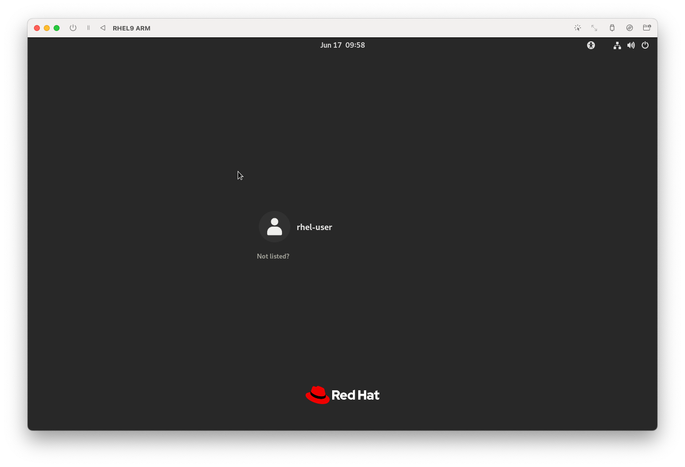
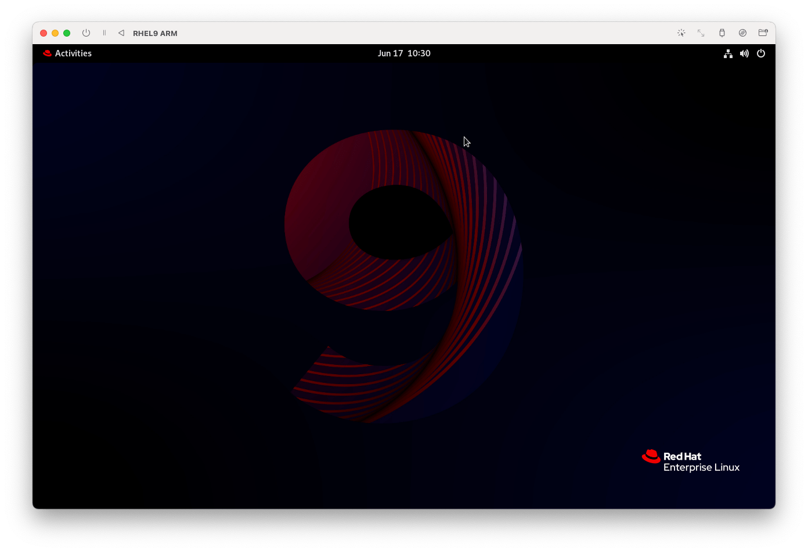
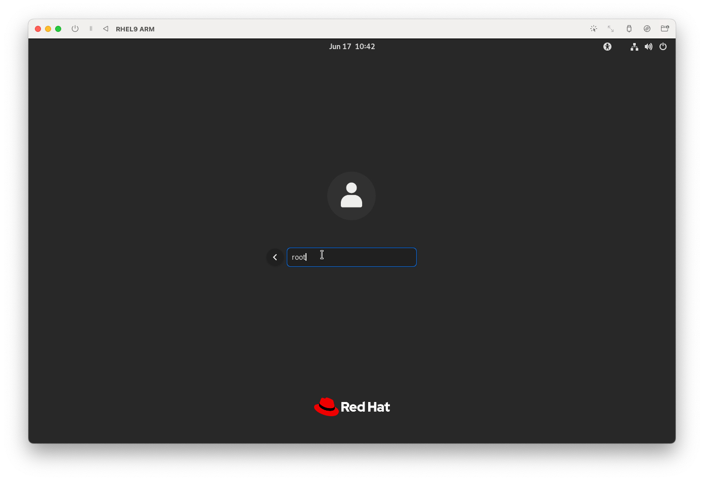
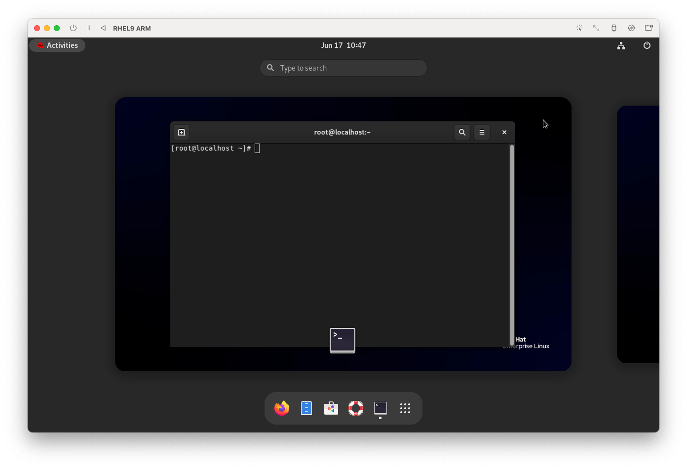
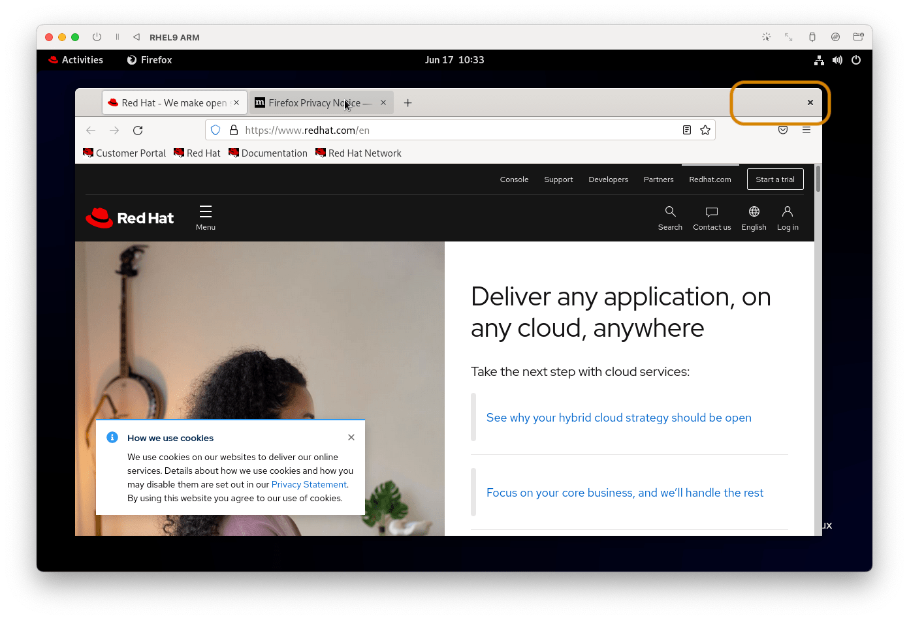
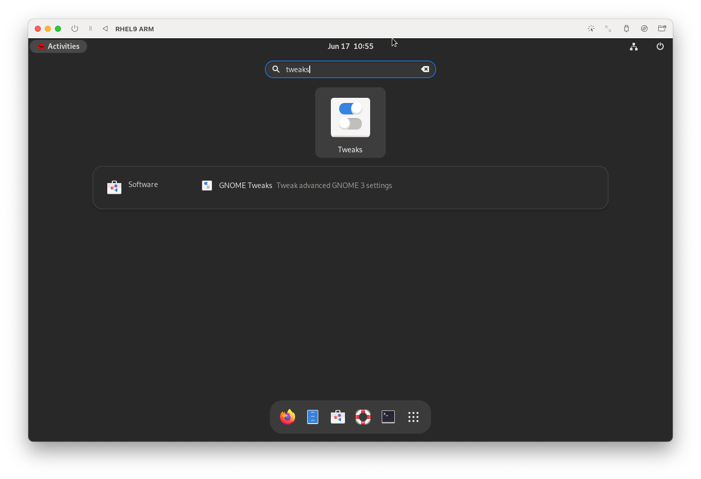
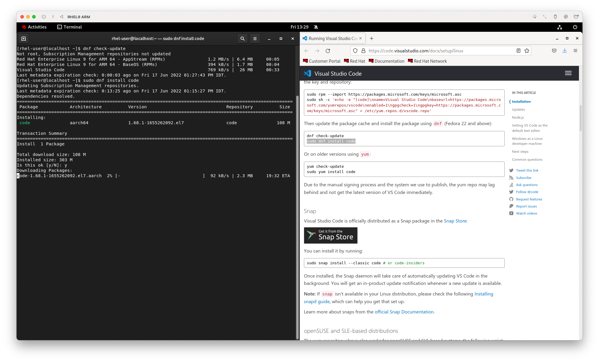

Red Hat Enterprise Linux 9 (RHEL 9) под кодовым названием Plow стал общедоступным (GA). Компания Red Hat объявила об этом 18 мая 2022 года. Она сменила бета-версию, которая существовала с 3 ноября 2021 года.

RHEL 9 - это несколько первых релизов в семействе Red Hat. Это первый крупный релиз после приобретения Red Hat компанией IBM в июле 2019 года, а также первая крупная версия после отказа от проекта CentOS в пользу CentOS Stream, который теперь является предшественником RHEL.

RHEL 9 является последней основной версией RHEL и поставляется с ядром 5.14, множеством новых пакетов программного обеспечения и массой усовершенствований. В ней особое внимание уделяется безопасности, стабильности, гибкости и надежности.

## Описание

RHEL 9 поставляется с новыми версиями программного обеспечения, включая Python 3.9. Node.JS 16, GCC 11, Perl 5.32, Ruby 3.0, PHP 8.0 и многие другие.

## Подготовка к установке

### Регистрация на портале Red Hat

Подписка Red Hat Developer Subscription - это бесплатное предложение программы Red Hat Developer, предназначенное для индивидуальных разработчиков, которые хотят воспользоваться всеми преимуществами Red Hat Enterprise Linux.

Она дает разработчикам доступ ко всем версиям Red Hat Enterprise Linux, а также к другим продуктам Red Hat, таким как дополнения, обновления программного обеспечения и ошибки безопасности.

Прежде всего, убедитесь, что у вас есть активная учетная запись Red Hat. Если у вас еще нет учетной записи, перейдите на портал [Red Hat Customer Portal](https://access.redhat.com/), нажмите на кнопку "Регистрация" и заполните свои данные для создания учетной записи Red Hat.


### Загрузка установочного образа

После создания учетной записи Red Hat вы можете приступать к загрузке RHEL 9. Чтобы загрузить Red Hat Enterprise Linux 9 **абсолютно бесплатно**, зайдите на [Red Hat Developer Portal](https://developers.redhat.com/products/rhel/overview) и войдите в систему, используя учетные данные своей учетной записи.


Затем перейдите на страницу [загрузки RHEL 9](https://developers.redhat.com/products/rhel/download) и нажмите на кнопку загрузки, показанную ниже.

Я использую MacBook M1, поэтому скачиваю образ RHEL 9 для M1 процессора aarch64


### Виртуальная машина

В качестве вирутальной машины для установки RHEL 9 использую бесплатную [виртуальную машину UTM](https://mac.getutm.app/). Установить можно с помощью [Homebrew](../mac-setup-development/#homebrew), выполнив команду `brew install --cask utm`.

## Установка Red Hat Enterprise Linux 9

### Настройка виртуальной машины UTM

В UTM нажимаем `Create a New Virtual Machine` -> Virtualize


Выбираем скачанный образ RHEL 9 и нажимаем `Continue`


### Главное меню


Помеченные поля необходимо заполнить

Создаем Root Password

**User Creation**. Создаем пользователя, под которым будет осуществляться вход в систему.


**Connect to Red Hat**. Здесь используем учетную запись, созданную выше.

Вводим данные аккаунта, нажимаем Register

Нажимаем Done

В разделе **Installation Destination** выбираем диск по умолчанию

Теперь можем продолижть установку. На главном экране появилась кнопка ***Begin installation***  


После завершения установки перезагружаем систему.

Иногда после перезагрузки запускается загрузка с установочного образа опять. Неоьбходимо либо отключить диск в настройка вирутальной машины либо перезагрузить UTM.

## Запуск Red Hat Enterprise Linux 9



Вводим пароль и видим рабочий стол RHEL 9


Для доступа к приложениям нажимаем кнопку **Activities** в верхнем левом углу

## Настройка Red Hat Enterprise Linux 9

### Проверка пользователя ROOT

В системе Linux пользователи относятся к разным группам, у которых есть определенные права. Если в процессе установки мы не поставили галку сделать пользователя администратором, то по умолчанию он не сможет устанавливать некоторые системные программы.

Выходим из системы и заходим в систему под пользователем root (тем самым, которого создавали ранее на главном экране). Нажимаем ***Log out***


Теперь входим под **root**. Пользователя может не быть в списке. Жмем **Not listed** и вводим данные аккаунта.


Открываем терминал и проверяем


### Настройка параметров системы

#### Кнопки сворачивания приложения

Первое, что кажется непривычным при использовании GUI, отсутствие кнопок сворачивания окон


Устанавливаем необходимый пакет

```
yum install gnome-tweaks -y
```


После установки появится приложение Tweaks. Найдем его через поиск.

В приложении множество и других настроек. Мы отобразим кнопки сворачивания приложений.

Идем в раздел **Windows titlebars** и включаем параметры Maximize, Minimize


#### Доступ пользователю на установку приложений

Чтобы постоянно не переключаться на root пользователя для устновки приложений, мы можем предоставить обычному пользвоателю доступ к установке приложений.
Действия продолжаем делать под пользователем  ***root***.
Открываем файл /etc/sudoers и добавляем пользователя

```
sudo vi /etc/sudoers
```

Добавляем в конец файла данные пользователя. Имя моего пользователя: ***rhel-user***

```
rhel-user ALL= NOPASSWD: /usr/sbin/synaptic, /usr/bin/software-center, /usr/bin/apt-get, /usr/bin/dnf
```


Установим ***Visual Studio Code*** под обычным пользователем
Установка состоит из следующих шагов:

1. добавление нужного репозитория. Права на добавление репозитория (изменение файлов в директории по прежнему только у ***root*** пользователя)
2. загрузка и Установка

Первый шаг делаем под пользователем root
Идем на сайт [https://code.visualstudio.com/docs/setup/linux](https://code.visualstudio.com/docs/setup/linux)

Копируем код и запускаем в терминале

```
sudo rpm --import https://packages.microsoft.com/keys/microsoft.asc
sudo sh -c 'echo -e "[code]\nname=Visual Studio Code\nbaseurl=https://packages.microsoft.com/yumrepos/vscode\nenabled=1\ngpgcheck=1\ngpgkey=https://packages.microsoft.com/keys/microsoft.asc" > /etc/yum.repos.d/vscode.repo'
```

- Переключаемся на пользователя ***rhel-user***. Это можно сделать и в терминале.
- Обновим репозитории
- Установим VSCode

```
su rhel-user
dnf check-update

sudo dnf install code
```





## Ссылки

- [https://developers.redhat.com/products/rhel/getting-started](https://developers.redhat.com/products/rhel/getting-started)
- [https://www.redhat.com/sysadmin/install-linux-rhel-9](https://www.redhat.com/sysadmin/install-linux-rhel-9)
