Ubuntu - одна из популярных Linux систем и достаточно много [обзоров по установке Ubuntu](https://mac.getutm.app/gallery/ubuntu-20-04). В этой статье мы будем устанавливать образ Ubuntu для ARM процессора на виртуальную машину UTM. Вся установка будет проходить на Mac OS.

### Загрузка установочного образа

На сайте Ubuntu доступен для скачивания только образ [Ubuntu Server ARM](https://ubuntu.com/download/server/arm) версии **22.04** - без графического интерфейса. Но можно скачать обновленный релиз Ubuntu Desktop для ARM - Daily Build по [ссылке](https://cdimage.ubuntu.com/daily-live/current/).

Находим *64-bit ARM (ARMv8/AArch64) desktop image* и скачиваем
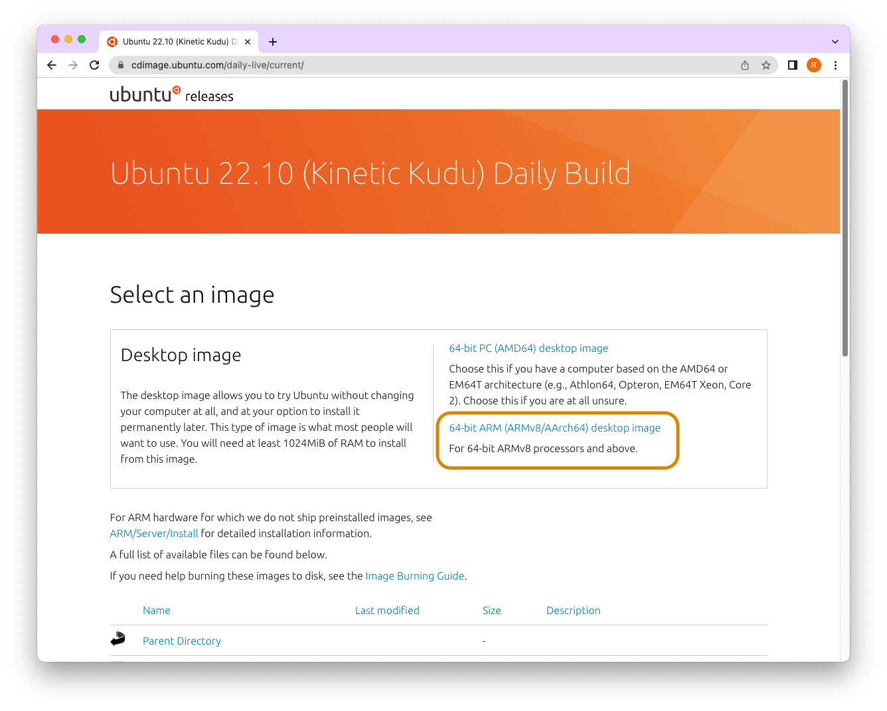

### Виртуальная машина

В качестве виртуальной машины для установки RHEL 9 использую бесплатную [виртуальную машину UTM](https://mac.getutm.app/). Установить можно с помощью [Homebrew](https://romankurnovskii.com/posts/mac-setup-development/#homebrew), выполнив команду `brew install --cask utm`.

## Установка Ubuntu Desktop

### Настройка виртуальной машины UTM
В UTM нажимаем `Create a New Virtual Machine` -> Virtualize
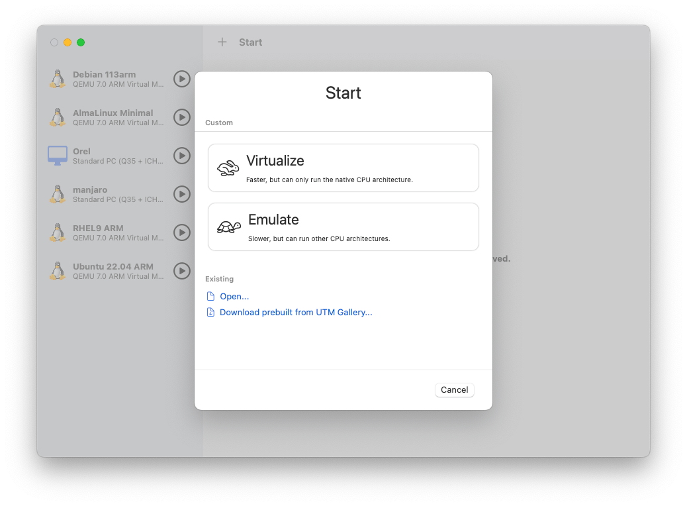

Выбираем скачанный образ и нажимаем `Continue`, далее оставляем опции по умолчанию
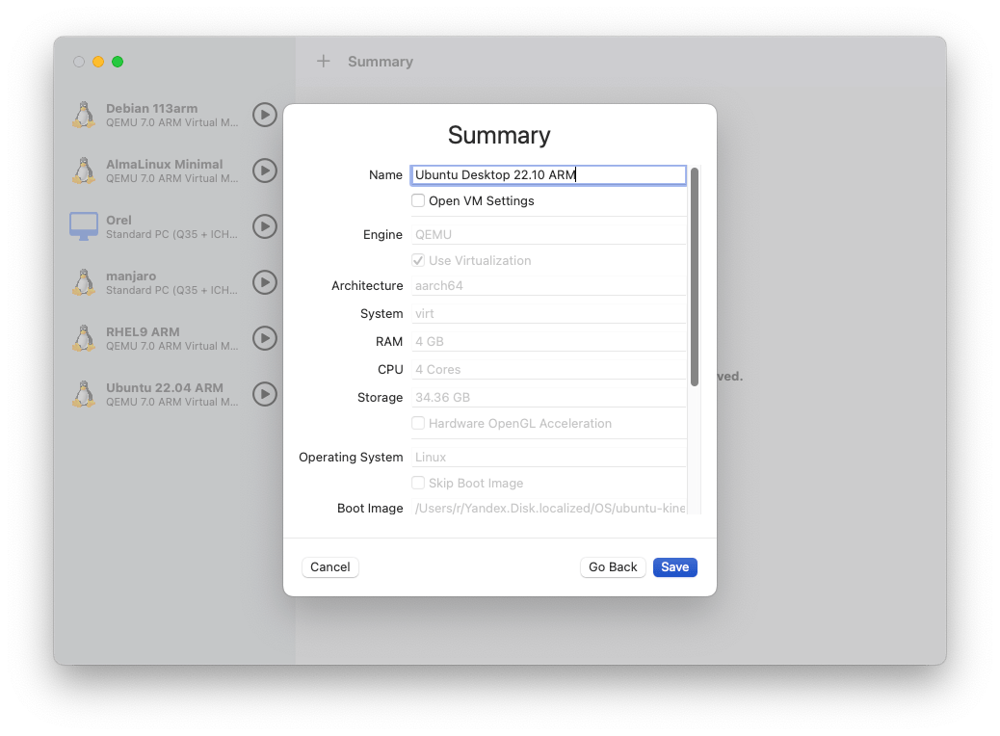

### Запуск Live версии
Выбираем *Try or Install Ubuntu*. Запустится live образ ubuntu. Такой образ не сохраняет свое состояние после перезагрузки.
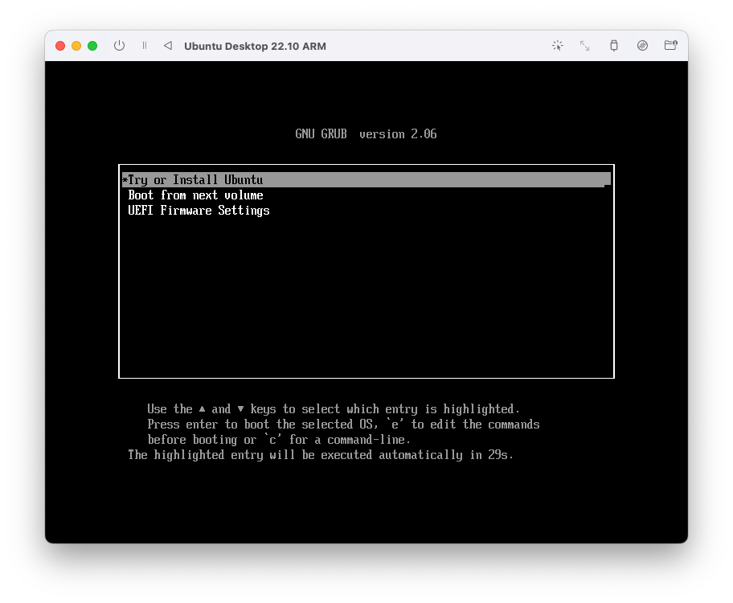

Входим под пользователем ubuntu

Видим рабочий стол и можем пользоваться.

### Установка
Внизу справа есть ярлык для стандартной установки Ubuntu. Нажимаем и запускаем обычную установку на диск.

Выбираем нужный язык

Я выбираю минимальную установку, т.к. мне не нужны будут предустановленные игры и прочие приложения. Графический интерфейс, браузер, терминал остается со всеми базовыми настройками.
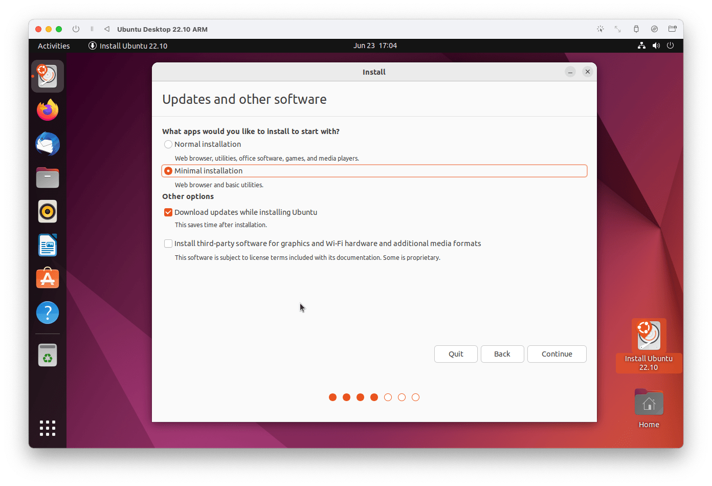
Оставляем по умолчанию стирание виртуального диска перед установкой
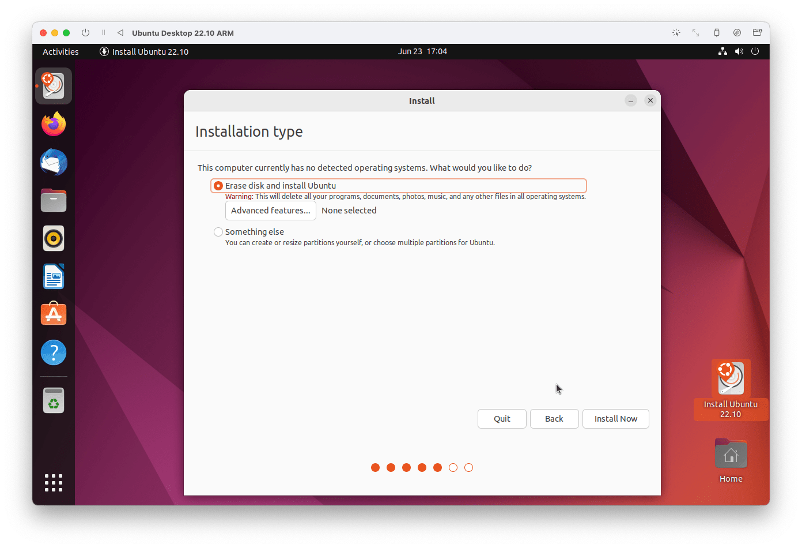
Создаем пользователя, под которым будем входить в систему
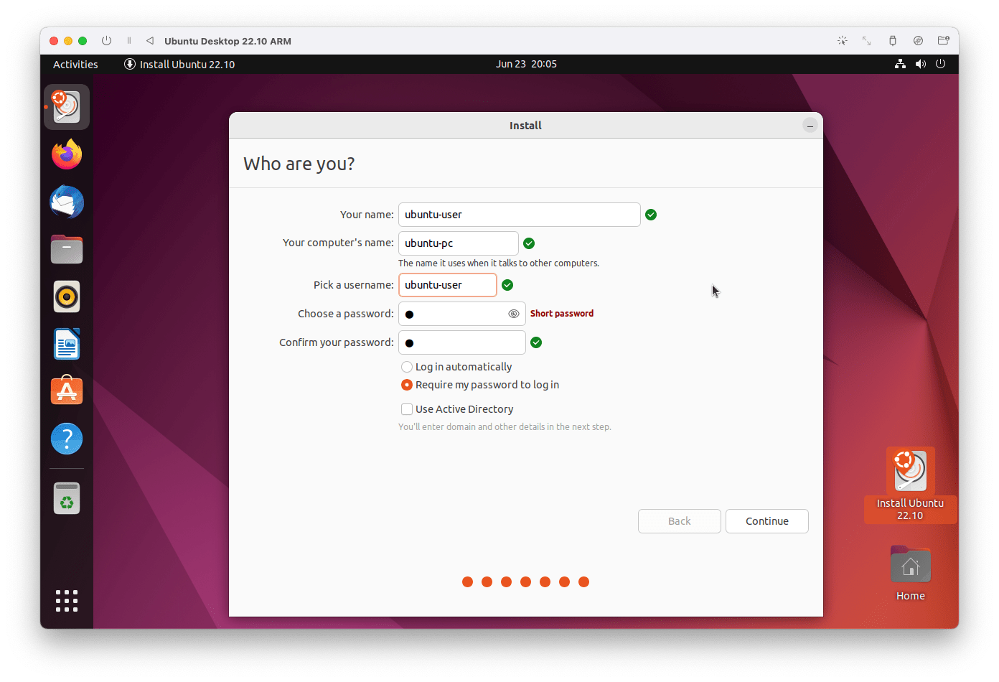
Как только установка закончится, нажимаем *Restart*. 
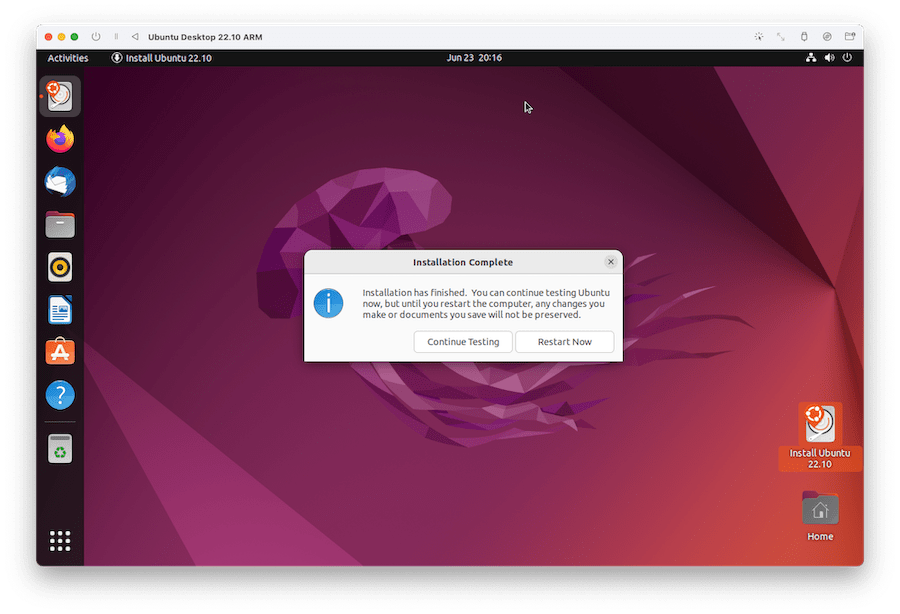
У меня после перезагрузки черный экран. Поэтому я просто закрываю и снова запускаю вирутальную машину.

### Вход в систему
После запуска системы выбираем *Boot from next volume. Первым по умолчанию будет запуск с вирутального образа, но у нас уже есть система на диске, поэтому выбираем запуск со следующего по очереди диска.
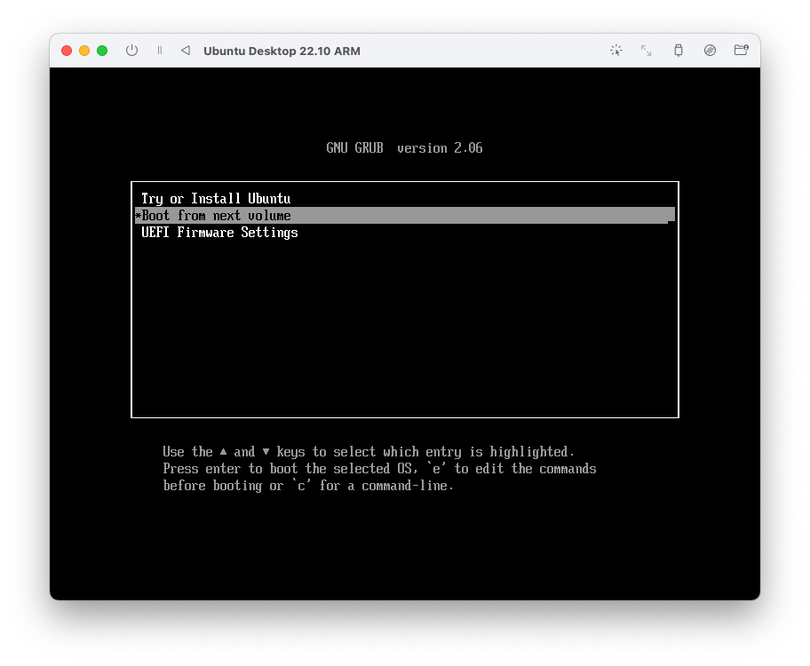
Входим под своим пользователем
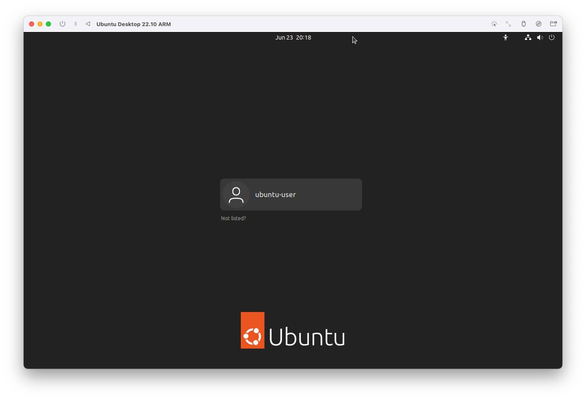
Система предлагает скачать обновления для системы. Нажимаю установить.
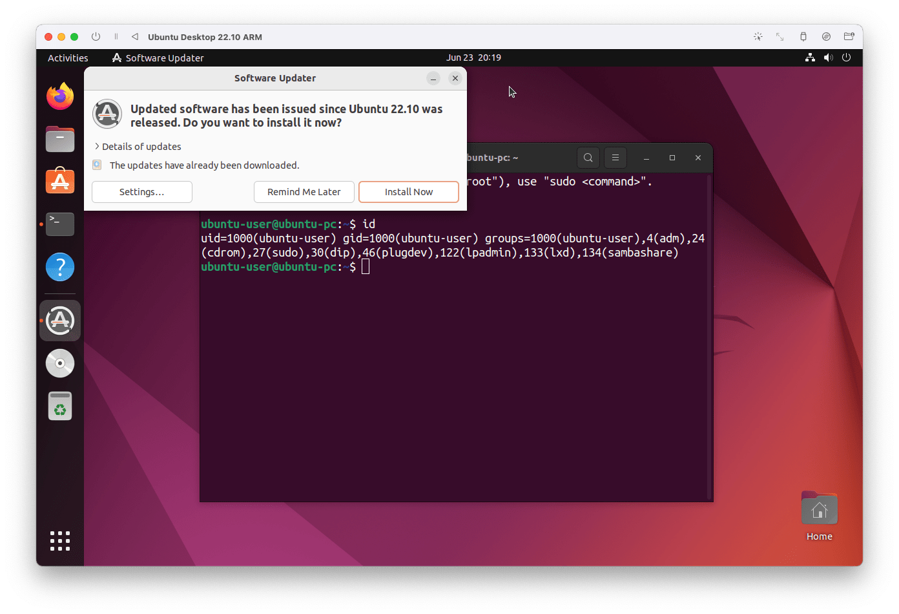
Теперь можно пользоваться системой и все данные будут сохраняться после перезагрузки.
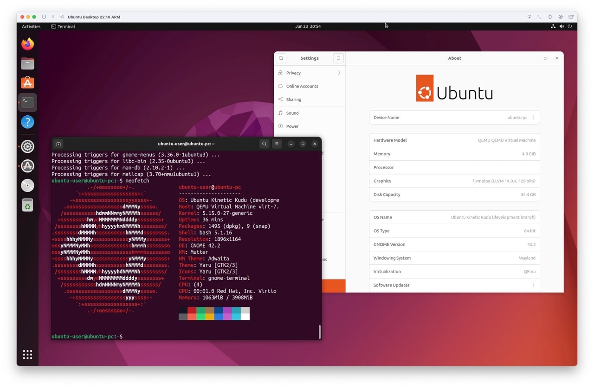

## Ссылки

- [Kinetic Kudu Release Schedule](https://discourse.ubuntu.com/t/kinetic-kudu-release-schedule/27263)
