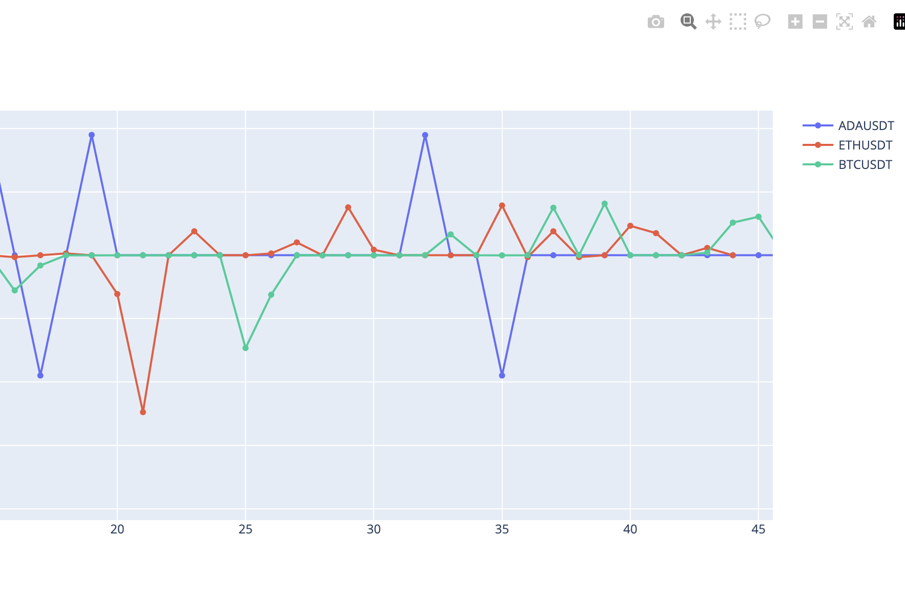

# How to Create Interactive Financial Charts using Tkinter and Plotly

Data visualization is an integral part of data analysis. Python, with its strong set of libraries, has emerged as a go-to language for data visualization. In this tutorial, we will create an application that generates and displays interactive financial charts using Tkinter and Plotly.

## Prerequisites

Before we get started, ensure you have the following installed on your machine:

- Python 3.6 or newer
- Dash, Plotly's Python framework for building analytical web applications.
- Tkinter, Python's standard GUI package.

You can install Dash using pip:

```sh
pip install dash plotly
```

## Step 1: Python Script Imports

```python
import tkinter as tk
import threading
import webbrowser
import random

import plotly.graph_objs as go
import dash_html_components as html

from dash import Dash, dcc
from dash.dependencies import Output, Input
```

## Step 2: Creating a Dash Application Thread

We'll be running the Dash application in a separate thread. This allows the Tkinter GUI and Dash app to run simultaneously. To do this, we create a new `DashThread` class that inherits from Python's `threading.Thread`:

```python
class DashThread(threading.Thread):
    def __init__(self, data_list):
        threading.Thread.__init__(self)
        self.data_list = data_list

        self.app = Dash(__name__)

        # Initialize an empty graph
        self.app.layout = html.Div(
            [
                dcc.Graph(id="live-graph", animate=True),
                dcc.Interval(
                    id="graph-update",
                    interval=1 * 1000,
                ),
            ]
        )

        @self.app.callback(
            Output("live-graph", "figure"), [Input("graph-update", "n_intervals")]
        )
        def update_graph(n):
            data = [
                go.Scatter(
                    x=list(range(len(self.data_list[symbol]))),
                    y=self.data_list[symbol],
                    mode="lines+markers",
                    name=symbol,
                )
                for symbol in self.data_list.keys()
            ]
            fig = go.Figure(data=data)

            # Update x-axis range to show last 120 data points
            fig.update_xaxes(range=[max(0, n - 120), n])

            return fig

    def run(self):
        self.app.run_server(debug=False)
```

## Step 3: Creating the Main Application Class

The `App` class will initialize the Tkinter window and generate random prices for each of the financial symbols:

```python

class App:
    def __init__(self, root):
        self.root = root
        self.data_list = {"ETHUSDT": [], "BTCUSD": [], "BNBUSDT": []}

        # Start the Dash application in a separate thread
        dash_thread = DashThread(self.data_list)
        dash_thread.start()

        # Open Dash app in web browser
        webbrowser.open("http://localhost:8050")

        # Start the price generation in tkinter after Dash app is launched
        self.root.after(1000, self.generate_prices)

    def generate_prices(self):
        for symbol in self.data_list.keys():
            new_price = random.randint(1, 100)  # Generate random price
            self.data_list[symbol].append(new_price)  # Store the price in list

        # Schedule the function to run again after 1 second
        self.root.after(1000, self.generate_prices)
```

## Step 4: Running the Application

Finally, we create a Tkinter root window, instantiate the `App` class, and start the Tkinter event loop:

```python
if __name__ == "__main__":
    root = tk.Tk()
    app = App(root)
    root.mainloop()
```



## Conclusion

You've successfully created an application that generates and displays interactive financial charts using [Tkinter](https://docs.python.org/3/library/tkinter.html) and [Plotly](https://plotly.com/python/getting-started/). This project can be extended with real-time data feeds and additional interactive features to fit your needs. Happy coding!
