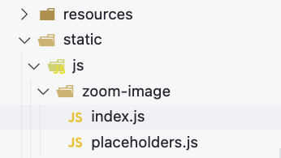
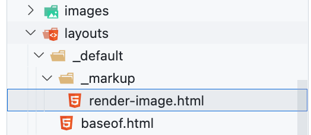

## Introduction

Hugo by default uses parsing of *markdown* files. This means that we get the html code as it is written in markdown.

In order to understand which images we can enhance, we add a separate tag/key/id to those images

## Tools

To implement the functionality, we need to:
- Write/connect a script/handler that will perform the **zoomin** effect on the images we need
- Add the necessary *metadata* to the images, so the script can find them
  
## zoomin script

To add the ability to zoom on click, we will use the [medium-zoom](https://github.com/francoischalifour/medium-zoom) package.

This package provides this functionality in a non-loaded, handy style.


[Demo](https://medium-zoom.francoischalifour.com/)


### Script logic

The script finds images with `id` and so understands to apply the `zoomin` property to those images

Possible `id`:

- zoom-default
- zoom-margin
- zoom-background
- zoom-scrollOffset
- zoom-trigger
- zoom-detach
- zoom-center

### Connecting the scripts

In order for the script to work, we need to connect the logic as well as the handler.

Hugo has a **static** folder in the root of the project, which can be used to store static files (styles, scripts) and used to connect them to the site. If there is no such folder, you can create one.

In the **static** folder create a folder *zoom-image* and add two scripts to it



#### static/js/zoom-image/index.js

```js
const zoomDefault = mediumZoom('#zoom-default')
const zoomMargin = mediumZoom('#zoom-margin', { margin: 48 })
const zoomBackground = mediumZoom('#zoom-background', { background: '#212530' })
const zoomScrollOffset = mediumZoom('#zoom-scrollOffset', {
    scrollOffset: 0,
    background: 'rgba(25, 18, 25, .9)',
})

// Trigger the zoom when the button is clicked
const zoomToTrigger = mediumZoom('#zoom-trigger')
const button = document.querySelector('#button-trigger')
button.addEventListener('click', () => zoomToTrigger.open())

// Detach the zoom after having been zoomed once
const zoomToDetach = mediumZoom('#zoom-detach')
zoomToDetach.on('closed', () => zoomToDetach.detach())

// Observe zooms to write the history
const observedZooms = [
    zoomDefault,
    zoomMargin,
    zoomBackground,
    zoomScrollOffset,
    zoomToTrigger,
    zoomToDetach,
]

// Log all interactions in the history
const history = document.querySelector('#history')

observedZooms.forEach(zoom => {
    zoom.on('open', event => {
        const time = new Date().toLocaleTimeString()
        history.innerHTML += `<li>Image "<em>${event.target.alt
            }</em>" was zoomed at ${time}</li>`
    })

    zoom.on('detach', event => {
        const time = new Date().toLocaleTimeString()
        history.innerHTML += `<li>Image <em>"${event.target.alt
            }"</em> was detached at ${time}</li>`
    })
})
```

#### static/js/zoom-image/placeholders.js

```js
// Show placeholders for paragraphs
const paragraphs = [].slice.call(document.querySelectorAll('p.placeholder'))

paragraphs.forEach(paragraph => {
  // eslint-disable-next-line no-param-reassign
  paragraph.innerHTML = paragraph.textContent
    .split(' ')
    .filter(text => text.length > 4)
    .map(text => `<span class="placeholder__word">${text}</span>`)
    .join(' ')
})
```

#### CDN script

You can download the script, or you can upload it

[Script Link](https://cdn.jsdelivr.net/npm/medium-zoom@1.0.6/dist/medium-zoom.min.js)


#### Adding to template

In order for these scripts to work in the website template, they must be connected.

I use for this the template **baseof.html**. I simply add links to the scripts in **body** of the template.

```html
    # baseof.html

    ...
    </footer>

    <script src="https://cdn.jsdelivr.net/npm/medium-zoom@1.0.6/dist/medium-zoom.min.js" defer></script>
    <script src="/js/zoom-image/placeholders.js" defer></script>
    <script src="/js/zoom-image/index.js" defer></script>

  </body>
</html>
```

## image ID

Hugo allows you to change the parsing behavior of *markdown* files with hooks. You can read more about render-hooks at [website](https://gohugo.io/templates/render-hooks/).

In the **layouts* folder.

Let's add the file **render-image.html** to the following path **layouts -> _default -> _markup**


file code:

```html
<p class="md__image">
    
</p>
```

We only added `id="zoom-default"` to the default code

## Result

<video  controls>
  <source src="img/gallery.mp4" type="video/mp4">
Your browser does not support the video tag.
</video>

### Process

