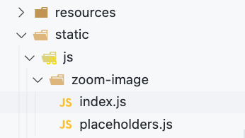

## Введение

В Hugo по умолчанию используется парсинг *markdown* файлов. Т.е. мы получаем html код в том виде, как он написан в markdown.

Для того, чтобы нам понимать какие именно изображения мы можем увеличивать, добавим к этим изображениям отдельный тег/ключ/id

## Инструменты

Для реализации функционала нам необходимо:
- написать/подключить скрипт/обработчик, который будет выполнять эффект **zoomin** к нужным нам изображениям
- Добавить необходимые *метаданные* к изображениям, чтобы скрипт их смог найти
  
## Скрипт zoomin
Для добавления возможности увеличивать картинку при нажатии воспользуемся пакетом [medium-zoom](https://github.com/francoischalifour/medium-zoom). 

Данный покет реализовывает данную функциональность в ненагруженном удобном стиле.


[Демо сайт](https://medium-zoom.francoischalifour.com/)

### Логика скрипта

Скрипт находит изображения с `id` и так понимает, что нужно применить свойство `zoomin` к этим изображениям

Возможные `id`:

- zoom-default
- zoom-margin
- zoom-background
- zoom-scrollOffset
- zoom-trigger
- zoom-detach
- zoom-center

### Подключение скриптов

Для работы скрипта, нам необходимо подключить логику, а также обработчик.

В Hugo в корне проекта есть папка static, которую можно использовать для хранения статических файлов (стиле, скриптов) и использовать для подключения на сайте. Если такой папки нет, то можно создать.

В папке *static* создадим папку *zoom-image* и добавим в нее 2 скрипта



#### static/js/zoom-image/index.js

```javascript
const zoomDefault = mediumZoom('#zoom-default')
const zoomMargin = mediumZoom('#zoom-margin', { margin: 48 })
const zoomBackground = mediumZoom('#zoom-background', { background: '#212530' })
const zoomScrollOffset = mediumZoom('#zoom-scrollOffset', {
    scrollOffset: 0,
    background: 'rgba(25, 18, 25, .9)',
})

// Trigger the zoom when the button is clicked
const zoomToTrigger = mediumZoom('#zoom-trigger')
const button = document.querySelector('#button-trigger')
button.addEventListener('click', () => zoomToTrigger.open())

// Detach the zoom after having been zoomed once
const zoomToDetach = mediumZoom('#zoom-detach')
zoomToDetach.on('closed', () => zoomToDetach.detach())

// Observe zooms to write the history
const observedZooms = [
    zoomDefault,
    zoomMargin,
    zoomBackground,
    zoomScrollOffset,
    zoomToTrigger,
    zoomToDetach,
]

// Log all interactions in the history
const history = document.querySelector('#history')

observedZooms.forEach(zoom => {
    zoom.on('open', event => {
        const time = new Date().toLocaleTimeString()
        history.innerHTML += `<li>Image "<em>${event.target.alt
            }</em>" was zoomed at ${time}</li>`
    })

    zoom.on('detach', event => {
        const time = new Date().toLocaleTimeString()
        history.innerHTML += `<li>Image <em>"${event.target.alt
            }"</em> was detached at ${time}</li>`
    })
})
```

#### static/js/zoom-image/placeholders.js

```javascript
// Show placeholders for paragraphs
const paragraphs = [].slice.call(document.querySelectorAll('p.placeholder'))

paragraphs.forEach(paragraph => {
  // eslint-disable-next-line no-param-reassign
  paragraph.innerHTML = paragraph.textContent
    .split(' ')
    .filter(text => text.length > 4)
    .map(text => `<span class="placeholder__word">${text}</span>`)
    .join(' ')
})
```

#### CDN скрипт

Скрипт можно скачать, а можно подгружать

[Ссылка на скрипт](https://cdn.jsdelivr.net/npm/medium-zoom@1.0.6/dist/medium-zoom.min.js)


#### Добавление в шаблон

Для того, чтобы данные скрипты работали в шаблоне сайта, их необходимо подключить.

Я использую для этого шаблон **baseof.html**. Просто добавляю ссылки на скрипта в **body** шаблона.

```html
    # baseof.html

    ...
    </footer>

    <script src="https://cdn.jsdelivr.net/npm/medium-zoom@1.0.6/dist/medium-zoom.min.js" defer></script>
    <script src="/js/zoom-image/placeholders.js" defer></script>
    <script src="/js/zoom-image/index.js" defer></script>

  </body>
</html>
```

## ID изображения

Hugo позволяет изменить поведение при парсинге *markdown* файлов с помощью хуков. Подробнее о рендер-хуках можно прочитать на [сайте](https://gohugo.io/templates/render-hooks/).

В папке **layouts*

Добавим файл **render-image.html** по следующему пути **layouts -> _default -> _markup**


код файла:

```html
<p class="md__image">
    
</p>
```

Мы добавили только `id="zoom-default"` в код по умолчанию

## Итоги

<video  controls>
  <source src="img/gallery.mp4" type="video/mp4">
Your browser does not support the video tag.
</video>


### Процесс

