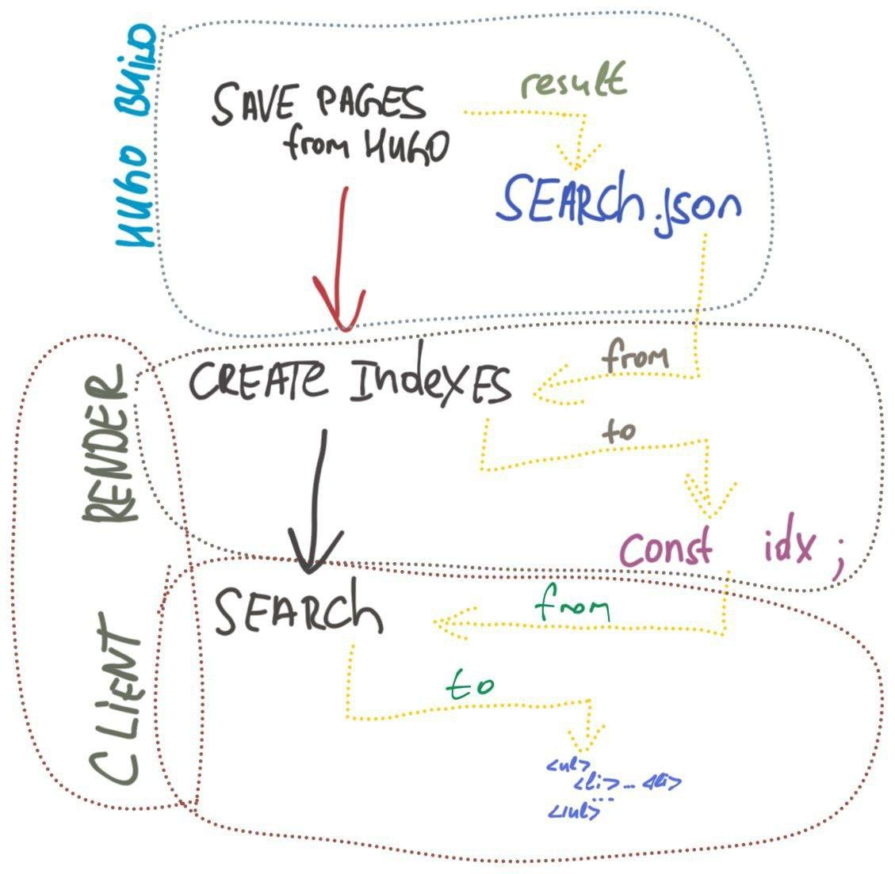

## Initial

I had the need to implement search functionality on my site. Content on is in different languages. 

The goal is to impelemnt search for all pages and separate search results for each and every language.


## How it works

1. Hugo generates the search index. In this case it means that we get *json* file with every static page on the site.

2. To make search works we need to create *index*. [lunr.js](http://lunrjs.com/) takes care of it.

3. Client send query -> our script "tries to find" in the index

4. Render the results

This is how the logic looks like:




## Implementation


1. Create search form
2. Create popup modal where will render search results
3. Connect Lunr.js script
4. Generate pages data
5. Connect search/result forms with lunr.js search


### TL;DR

**Files to change/create:**


<details>
<summary>1.  `/layouts/partials/header.html`</summary>

```html
<form id="search">   
 <input type="text" type="search" id="search-input">
</form>
```

</details>

<details>
<summary>2. `/layouts/partials/components/search-list-popup.html`</summary>

```html
<div id="search-result" tabindex="-1"
  class="overflow-y-auto overflow-x-hidden fixed top-0 right-0 left-0 z-50 max-w-xs " hidden>
  <div class="relative p-4 w-full max-w-xs h-full md:h-auto">
    <div class="relative bg-white rounded-lg shadow dark:bg-gray-700">
      <div class="p-6">
        <h3>Search results</h3>
        <div id="search-results" class="prose"></div>
      </div>
    </div>
  </div>
</div>
```
  
</details>

<details>
<summary>3. `/layouts/partials/footer.html`</summary>

  ```html
  ...
  {{ $languageMode := .Site.Language }}
  <script src="https://unpkg.com/lunr/lunr.min.js"></script>
  <script src="/js/search.js?1" languageMode={{ $languageMode }} ></script>

  {{ partial "components/search-list-popup.html" . }}
  ...
  ```

</details>


<details>
<summary>4. `/layouts/_default/index.json`</summary>

```go
{{ $translatedCount := 0 }}
{
  "ru": [
    {{- range $index, $page := .Site.RegularPages.ByTitle -}}
      {{- if gt $index 0 -}} , {{- end -}}
      {{- $entry := dict "uri" $page.RelPermalink "title" $page.Title -}}
      {{- $entry = merge $entry (dict "description" .Description) -}}
      {{- $entry = merge $entry (dict "content" (.Plain | htmlUnescape)) -}}
      {{- $entry | jsonify -}}
    {{- end -}}
  ],
  "en": [
    {{- range $index, $page := .Site.RegularPages.ByTitle -}}
        {{- if $page.IsTranslated -}}
          {{ if gt (index $page.Translations 0).WordCount 0 }}
              {{ range .Translations }}
                {{- if gt $translatedCount 0 -}} , {{- end -}}
                {{- $entry := dict "uri" .RelPermalink "title" .Title -}}
                {{- $entry = merge $entry (dict "description" .Description) -}}
                {{- $entry = merge $entry (dict "content" (.Plain | htmlUnescape)) -}}
                {{- $entry | jsonify -}}
                {{ $translatedCount = add $translatedCount 1 }}
              {{ end}}
          {{ end }}
        {{- end -}}
    {{- end -}}
  ]
}
```

</details>

<details>
<summary>5. `config.yaml`</summary>

```yaml
# config.yaml
# need for search popup service / creates search.json index fo lunr.js

outputFormats:
  SearchIndex:
    baseName: search
    mediaType: application/json

outputs:
  home:
    - HTML
    - RSS
    - SearchIndex
```

</details>

<details>
<summary>6. `static/js/search.js`</summary>

```js
const languageMode = window.document.currentScript.getAttribute('languageMode');

let idx = {}
let pagesStore = {}

const createIndex = (documents, lang) => {
    idx[lang] = lunr(function () {
        this.field("title");
        this.field("content");
        this.field("description");
        this.field("uri");

        this.ref('uri')

        documents.forEach(function (doc) {
            pagesStore[doc['uri']] = doc['title']
            this.add(doc)
        }, this)
    })

}

const loadIndexData = () => {
    const url = "/search.json";

    var xmlhttp = new XMLHttpRequest();
    xmlhttp.onreadystatechange = function () {
        if (this.readyState == 4 && this.status == 200) {
            const pages_content = JSON.parse(this.responseText);

            const ru_pages = pages_content['ru']
            const en_pages = pages_content['en']

            createIndex(ru_pages, 'ru')
            createIndex(en_pages, 'en')
        }
    };

    xmlhttp.open("GET", url, true);
    xmlhttp.send();
}

const search = (text, languageMode) => {
    let result = idx[languageMode].search(text)
    return result
}

const renderSearchResults = (results) => {
    const searchResultsViewBlock = document.getElementById('search-result')
    searchResultsViewBlock.style.display = 'initial';
    searchResultsViewBlock.removeAttribute('hidden')
    searchResultsViewBlock.setAttribute('aria-hidden', 'false')

    document.addEventListener('mouseup', function (e) {
        if (!searchResultsViewBlock.contains(e.target)) {
            searchResultsViewBlock.style.display = 'none';
            searchResultsViewBlock.setAttribute('class','hidden')
        }
    });

    const searchResultsDiv = document.getElementById('search-results')
    searchResultsDiv.innerHTML = ''
    const resultsBlock = document.createElement('ul')

    for (let post of results) {
        const url = post['ref']
        const title = pagesStore[url]

        let commentBlock = document.createElement('li')

        let link = document.createElement('a',)
        let linkText = document.createTextNode(title);
        link.appendChild(linkText)
        link.href = url

        commentBlock.appendChild(link)
        resultsBlock.appendChild(commentBlock)

    }

    searchResultsDiv.appendChild(resultsBlock)
}

const searchFormObserver = () => {
    var form = document.getElementById("search");
    var input = document.getElementById("search-input");

    form.addEventListener("submit", function (event) {
        event.preventDefault();

        var term = input.value.trim();
        if (!term) {
            return
        }

        const search_results = search(term, languageMode);
        renderSearchResults(search_results)

    }, false);
}


// create indexes
loadIndexData()

searchFormObserver()

```

</details>


### Search form

I am going to add search form to the header part. For thios purpose edit `header.html` file in the path `/layouts/partials/header.html`

Set form id: `search`. By this id script can find this form

Minimal form for work:
```html
<form id="search">   
 <input type="text" type="search" id="search-input">
</form>
```

I use Tailwind, so this is how my form looks like:
```html
<div class="relative pt-4 md:pt-0">
    <form id="search" class="flex items-center">   
        <label for="search-input" class="sr-only">Search</label>
        <div class="relative w-full">
            <input type="text" type="search" id="search-input" class="bg-gray-50 border border-gray-300 text-gray-900 text-sm rounded-lg focus:ring-blue-500 focus:border-blue-500 block w-full pl-10 p-2.5  dark:bg-gray-700 dark:border-gray-600 dark:placeholder-gray-400 dark:text-white dark:focus:ring-blue-500 dark:focus:border-blue-500" placeholder="Search" required>
        </div>
    </form>
</div>
```


### Modal with results

By default this modal window is hidden. So don't need to add this to any page. But need to add somewhere.

**1. Create .html component**

path: `/layouts/partials/components/search-list-popup.html`

For modal block to show or hide I use id: `search-result`

For block with search results id is: `search-results`

Content:

```html
<div id="search-result" tabindex="-1"
  class="overflow-y-auto overflow-x-hidden fixed top-0 right-0 left-0 z-50 max-w-xs " hidden>
  <div class="relative p-4 w-full max-w-xs h-full md:h-auto">
    <div class="relative bg-white rounded-lg shadow dark:bg-gray-700">
      <div class="p-6">
        <h3>Search results</h3>
        <div id="search-results" class="prose"></div>
      </div>
    </div>
  </div>
</div>
```

**2. Add component to the site**

Add this component to the footer. File path: `/layouts/partials/footer.html`

```go
...
    {{ partial "components/search-list-popup.html" . }}
...
```

### Connect Lunr.js

Add link to this script to the footer template too

Part of the footer template:

```html
...
    <script src="https://unpkg.com/lunr/lunr.min.js"></script>
    {{ partial "components/search-list-popup.html" . }}
...
```

### Generate pages data

Hugo can generate the search index the same way it generates RSS feeds for example, it’s just another output format.

**1. Generate script**

This generator is for multilingual site
Creates json in format:

```json
{
    "ru": [{"title":"title01"}],
    "en": [{"title":"title01"}],
}
```

Create file `/layouts/_default/index.json`

```go
{{ $translatedCount := 0 }}
{
  "ru": [
    {{- range $index, $page := .Site.RegularPages.ByTitle -}}
      {{- if gt $index 0 -}} , {{- end -}}
      {{- $entry := dict "uri" $page.RelPermalink "title" $page.Title -}}
      {{- $entry = merge $entry (dict "description" .Description) -}}
      {{- $entry = merge $entry (dict "content" (.Plain | htmlUnescape)) -}}
      {{- $entry | jsonify -}}
    {{- end -}}
  ],
  "en": [
    {{- range $index, $page := .Site.RegularPages.ByTitle -}}
        {{- if $page.IsTranslated -}}
          {{ if gt (index $page.Translations 0).WordCount 0 }}
              {{ range .Translations }}
                {{- if gt $translatedCount 0 -}} , {{- end -}}
                {{- $entry := dict "uri" .RelPermalink "title" .Title -}}
                {{- $entry = merge $entry (dict "description" .Description) -}}
                {{- $entry = merge $entry (dict "content" (.Plain | htmlUnescape)) -}}
                {{- $entry | jsonify -}}
                {{ $translatedCount = add $translatedCount 1 }}
              {{ end}}
          {{ end }}
        {{- end -}}
    {{- end -}}
  ]
}
```

Creates search.json file with page indexes in `/public/search.json`

**2. Set index file path**

Update `config.yaml` file:

```yaml
# config.yaml
# need for search popup service / creates search.json index fo lunr.js

outputFormats:
  SearchIndex:
    baseName: search
    mediaType: application/json

outputs:
  home:
    - HTML
    - RSS
    - SearchIndex
```

### Connect search/result forms with lunr.js search


Create file in the path: `static/js/search.js`

```js
const languageMode = window.document.currentScript.getAttribute('languageMode');

let idx = {}
let pagesStore = {}

const createIndex = (documents, lang) => {
    idx[lang] = lunr(function () {
        this.field("title");
        this.field("content");
        this.field("description");
        this.field("uri");

        this.ref('uri')

        documents.forEach(function (doc) {
            pagesStore[doc['uri']] = doc['title']
            this.add(doc)
        }, this)
    })

}

const loadIndexData = () => {
    const url = "search.json";

    var xmlhttp = new XMLHttpRequest();
    xmlhttp.onreadystatechange = function () {
        if (this.readyState == 4 && this.status == 200) {
            const pages_content = JSON.parse(this.responseText);

            const ru_pages = pages_content['ru']
            const en_pages = pages_content['en']

            createIndex(ru_pages, 'ru')
            createIndex(en_pages, 'en')
        }
    };

    xmlhttp.open("GET", url, true);
    xmlhttp.send();
}

const search = (text, languageMode) => {
    let result = idx[languageMode].search(text)
    return result
}

const renderSearchResults = (results) => {
    const searchResultsViewBlock = document.getElementById('search-result')
    searchResultsViewBlock.style.display = 'initial';
    searchResultsViewBlock.removeAttribute('hidden')
    searchResultsViewBlock.setAttribute('aria-hidden', 'false')

    document.addEventListener('mouseup', function (e) {
        if (!searchResultsViewBlock.contains(e.target)) {
            searchResultsViewBlock.style.display = 'none';
            searchResultsViewBlock.setAttribute('class','hidden')
        }
    });

    const searchResultsDiv = document.getElementById('search-results')
    searchResultsDiv.innerHTML = ''
    const resultsBlock = document.createElement('ul')

    for (let post of results) {
        const url = post['ref']
        const title = pagesStore[url]

        let commentBlock = document.createElement('li')

        let link = document.createElement('a',)
        let linkText = document.createTextNode(title);
        link.appendChild(linkText)
        link.href = url

        commentBlock.appendChild(link)
        resultsBlock.appendChild(commentBlock)

    }

    searchResultsDiv.appendChild(resultsBlock)
}

const searchFormObserver = () => {
    var form = document.getElementById("search");
    var input = document.getElementById("search-input");

    form.addEventListener("submit", function (event) {
        event.preventDefault();

        var term = input.value.trim();
        if (!term) {
            return
        }

        const search_results = search(term, languageMode);
        renderSearchResults(search_results)

    }, false);
}


// create indexes
loadIndexData()

searchFormObserver()

```


Next need to add this file to the site: `/layouts/partials/footer.html`

Now footer looks like this:

```html
...
{{ $languageMode := .Site.Language }}
<script src="https://unpkg.com/lunr/lunr.min.js"></script>
<script src="/js/search.js?1" languageMode={{ $languageMode }} ></script>

{{ partial "components/search-list-popup.html" . }}
...
```


