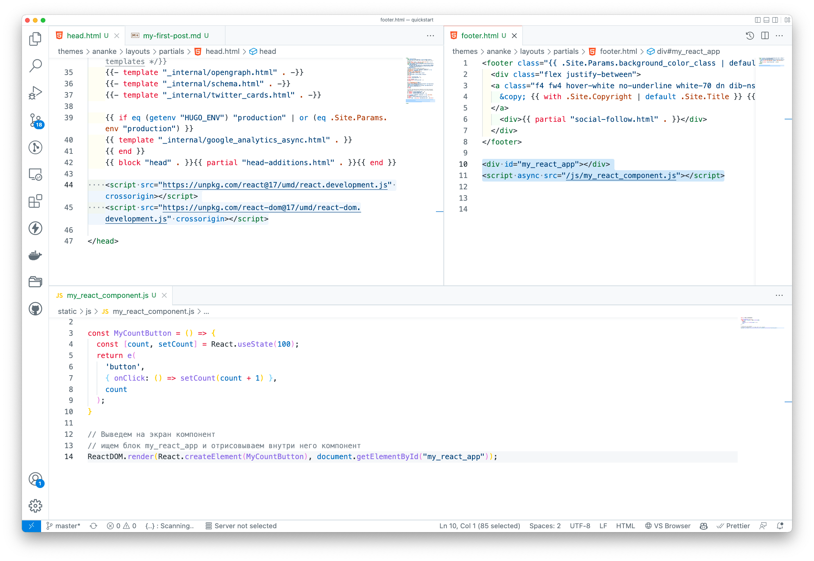

Hugo предлагает подключение различных JS библиотек в проект. Такие изменения влекут за собой полное обновление проекта.
Сегодня мы подключим компонент react без внесения больших изменений.

React - это библиотека. Чтобы она заработала на сайте, необходимо ее подклчюить, а далее воспользоваться внутренними функциями.

## Подключение библиотеки React
В проекте Hugo в шаблонах обновим файл head.html. В моем проекте это шаблон, который содержит основные теги `html и head`.
Открываем `layouts/partials/head.html` и добавляем скрипт в раздел `<head>`:

```html
<!-- ... <head>  ... -->
<!-- Примечание: при деплое на продакшен замените «development.js» на «production.min.js» -->
  <script src="https://unpkg.com/react@17/umd/react.development.js" crossorigin></script>
  <script src="https://unpkg.com/react-dom@17/umd/react-dom.development.js" crossorigin></script>
  <!-- ... </head>  ... -->
```

## Выбор места для отрисовки компонента

Создадим `div` блок в любом шаблоне Hugo, где будем отрисоывать React компонент.
Например файл `layouts/partials/footer.html`

```html
<div id="my_react_app"></div>
```
React будет искать данный блок и отрисует внутри него компонент

## Создание компонента
Вынесем создание компонента в отдельный `js` файл. В Hugo есть директория **static** в корне проекта. Если нету, то можно создать. Подробнее о [static folder](https://gohugo.io/content-management/static-files/)

Создадим файл `static/js/my_react_component.js` и запишем код:
> Важно: сркипт должен подключиться в проекте **после** блока `<div id="my_react_app"></div>`

```js
const e = React.createElement;

const MyCountButton = () => {
  const [count, setCount] = React.useState(100);
  return e(
    'button',
    { onClick: () => setCount(count + 1) },
    count
  );
}

// Выведем на экран компонент
// ищем блок my_react_app и отрисовываем внутри него компонент
ReactDOM.render(React.createElement(MyCountButton), document.getElementById("my_react_app"));
```

## Подключение скрипта с React компонентами

Так как скрипт будет искать div "my_react_app", данный div блок должен быть загружен **до** исполнения скрипта. Поэтому в файле `layouts/partials/footer.html` добавляем скрипт в конец раздела `<body>`:



## Пример


  Нажми на счетчик:
  <div id="_post_my_react_app" style="display:inline-block"  class='inline-block bg-tertiary-bg text-sm rounded px-3 py-1 my-1 me-2 hover:text-eureka' ></div>
  <script>
    const _post_e = React.createElement;

const MyCountButton = () => {
  const [count, setCount] = React.useState(Math.round(Math.random() * 100));
  return _post_e(
    'button',
    { onClick: () => setCount(count + 1) },
    count
  );
}

ReactDOM.render(React.createElement(MyCountButton), document.getElementById("_post_my_react_app"));
</script>



