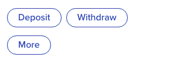
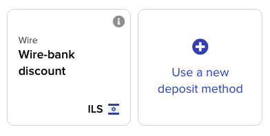
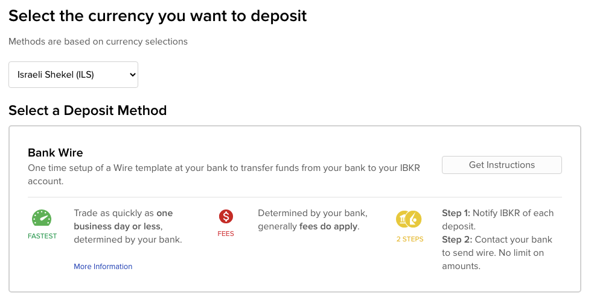
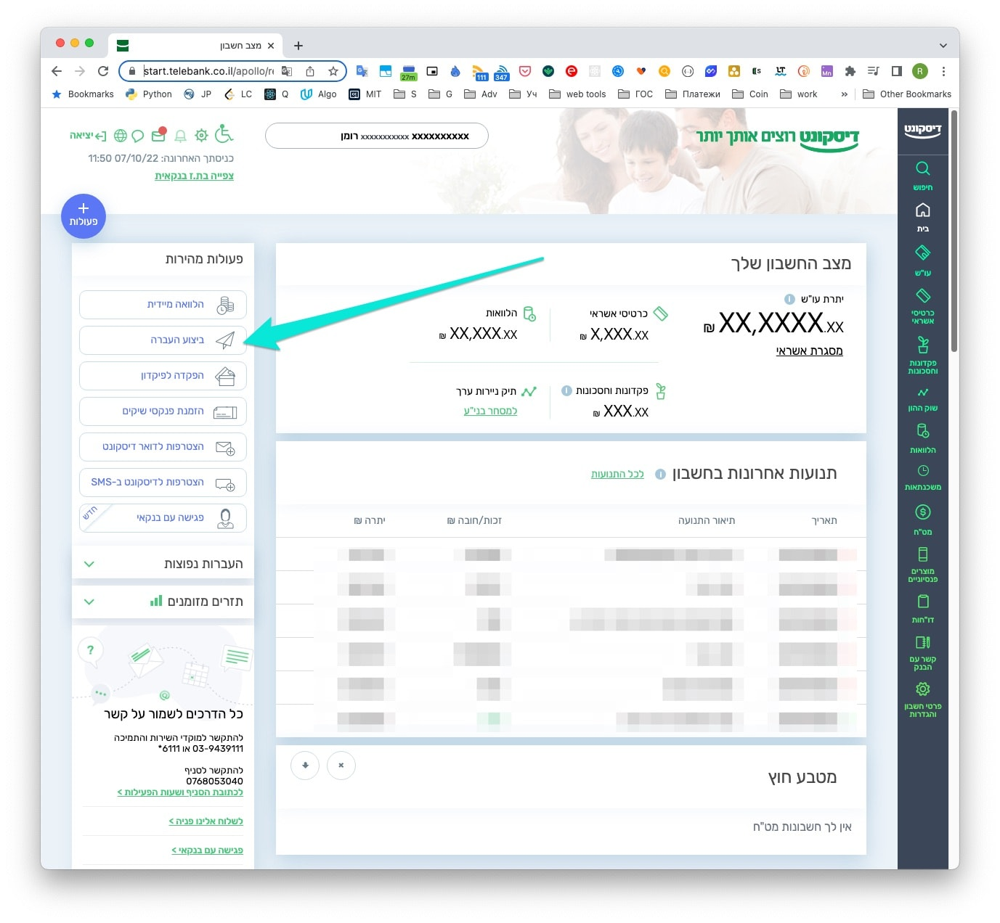
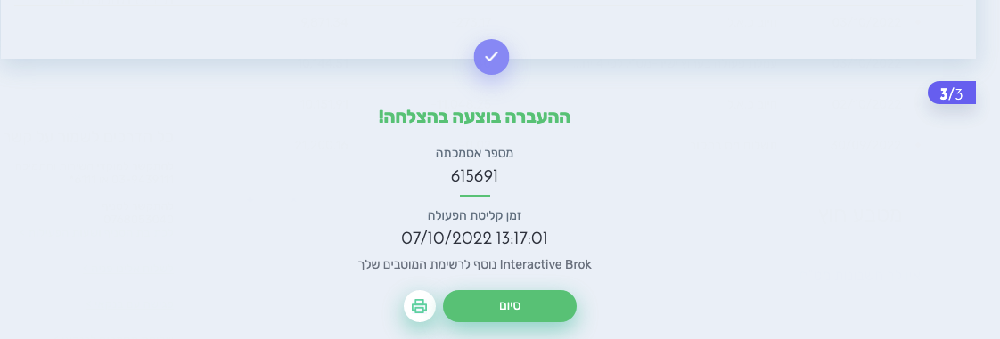

## Web

### Создание заявки в IB

1. Заходим на сайт https://www.interactivebrokers.co.uk/portal/#/
1. Нажимаем [**Deposit**](https://www.interactivebrokers.co.uk/AccountManagement/AmAuthentication?action=FUND_TRANSFERS&type=DEPOSIT)

1. Нажимаем **Use a new deposit method** если ранее шаблон не был создан

4. Bank Wire -> Get instructions

Account Number: Номер банковского счета.

5. Получаем инструкции с реквизитами для пополнения *Bank Wire Instructions*

Эти данные Вам нужны для оплаты в Discount Bank

### Отправить деньги из Discount Bank

1. Заходим в личный кабинет банка [start.telebank.co.il](https://start.telebank.co.il/)

1. Нажимаем: **ביצוע העברה**

1. Заполняем форму

1. Нажимаем **המשך** и жмем далее. Приходит смс с подверждением, вводим и жмем далее

