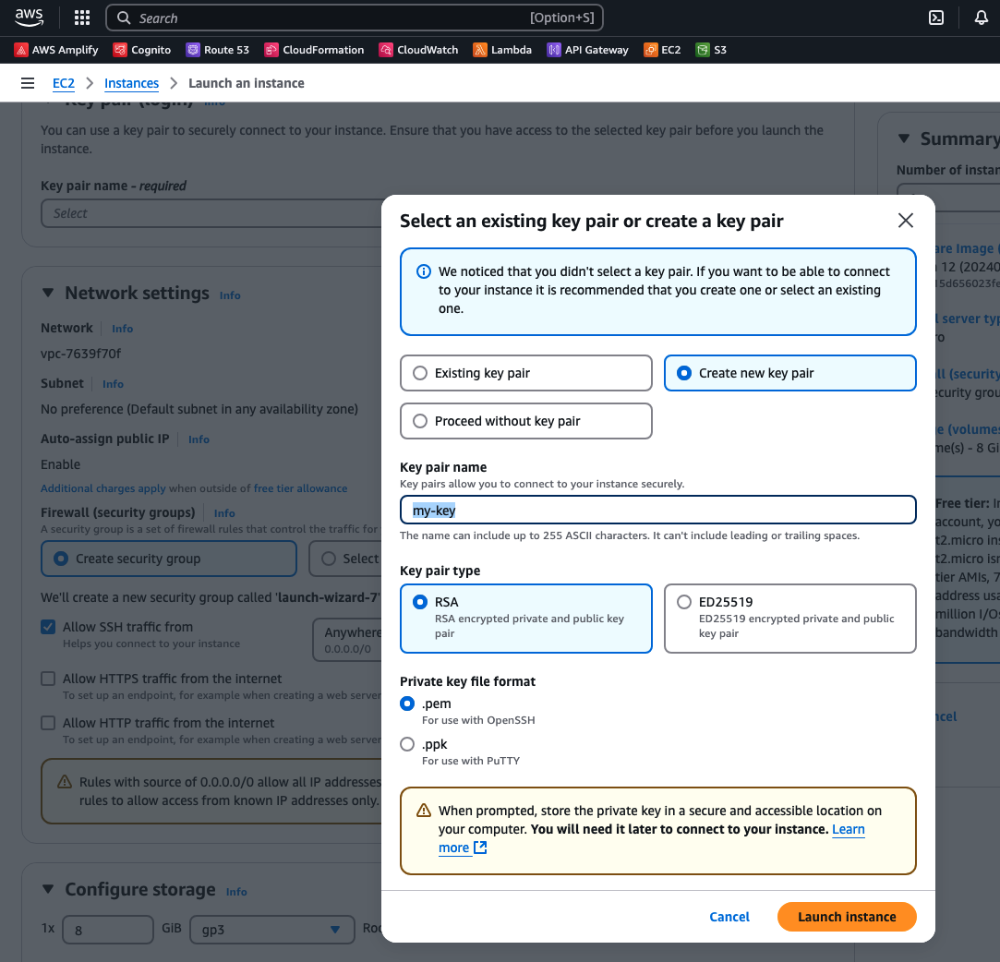
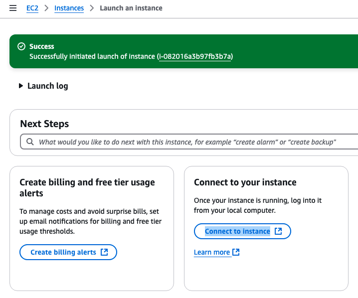
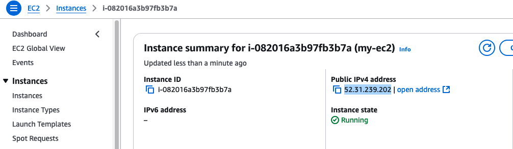

## Step 1: Launch an EC2 Instance

1. **Go to the AWS Console** → Navigate to **EC2**.
2. Click **Launch Instance**.
3. Choose an **AMI** (e.g., Amazon Linux, Ubuntu).
4. Select an **instance type** (e.g., `t2.micro` for free tier).
5. Configure **instance details** (default settings are fine).
6. Add **storage** (default 8GB is sufficient, adjust as needed).
7. Configure **security groups**:
   - Allow **SSH (port 22)** from `My IP` (recommended).
   - Add rules for other services (e.g., HTTP, HTTPS) if needed.
8. Choose or **create a key pair** (important for SSH access).
    
9. Click **Launch**.
    

## Step 2: Connect to EC2 via SSH

### Using a `.pem` Key (Linux/macOS)

1. Move the key to a secure location:

   ```bash
   mv ~/Downloads/my-key.pem ~/.ssh/

2. Set permissions:

    ```bash
    chmod 400 ~/.ssh/my-key.pem
    ```

3. Connect:
    

    ```bash
    ssh -i ~/.ssh/my-key.pem admin@your-ec2-public-ip
    # ssh -i ~/.ssh/my-key.pem admin@52.31.239.202
    ```

- Replace `ec2-user/admin` with `ubuntu` for Ubuntu AMIs.
- Replace your-ec2-public-ip with the instance’s public IP.

### Using PuTTY (Windows)

1. Convert .pem to .ppk using PuTTYgen.
1. Open PuTTY.
1. Under Session, enter your-ec2-public-ip in Host Name.
1. Go to SSH → Auth, load the .ppk file.
1. Click Open.

## Step 3: Configure Automatic SSH Login

### Method 1: Add Key to SSH Agent (Recommended)

1. Start the SSH agent (if required):

    ```bash
    eval "$(ssh-agent -s)"
    ```

2. Add the key:

    ```sh
    ssh-add ~/.ssh/my-key.pem
    ```

3. Now, connect with:

    ```bash
    ssh admin@your-ec2-public-ip
    ```

### Method 2: Add Key to SSH Config File

1. Open (or create) the SSH config file:

    ```bash
    nano ~/.ssh/config
    ```

2. Add the following:

    ```ini
    Host my-ec2
        HostName your-ec2-public-ip
        User ec2-user
        IdentityFile ~/.ssh/my-key.pem
    ```

3. Save and exit (`CTRL+X`, then `Y`, then `ENTER`).
4. Now, connect easily with:

    ```bash
    ssh my-ec2
    ```

## Connected

Once connected:

- [Debian initial Setup](../debian-vps-initial-setup/)
- [Ubuntu initial Setup](../ubuntu-server-initial-setup/)
