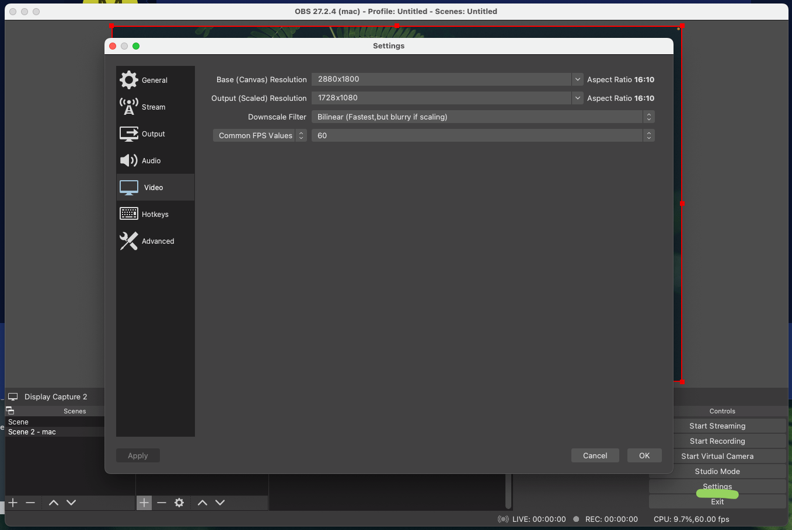

## MacBook Pro Specification

- 13-inch
- Apple M1 Pro M1 2020
- 16 GB RAM
- 512 GB SSD
- QWERTY = English/Hebrew
- macOS Monterey (Update always)


## Homebrew

Install [Homebrew](https://brew.sh) as package manager for macOS:

```bash
## paste in terminal and follow the instructions
/bin/bash -c "$(curl -fsSL https://raw.githubusercontent.com/Homebrew/install/HEAD/install.sh)"
```

Update everything in Homebrew to recent version:

```bash
brew update
```

Add additional [source for casks](https://github.com/Homebrew/homebrew-cask-versions):

```bash
brew tap homebrew/cask-versions
```

Install GUI applications (read more about these in GUI Applications):

```bash
brew install --cask \
  google-chrome  \
  firefox \
  visual-studio-code \
  all-in-one-messenger \
  sublime-text \
  docker \
  rectangle \
  discord \
  vlc \
  figma \
  grammarly \
  macx-youtube-downloader \
  notion \
  postman \
  tor-browser \
  transmission \
  utm \
  viber \
  yandex-disk \
  zoom \
  mongodb-compass \
  disk-inventory-x \
  obs \
  spotify \
  iterm2 \
  deepl
```

Install terminal applications (read more about these in Terminal Applications):

```bash
brew install \
  git \
  ffmpeg \
  nvm \
  jupyterlab
```
## Additional GUI Applications
### Kotatogram
 [Kotatogram](https://kotatogram.github.io/) - Experimental fork of Telegram Desktop. Folders with features

## GUI Applications

### Google Chrome
 [Google Chrome](https://www.google.com/chrome/) (web development, web browsing)
  - Preferences
    - set default browser
    - always show bookmarks
    - import bookmarks from previous machine
  - Chrome Developer Tools
    - Network -> only "Fetch/XHR"
  - Search Shortcuts. Add Shortucts for different search engines. 
    - chrome://settings/searchEngines
    - Yandex, search only in Russia. 
        - Shortcut: `vv`
        - url: `https://yandex.ru/{yandex:searchPath}?text=%s&{yandex:referralID}&lr=101443&rstr=-225`
    - Yutube
      - Shortcut: `yy`
      - url: `https://www.youtube.com/results?search_query=%s&page={startPage?}&utm_source=opensearch`
  - Chrome Extensions
    - [Google Translate](https://chrome.google.com/webstore/detail/google-translate/aapbdbdomjkkjkaonfhkkikfgjllcleb)
    - [DeepL Translate](https://chrome.google.com/webstore/detail/deepl-translate-beta-vers/cofdbpoegempjloogbagkncekinflcnj/related?hl=en) - AI translator
    - [React Developer Tools](https://chrome.google.com/webstore/detail/react-developer-tools/fmkadmapgofadopljbjfkapdkoienihi)
    - [Pocket](https://chrome.google.com/webstore/detail/save-to-pocket/niloccemoadcdkdjlinkgdfekeahmflj)
    - [Session Buddy](https://chrome.google.com/webstore/detail/session-buddy/edacconmaakjimmfgnblocblbcdcpbko) (Manage Browser Tabs and Bokmarks)
    - [LanguageTool](https://chrome.google.com/webstore/detail/grammar-spell-checker-%E2%80%94-l/oldceeleldhonbafppcapldpdifcinji) (multilingual grammar, style, and spell checker)
    - ~~[RSS Feed Reader](https://chrome.google.com/webstore/detail/rss-feed-reader/pnjaodmkngahhkoihejjehlcdlnohgmp) (Easy to subscribe/unsubscribe to blogs/no need email + iOS/Android)~~
    - [Inoreader](https://inoreader.com) (Easy to subscribe/unsubscribe to blogs/no need email + iOS/Android)
    - [30 Seconds of Knowledge](https://chrome.google.com/webstore/search/https%3A%2F%2F30secondsofknowledge.com%2F) (random code snippet on a new tab)
    - [JSON Formatter](https://chrome.google.com/webstore/detail/json-formatter/bcjindcccaagfpapjjmafapmmgkkhgoa)
    - [picture-in-picture](https://chrome.google.com/webstore/detail/picture-in-picture-extens/hkgfoiooedgoejojocmhlaklaeopbecg) (yutube/video above other screens)
### Firefox
[Firefox](https://www.google.com/chrome/) (web development)
### UTM
[UTM](https://mac.getutm.app/) (Virtual machines UI using QEMU)
  - download ubuntu for arm, [doc](https://mac.getutm.app/gallery/ubuntu-20-04)
  - On error with shared folder: *Could not connect: Connection refused* open in browser: http://127.0.0.1:9843/
  - For Debian install `spice-webdavd` for shared folder. https://packages.debian.org/search?keywords=spice-webdavd, https://github.com/utmapp/UTM/issues/1204
```sh
sudo apt install spice-vdagent spice-webdavd -y
```
### Visual Studio Code
[Visual Studio Code](https://code.visualstudio.com/) (web development IDE
### Transmission
 [Transmission](https://www.transmissionbt.com/) (A torrent client that I use. Very minimal in its UI but very powerful and has all the features that I need)
### Sublime Text
[Sublime Text](https://www.sublimetext.com/) (editor)
### Docker
[Docker](https://www.docker.com/products/docker-desktop) (Docker, see [setup](/docker-macos/))
  - used for running databases (e.g. PostgreSQL, MongoDB) in container without cluttering the Mac
  - Preferences
    - enable "Use Docker Compose"
### VLC
[VLC](https://www.videolan.org/vlc/) (video player)
  - use as default for video files
### Maccy
 [Maccy](https://maccy.app/) (clipboard manager)
  - enable "Launch at Login"
### OBS
[OBS](https://obsproject.com/) (for video recording and live streaming)
  - for Native Mac Screen recorder
    - Base (Canvas) 2880x1800 (Ratio: 16:10)
    - Output 1728x1080
    
### Spotify
[Spotify](https://www.spotify.com/)
### Disk Inventory X
[Disk Inventory X](http://www.derlien.com/) (disk usage utility for macOS)
 ## Terminal Applications

### nvm
[nvm](https://github.com/nvm-sh/nvm) (node version manager)
### jupyterlab
[jupyterlab](https://jupyter.org/) (Jupyter - python development, fast code snippets)
  - `jupyter notebook` - to start jupyter notebook
### ffmpeg
[ffmpeg](https://ffmpeg.org/) (Converting video and audio)
  - compress video:
  ```bash
  ffmpeg -i input.mp4 -c:v libx264 -crf 23 -preset slow -c:a aac -b:a 192k output.mp4
  # or
  ffmpeg -i input.mp4 output.avi
  ```
  - convert video to .gif:
  ```bash
  - ffmpeg \
  -i input.mp4 \
  -ss 00:00:00.000 \
  -pix_fmt rgb24 \
  -r 10 \
  -s 960x540 \ 
  -t 00:00:10.000 \
  output.gif
  ```
## NVM for Node/npm

The [node version manager (NVM)](https://github.com/nvm-sh/nvm) is used to install and manage multiple Node versions. After you have installed it via Homebrew in a previous step, type the following commands to complete the installation:

```text
echo "source $(brew --prefix nvm)/nvm.sh" >> ~/.zshrc

source ~/.zshrc
## or alias
## zshsource
```

Now install the latest LTS version on the command line:

```text
nvm install <latest LTS version from https://nodejs.org/en/>
```

Afterward, check whether the installation was successful and whether the [node package manager (npm)](https://www.npmjs.com/) got installed along the way:

```text
node -v && npm -v
```

Update npm to its latest version:

```text
npm install -g npm@latest
```

And set defaults for npm:

```text
npm set init.author.name "your name"
npm set init.author.email "you@example.com"
npm set init.author.url "example.com"
```

If you are a library author, log in to npm too:

```text
npm adduser
```

That's it. If you want to list all your Node.js installation, type the following:

```text
nvm list
```

If you want to install a newer Node.js version, then type:

```text
nvm install <version> --reinstall-packages-from=$(nvm current)
nvm use <version>
nvm alias default <version>
```

Optionally install [yarn](https://yarnpkg.com/) if you use it as alternative to npm:

```text
npm install -g yarn
yarn -v
```
****
If you want to list all globally installed packages, run this command:

```text
npm list -g --depth=0
```

That's it. You have a running version of Node.js and its package manager.

## OH MY ZSH

MacOS already comes with zsh as default shell. Install [Oh My Zsh](https://ohmyz.sh/#install) for an improved (plugins, themes, ...) experience. Oh My Zsh is an open source, community-driven framework for managing your zsh configuration. It comes with a bunch of features out of the box and improves your terminal experience.

Install:

```bash
sh -c "$(curl -fsSL https://raw.github.com/ohmyzsh/ohmyzsh/master/tools/install.sh)"
```

Update everything (e.g. plugins) in Oh My Zsh to recent version:

```bash
omz update
```

Install fonts for themes:

```bash
brew tap homebrew/cask-fonts
brew install --cask font-hack-nerd-font
```

## iTerm2

### Install theme

[Theme description ](https://github.com/romkatv/powerlevel10k#batteries-included)

```bash
brew install romkatv/powerlevel10k/powerlevel10k
echo "source $(brew --prefix)/opt/powerlevel10k/powerlevel10k.zsh-theme" >>~/.zshrc
```

### Enable suggestions
```bash
git clone https://github.com/zsh-users/zsh-autosuggestions ${ZSH_CUSTOM:-~/.oh-my-zsh/custom}/plugins/zsh-autosuggestions
echo "plugins=(zsh-autosuggestions)" >>~/.zshrc
```

Open new tab(CMD+T)/restart iTerm to proceed with theme setup

## Terminal Script and Aliases

Update `.zprofile`. Еhe changes will take effect after restarting the terminal

```bash
vi ~/.zprofile
```

### Automatic software updates

Add script to zprofile that updates everything:

1. Update, upgrade all and cleanup
2. softwareupdate - system software update tool

We can execute this command on strartup, but i prefer handle it. When I kick of `upd` command in terminal, it will update everythin I need:

```bash
alias upd='brew update; brew upgrade; brew cu -a --cleanup -y -v; brew cleanup; softwareupdate -i -a; i'
```

Add aliases to latest versions pip & python

```bash
alias pip=pip3
alias python=python3
```

Final view of .zprofile
```bash
...
alias pip=pip3
alias python=python3
alias upd='omz update; brew update; brew upgrade; brew cu -a --cleanup -y -v; brew cleanup; softwareupdate -i -a; i'
```

## Links
- [https://www.robinwieruch.de/mac-setup-web-development/](https://www.robinwieruch.de/mac-setup-web-development/)
- [https://sourabhbajaj.com/mac-setup/iTerm/ack.html](https://sourabhbajaj.com/mac-setup/iTerm/ack.html)
- [https://www.engineeringwithutsav.com/blog/spice-up-your-macos-terminal](https://www.engineeringwithutsav.com/blog/spice-up-your-macos-terminal)