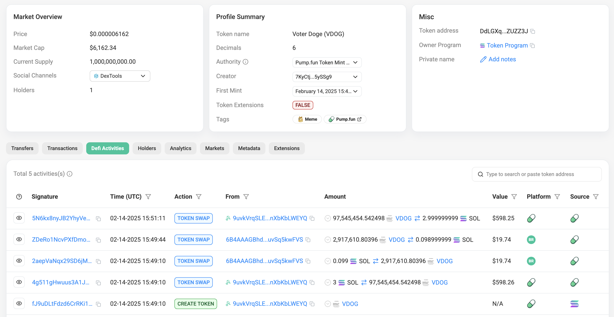

## Что такое Market Cap?

Рыночная капитализация (Market Cap) — это общий объём денег, вложенных в определённую криптовалюту.

Рассчитывается по формуле:

`Market Cap = Цена 1 токена * Общее количество в обращении`

Если, например, у токена в обращении 10_000_000 монет, и каждая стоит 0.01 SOL, то его рыночная капитализация составляет:

$10.000.000 × 0.01 SOl = 100.000 SOL$

## Пример Pump.fun

На примере <https://solscan.io/token/DdLGXqbWa1kcKQFjTkM21DQLsJSMBUzi81JncyZUZZ3J#defiactivities>

При создании нового токена программой установлены фиксированные данные:

- Количество токенов **в резерве** (`vTokensInBondingCurve`): 1073000000 штук
- Количество SOL **в резерве** (Виртуальный пул, Стартовая ликвидность, `vSolInBondingCurve`): 30 SOL
- Количество токенов в пуле (**Mint**, Current Supply): 1_000_000_000
  
1. Пользователь создал токен `VDOG`, и купил токенов (`initialBuy`) на `0` SOL (`solAmount`)

    ```js
    {
        "signature": "fJ9uDLtFdzd6CrRKi1vHqR4AJD4ReBp8rDwoHZ9WVrkLL4xKp3QL2kbpyBxzwfVhyvvDg2bRV7RNVJ1wg2zBwT6",
        "mint": "DdLGXqbWa1kcKQFjTkM21DQLsJSMBUzi81JncyZUZZ3J",
        "traderPublicKey": "9uvkVrqSLEuQSUP2pbtF6Fv7RFJV2wgRwBnXbKbLWEYQ",
        "txType": "create",
        "initialBuy": 0,
        "solAmount": 0,
        "bondingCurveKey": "5CF3dHryaABtcEuPS9tK9HbRqeyLGhtJHFFHyRHXpB1o",
        "vTokensInBondingCurve": 1073000000,
        "vSolInBondingCurve": 30,
        "marketCapSol": 27.958993476234856,
        "name": "Voter Doge",
        "symbol": "VDOG",
        "uri": "https://ipfs.io/ipfs/QmUJjXLRCDCDsTcr9Kv6huezqqg31mPELU7pu7RZoGBJbF",
        "pool": "pump",
        "time": "2025-02-14T15:49:10.774Z"
    }
    ```

    Pump.fun использует модель CLMM (Маркет-мейкер концентрированной ликвидности) по формуле:

    $k = x * k$

    - `x` = SOL в резерве (`vSolInBondingCurve` = 30 SOL)
    - `y` = Токенов в резерве (`vTokensInBondingCurve` = 1,073,000,000 tokens)
    - `k` = Constant product liquidity

    При инициализации токена в Pump.fun, коэффициент `k` можно рассчитать и получается `32190005730`.

   - `vTokensInBondingCurve`: Общее количество токенов в резерве
   - `vSolInBondingCurve`: Общее количество SOL в резерве
   - `marketCapSol`: капитализация в SOL

2. Зная первоначальный объем пула и количество выпущенных токенов, можно узнать примерную начальную цену: `0.000000028 SOL`

    Цена токена:
      - `tokenPriceSol = vSolInBondingCurve / vTokensInBondingCurve`:
      - `tokenPriceSol = 30 / 1073000000 = 0.000000028`
      - Более точная цена в данном случае: `0.00000002795899347623485`

3. Зная цену и реальное количество токенов в пуле (в Pump.fun 1_000_000_000), можно рассчитать рыночную капитализацию (Market Cap):
   - `totalTokensInPool` = 1_000_000_000
   - `marketCapSol = tokenPriceSol * totalTokensInPool`
   - `marketCapSol = 0.00000002795899347623485 * 1_000_000_000 = 27.9589`



1. Следующим шагом происходит покупка `97545454.542498` токена на сумму `3` SOL
   - `vTokensInBondingCurve = vTokensInBondingCurve - 97545454.542498`
   - `vSolInBondingCurve = vSolInBondingCurve + 3`

   Новые значения:
   - `vTokensInBondingCurve = 975454545.457502`
   - `vSolInBondingCurve = 33`
   - `tokenPriceSol = 33 / 975454545.457502 = 0.00000003383038`
   - `marketCapSol = 0.00000003383038 * 1_000_000_000 = 33.83038`

    При первой покупке на 1 SOL цена изменилась на 20%

4.1 Покупка `2917610.80396` токена на `0.099` SOL
   Новые значения:

- `vTokensInBondingCurve = 975454545.457502-2917610.80396 = 972536934.653542`
- `vSolInBondingCurve = 33.099`
- `tokenPriceSol = 33.099 / 972536934.653542 = 0.000000034033668`
- `marketCapSol = 0.000000034033668 * 1_000_000_000 =34.033668`

4.2 Продажа `2917610.80396` токена на `0.0989999` SOL
   Новые значения:

- `vTokensInBondingCurve = 972536934.653542+2917610.80396 = 975454545.457502`
- `vSolInBondingCurve = 33.099-0.0989999 = 33.000000099`
- `tokenPriceSol = 33.000000099 / 975454545.457502 = 0.00000003383038`
- `marketCapSol = 0.00000003383038 * 1_000_000_000 = 33.83038`

4.2 Продажа `97,545,454.542498` токена на `2.999999` SOL
   Новые значения:

- `vTokensInBondingCurve = 975454545.457502+97545454.542498 = 1073000000`
- `vSolInBondingCurve = 33.000000099-2.999999 = 30`
- `tokenPriceSol = 30 / 1073000000 = 0.000000027958`
- `marketCapSol = 0.000000027958 * 1_000_000_000 = 27.958`
