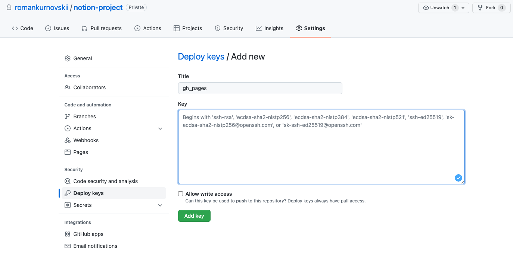
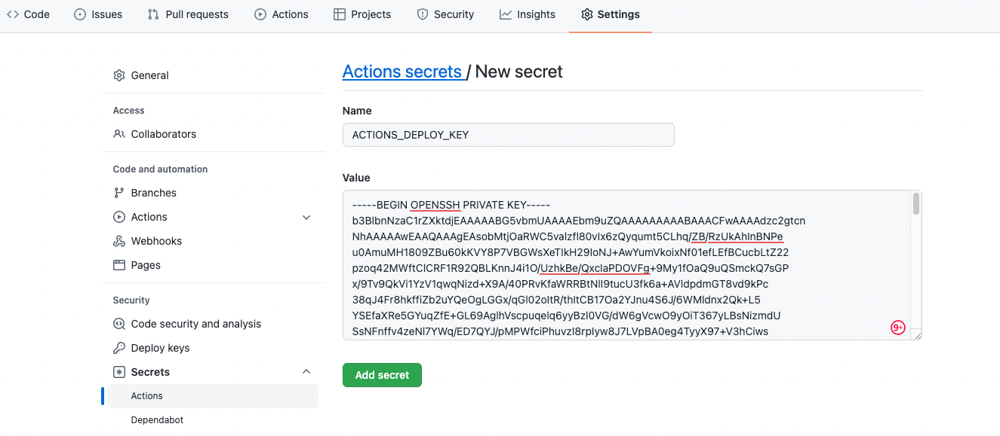
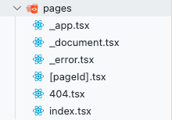

## Подготовка

коммит все предыдущего состояния на случай вынужденного отката

Для того чтобы Actions имели доступ к репозиторию нужно подключить ключи шифрования

## Настройка репозитория

Создаю ключи

```bash
ssh-keygen -t rsa -b 4096 -C "$(git config user.email)" -f gh-pages -N ""
```

Создалось 2 файла с ключами:

- gh-pages - приватный
- gh-pages.pub - публичный

в Репозитории (не профиле)

[https://github.com/romankurnovskii/notion-project/settings/keys](https://github.com/romankurnovskii/notion-project/settings/keys)

Settings → Deploy keys →Add new

из файла [gh-pages.pub](http://gh-pages.pub) вставляю текст публичного ключа



Settings → Secrets

Имя: `ACTIONS_DEPLOY_KEY`

Вставляю приватный ключ из приватного файла gh-pages

[https://github.com/romankurnovskii/notion-project/settings/secrets/actions/new](https://github.com/romankurnovskii/notion-project/settings/secrets/actions/new)



Удаляю ключи файлы чтобы случайно не закоммитить

на гитхабе создаю экшн

[https://github.com/romankurnovskii/notion-project/new/main?filename=.github%2Fworkflows%2Fmain.yml&workflow_template=blank](https://github.com/romankurnovskii/notion-project/new/main?filename=.github%2Fworkflows%2Fmain.yml&workflow_template=blank)

Actions → Create

## Создание Actions

Выбираю стандартный action (Deploy...)

Редактирую нижнюю часть кода

```yaml
- name: Build
        run: |
          npm i
          npm run build
          npm run export
- name: Deploy
        uses: peaceiris/actions-gh-pages@v3
        with:
          deploy_key: ${{ secrets.ACTIONS_DEPLOY_KEY }}
          publish_dir: ./out
```

npm run export - для создания статических файлов (добавлю позже)

ACTIONS_DEPLOY_KEY - название ключа, что создал ранее

peaceiris/actions-gh-pages@v3 - action из другого популярного репозитория. Ссылаюсь на него.

Итого код:

```yaml
name: Deploy to Github Pages

on:
  push:
    branches:
      - main

  workflow_dispatch:

jobs:
  deployment:
    runs-on: ubuntu-latest

    steps:
      - uses: actions/checkout@v2

      - name: Setup Node
        uses: actions/setup-node@v3
        with:
          node-version: "lts/*"
          cache: "npm"

      - name: Build
        run: |
          npm i
          npm run build
          npm run export
      - name: Deploy
        uses: peaceiris/actions-gh-pages@v3
        with:
          deploy_key: ${{ secrets.ACTIONS_DEPLOY_KEY }}
          publish_dir: ./out
```

открыть package.json

найти поле scripts, если нет создать:

```jsx
{
...,

  "scripts": {
    "dev": "next dev",
    "build": "next build",
    "start": "next start",
    "deploy": "vercel --prod",
    "export": "next export"
},
...
}
```

Если `npm run build && npm run export` отработала, то хорошо

## Отладка

Не отработала, ошибка:

```jsx
info  - Copying "static build" directory
info  - No "exportPathMap" found in "next.config.js". Generating map from "./pages"
Error: Image Optimization using Next.js' default loader is not compatible with `next export`.
  Possible solutions:
    - Use `next start` to run a server, which includes the Image Optimization API.
    - Use any provider which supports Image Optimization (like Vercel).
    - Configure a third-party loader in `next.config.js`.
    - Use the `loader` prop for `next/image`.
  Read more: https://nextjs.org/docs/messages/export-image-api
```

[https://nextjs.org/docs/api-reference/next.config.js/exportPathMap](https://nextjs.org/docs/api-reference/next.config.js/exportPathMap)

пример кода из документации

```jsx
module.exports = {
  exportPathMap: async function (
    defaultPathMap,
    { dev, dir, outDir, distDir, buildId }
  ) {
    return {
      "/": { page: "/" },
      "/about": { page: "/about" },
      "/p/hello-nextjs": { page: "/post", query: { title: "hello-nextjs" } },
      "/p/learn-nextjs": { page: "/post", query: { title: "learn-nextjs" } },
      "/p/deploy-nextjs": { page: "/post", query: { title: "deploy-nextjs" } },
    };
  },
};
```

мой:

```jsx
module.exports = withBundleAnalyzer({
  images: {
    domains: ["pbs.twimg.com"],
  },
});
```



Редактирую \***\*[next.config.js](https://github.com/romankurnovskii/notion-project)\*\***

Добавляю:

```jsx
const repoName = '/notion-project'
module.exports = {
    basePath: repoName,
    assetPrefix: repoName,
...
```

[https://github.com/romankurnovskii/notion-project/blob/main/next.config.js](https://github.com/romankurnovskii/notion-project/blob/main/next.config.js)

Проблема с установкой зависимости вовремя использованя npm установщика. Буду использовать yarn потому что он пропускает минорные уведомления для меня кажется более стабильным.

Пока разбирался с проблемы запуска экшенов и настройками нашёл новые экшены и без использования ключа. Обновлю код

После того как я редактирую данные нужен они не меняются на сайте. Не меняются потому что гитхаб создаёт статические файлы, то есть нужно заново сделать новый билд. Для меня моментальные изменения не критичны поэтому я поставлю задачу билда повторяться каждый день в 7:00 утра

Добавляю код в yaml файл

```yaml
on:
push:
branches: [main]
schedule:
  - cron: "0 7 * * *" ## every day 7 am
```

Итоговый результат

[https://github.com/romankurnovskii/notion-project/blob/main/.github/workflows/main.yml](https://github.com/romankurnovskii/notion-project/blob/main/.github/workflows/main.yml)

```yaml
lines (32 sloc)  867 Bytes
name: Deploy to GitHub Pages

on:
  push:
    branches: [main]
  schedule:
    - cron: "0 7 * * *" ## every day 7 am
jobs:
  build:
    runs-on: ubuntu-latest

    strategy:
      matrix:
        node-version: [14.x]

    steps:
      - name: Get files
        uses: actions/checkout@v2
      - name: Use Node.js ${{ matrix.node-version }}
        uses: actions/setup-node@v2
        with:
          node-version: ${{ matrix.node-version }}
      - name: Install packages
        run: yarn install
      - name: Build project
        run: yarn run build

      - name: Export static files
        run: yarn run export

      - name: Add .nojekyll file
        run: touch ./out/.nojekyll
      - name: Deploy
        uses: JamesIves/github-pages-deploy-action@4.1.1 #third party github actions / ok to use
        with:
          branch: gh-pages
          folder: out
```

После тестового комитета и билда получаю 2 проблемы:

- Стилей нет, картинки не подгружены
- Ссылки не работают

Next.js ожидает адрес вида https://username.github.io/

А у меня в конце ещё добавляется репозиторий. Т.е. добавился ещё один уровень в пути

```yaml
- name: Deploy
        uses: JamesIves/github-pages-deploy-action@4.1.1 #third party github actions / ok to use
        with:
          branch: gh-pages
          folder: out
- name: Add .nojekyll file
        run: touch ./out/.nojekyll
```

## Источники

- <a href="https://wallis.dev/blog/deploying-a-next-js-app-to-github-pages" target="_blank">https://wallis.dev/blog/deploying-a-next-js-app-to-github-pages</a>
- <a href="https://gregrickaby.blog/article/nextjs-github-pages" target="_blank">https://gregrickaby.blog/article/nextjs-github-pages</a>
- <a href="https://medium.com/@anotherplanet/git-tips-next-js-github-pages-2dbc9a819cb8" target="_blank">https://medium.com/@anotherplanet/git-tips-next-js-github-pages-2dbc9a819cb8</a>
- <a href="https://www.linkedin.com/pulse/deploy-nextjs-app-github-pages-federico-antu%C3%B1a" target="_blank">https://www.linkedin.com/pulse/deploy-nextjs-app-github-pages-federico-antu%C3%B1a</a>
