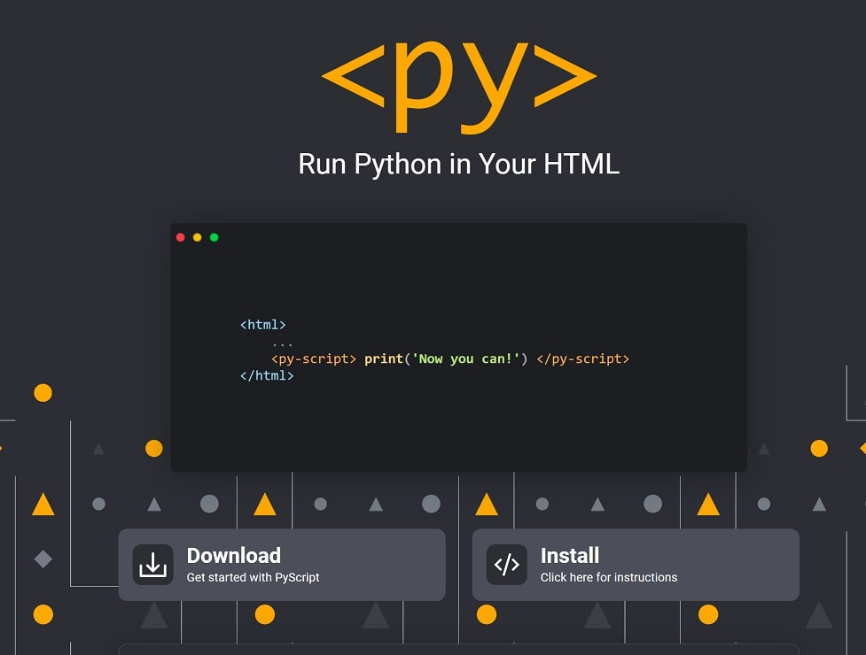
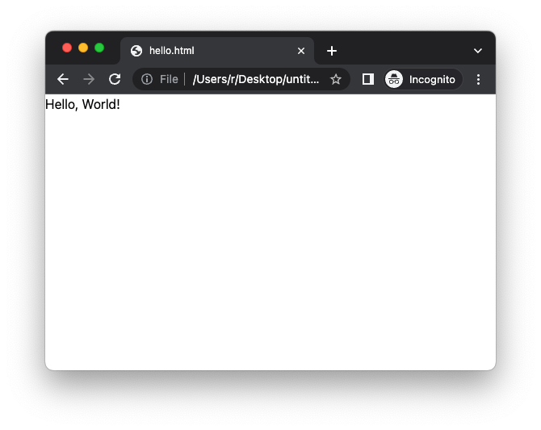
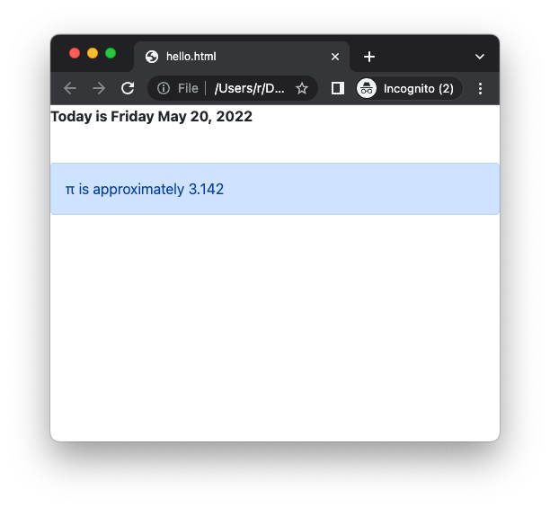

## PyScript

[PyScript](https://pyscript.net/) - средство запуска Python в браузере, встроенное в HTML, был анонсирован на мероприятии PyCon в Солт-Лейк-Сити, США.

_Кнопка `Instl` здесь для шутки, так как установка не требуется_

PyScript зависит от существующего проекта Pyodide, который является скомпилированным в WebAssembly интерпретатором CPython 3.8, позволяющим запускать Python в браузере, а также скомпилированных научных пакетов Python.

Связывание с файлами библиотеки CSS и JavaScript PyScript позволяет разработчикам встраивать код Python с помощью тега `<py-script>`, а также компонент `<py-repl>` (Read, Evaluate, Print, Loop), который позволяет Python печатать и выполняться динамически.

PyScript является открытым исходным кодом с использованием лицензии Apache 2.0.

Согласно сайту проекта, цели включают в себя включение Python в браузере без настройки на стороне сервера, запуск популярных пакетов Python, двунаправленную связь между JavaScript и Python и визуальную разработку с использованием «легкодоступных контролируемых компонентов пользовательского интерфейса, таких как кнопки, контейнеры, текстовые поля и многое другое».

Упрощение использования в браузере порадует не только ученых, разрабатывающих аналитические приложения, но и программистов любого профиля, ищущих альтернативу JavaScript — хотя разработчики проекта предупреждают, что это «чрезвычайно экспериментальный проект» и что он только проверен в веб-браузере Google Chrome.

> Please be advised that PyScript is very alpha and under heavy development. There are many known issues, from usability to loading times, and you should expect things to change often. We encourage people to play and explore with PyScript, but at this time we do not recommend using it for production.

## Туториал PyScript

Попробуем скачать, настроить и запустить приложение PyScript в браузере.

### Рабочая среда

Разработчики PyScript пишут, что для работы не требуется никакой среды разработки, кроме веб-браузера. Попробуем запустить в Chrome.

### Установка

Можно скачать весь пакет с [сайта](https://pyscript.net/), но будем использовать скрипт, с сервера pyscript.net

### Hello World

Создаем файл hello.html

```html
<html>
  <head>
    <link rel="stylesheet" href="https://pyscript.net/latest/pyscript.css" />
    <script defer src="https://pyscript.net/latest/pyscript.js"></script>
  </head>
  <body> <py-script> print('Hello, World!') </py-script> </body>
</html>
```

Тег `<py-script>` расположен внутри HTML body. Внутри этого тега будем пиcать Python код.

Откроем файл в браузере


Работает!

### Тег py-script

Тег `<py-script>` позволяет писать многострочный код

```html
<html>
<head>
    <link rel="stylesheet" href="https://pyscript.net/latest/pyscript.css" />
    <script defer src="https://pyscript.net/latest/pyscript.js"></script>
</head>

<body>
    <py-script>
      print("Let's compute π:")
      def compute_pi(n):
          pi = 2
          for i in range(1,n):
            pi *= 4 * i ** 2 / (4 * i ** 2 - 1)
          return pi

      pi = compute_pi(100000)
      s = f"π is approximately {pi:.3f}"
      print(s)
    </py-script>
</body>
</html>
```

Важно соблюдать отступы в самом блоке Python. Но Начальную строку кода можно начинать и с начала строки

```html
<html>
<head>
    <link rel="stylesheet" href="https://pyscript.net/latest/pyscript.css" />
    <script defer src="https://pyscript.net/latest/pyscript.js"></script>
</head>

<body>
    <py-script>
print("Let's compute π:")
def compute_pi(n):
    pi = 2
    for i in range(1,n):
      pi *= 4 * i ** 2 / (4 * i ** 2 - 1)
    return pi

pi = compute_pi(100000)
s = f"π is approximately {pi:.3f}"
print(s)
    </py-script>
</body>
</html>
```

#### Запись внутри HTML элементов

В приведенном выше примере у нас был один тег `<py-script>`, выводящий одну или несколько строк на страницу по порядку.
Внутри `<py-script>` есть доступ к модулю pyscript, который предоставляет метод .write() для отправки строк в помеченные элементы на странице.

Например, мы добавим некоторые элементы стиля и предоставим заполнители для тега `<py-script>` для записи.

```html
<html>
    <head>
      <link rel="stylesheet" href="https://pyscript.net/latest/pyscript.css" />
      <script defer src="https://pyscript.net/latest/pyscript.js"></script>
      <link href="https://cdn.jsdelivr.net/npm/bootstrap@5.1.3/dist/css/bootstrap.min.css" rel="stylesheet" crossorigin="anonymous">
    </head>

  <body>
    <b><p>Today is <u><label id='today'></label></u></p></b>
    <br>
    <div id="my-custom-pi" class="alert alert-primary"></div>
    <py-script>
import datetime as dt
pyscript.write('today', dt.date.today().strftime('%A %B %d, %Y'))

def compute_pi(n):
    pi = 2
    for i in range(1,n):
        pi *= 4 * i ** 2 / (4 * i ** 2 - 1)
    return pi

pi = compute_pi(100000)
pyscript.write('my-custom-pi', f'π is approximately {pi:.3f}')
    </py-script>
  </body>
</html>
```




### Тег py-env

В дополнение к стандартной библиотеке Python и модулю pyscript, многие сторонние пакеты работают с PyScript. Чтобы их использовать, нужно объявить зависимости с помощью тега `<py-env>` в заголовке HTML. Вы также можете ссылаться на файлы `.whl` прямо на диске

```html
<py-env>
 - './static/wheels/travertino-0.1.3-py3-none-any.whl'
 - './static/wheels/my-other-package-0.0.1-py3-none-any.whl'
</py-env>
<py-script>
  #my python code ...
</py-script>
```

**Пример с NumPy**

```html
<html>
    <head>
      <link rel="stylesheet" href="https://pyscript.net/latest/pyscript.css" />
      <script defer src="https://pyscript.net/latest/pyscript.js"></script>
      <py-env>
        - numpy
        - matplotlib
      </py-env>
    </head>

  <body>
    <h1>Let's plot random numbers</h1>
    <div id="plot"></div>
    <py-script output="plot">
import matplotlib.pyplot as plt
import numpy as np

x = np.random.randn(1000)
y = np.random.randn(1000)

fig, ax = plt.subplots()
ax.scatter(x, y)
fig
    </py-script>
  </body>
</html>
```

#### Импорт локальный модулей

Мы также можем использовать собсвтенные модули, которые импортируем внутри тега `<py-script>`

Например, создадим файл `data.py' и запишем в него собственную функцию

```python
# data.py
import numpy as np

def make_x_and_y(n):
    x = np.random.randn(n)
    y = np.random.randn(n)
    return x, y
```

Внутри тега `<py-env>` добавим стандартные модули и путь до нашего локального модуля

```html
<html>
    <head>
      <link rel="stylesheet" href="https://pyscript.net/latest/pyscript.css" />
      <script defer src="https://pyscript.net/latest/pyscript.js"></script>
      <py-env>
        - numpy
        - matplotlib
        - paths:
          - /data.py
      </py-env>
    </head>

  <body>
    <h1>Let's plot random numbers</h1>
    <div id="plot"></div>
    <py-script output="plot">
import matplotlib.pyplot as plt
from data import make_x_and_y

x, y = make_x_and_y(n=1000)

fig, ax = plt.subplots()
ax.scatter(x, y)
fig
    </py-script>
  </body>
</html>
```

### Тег py-repl

Тег `<py-repl>` создает компонент REPL(Read–eval–print loop), который отображается на странице как редактор кода, что позволяет писать исполняемый код в строке.

### Тег py-config

Тег `<py-config>` используется для установки и настройки общих метаданных о вашем приложении PyScript в формате YAML.

```html
<py-config>
  - autoclose_loader: false
  - runtimes:
    -
      src: "https://cdn.jsdelivr.net/pyodide/v0.20.0/full/pyodide.js"
      name: pyodide-0.20
      lang: python
</py-config>
```

### Тег py-title

Тег визуального отображения. Добавляет компонент заголовка статического текста, который стилизует текст внутри тега как заголовок страницы.

### Тег py-box

Создает объект-контейнер, который можно использовать для размещения одного или нескольких визуальных компонентов, определяющих, как элементы `<py-box>` должны выравниваться и отображаться на странице.

### Тег py-inputbox

Позволяет вставить окно с текстовым полем

### Тег py-button

Добавляет кнопку, к которой авторы могут добавлять метки и обработчики событий для действий на кнопке, таких как on_focus или on_click.

## Ресурсы
- [Примеры использования PyScript](https://pyscript.net/examples/)
- [Вопросы по PyScript](https://community.anaconda.cloud/c/tech-topics/pyscript/)
