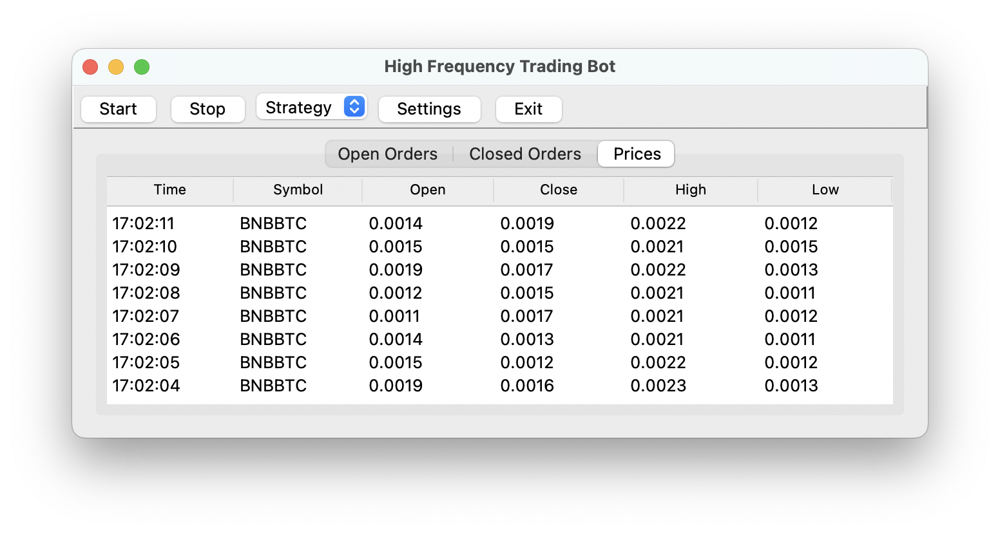

The journey towards creating a light trading bot framework begins with a simple, intuitive graphical user interface (GUI). For this venture, I have chosen to rely on Python's built-in [Tkinter](https://docs.python.org/3/library/tkinter.html) library to provide the fundamental building blocks for my GUI.

## Embracing Simplicity

The initial goal is to keep the GUI as straightforward as possible, focusing on the core functionalities required for a trading bot. The main elements incorporated are:

- Start/Stop Buttons: These allow the user to control the operation of the bot.
- Strategy Selection: An option to switch between different trading strategies.
- Market Price Stream: A live feed displaying the current market prices.

## Harnessing the Power of Tkinter

Tkinter, being a standard Python interface to the Tk GUI toolkit, offers the simplicity and versatility needed for this project. It provides an array of widgets and methods to create and manage the GUI with relative ease.

## Observer Pattern

To handle specific requests from the GUI and manage updates, I'll be integrating the observer pattern into the framework. This design pattern promotes a well-organized, flexible structure that will prove invaluable as the project progresses.

## Moving Forward

This is just the beginning. The GUI, while a crucial component, is merely the first step in the development of this lightweight trading bot framework. I'm looking forward to the journey ahead, as we dive deeper into the implementation and further enhance the features of the bot.

This is how this template looks like now:

