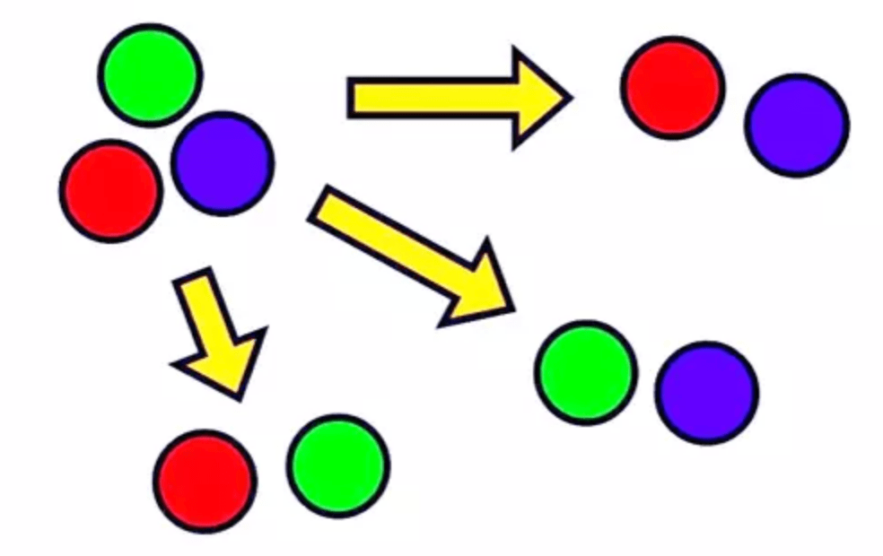

## Combinatorics

Combinatorics is the study of counting, arranging, and selecting discrete objects. It deals with problems that involve combinations, permutations, and the principles of counting. Combinatorics is used in problems, especially involving optimization or enumeration.

### Concepts

### Permutations

A permutation is an arrangement of objects in a specific order. The number of possible permutations of `n` objects is `n!` (factorial of `n`).

### Combinations

A combination is a selection of objects without considering the order. The number of combinations of `n` objects taken `r` at a time is given by the binomial coefficient: $$C(n, r) = n! / (r! * (n-r)!)$$

Imagine you have a set of distinct objects, like fruits. Let's say you have a **banana**, an **apple**, and an **orange**. You want to make a fruit salad, but you only have **room for two fruits**. How many different fruit salads can you make?

<div style="display: flex;">
    
    <div style="margin-left: 20px; margin-top: 30px">
        <mark>Combinations are a way to count the number of possible selections of objects (in this case, fruits) without considering the order. The order doesn't matter because, in a fruit salad, having a banana first and an apple second is the same as having an apple first and a banana second.</mark>
    </div>
</div>

In this example, we have 3 objects (`n = 3`) and we want to select 2 of them (`r = 2`). To calculate the number of possible combinations, we use the binomial coefficient formula: $$C(n, r) = n! / (r! * (n-r)!)$$

In our example, `n = 3` and `r = 2`, so the formula becomes:

$$C(3, 2) = 3! / (2! * (3-2)!)$$

Factorials (denoted by the exclamation mark) are a way to multiply a number by all the positive integers less than or equal to that number. For example:

```
3! = 3 * 2 * 1 = 6
2! = 2 * 1 = 2
1! = 1
```

Formula becomes $C(3, 2) = 6 / (2 * 1) = 3$

So, there are 3 different fruit salads you can make: **banana-apple**, **banana-orange**, and **apple-orange**.

To summarize, combinations help us count the number of ways to select a certain number of objects from a larger set without considering the order of the objects. The binomial coefficient formula, $C(n, r) = n! / (r! * (n-r)!)$, allows us to calculate the number of possible combinations.

### Pigeonhole Principle

- [Wikipedia](https://en.wikipedia.org/wiki/Pigeonhole_principle)

If `n` items are put into `m` containers, and `n > m`, then at least one container must contain more than one item. This principle is often used to prove the existence of a solution.

Inclusion-Exclusion Principle: This principle is used to count the number of elements in the union of several sets. It helps avoid overcounting by considering the intersections of the sets.

<div style="display: flex;">
    
    <div style="margin-left: 20px; margin-top: 30px">
        <mark><b>Pigeons in holes.</b></mark></br>
        <mark>Pigeons in holes. Here there are n = 10 pigeons in m = 9 holes. Since 10 is greater than 9, the pigeonhole principle says that at least one hole has more than one pigeon. (The top left hole has 2 pigeons.)</mark>
    </div>
</div>

### Inclusion-Exclusion Principle

<div style="display: flex;">
    
    <div style="margin-left: 20px; margin-top: 30px">
        <mark>This principle is used to count the number of elements in the union of several sets. It helps avoid overcounting by considering the intersections of the sets.</mark>
    </div>
</div>

Imagine you have two groups of students. **Group A** has **30** students who like pizza, and **Group B** has **20** students who like burgers. However, **10** students like **both** pizza and burgers.

Now, you want to find out **how many students like either pizza or burgers**.

You might think of adding the number of students who like pizza to the number of students who like burgers: `30 + 20 = 50`. But this would overcount the students who like both pizza and burgers because they are counted twice.

This is where the *Inclusion-Exclusion Principle* comes in. It helps us avoid overcounting by considering the **intersections of the sets**. The principle states that to find the total number of students who like either pizza or burgers, we should subtract the number of students who like both pizza and burgers from the sum of students in Group A and Group B:

`Total students = Students in Group A + Students in Group B - Students in both groups`

In our example:

Total students = `30 (Group A) + 20 (Group B) - 10 (both) = 40`

So, 40 students like either pizza or burgers.

In general, the Inclusion-Exclusion Principle can be extended to more than two sets. It involves including the number of elements in each set, then subtracting the number of elements in each pair of sets' intersection, adding back the number of elements in each triple of sets' intersection, and so on.

In summary, the Inclusion-Exclusion Principle helps us **count the number of elements in the union of several sets by considering the intersections of the sets and avoiding overcounting.**

## Problemset

1. 1777A - Everybody Likes Good Arrays! (greedy, math, 800)
1. 1787A - Exponential Equation (constructive algorithms, math, 800)
1. 1777B - Emordnilap (combinatorics, greedy, math, 900)
1. 1773F - Football (constructive algorithms, 800)
1. 1774A - Add Plus Minus Sign (constructive algorithms, math, 800)
1. 1776A - Walking Boy (greedy, 800)
1. 1776L - Controllers (binary search, math, 1500)
