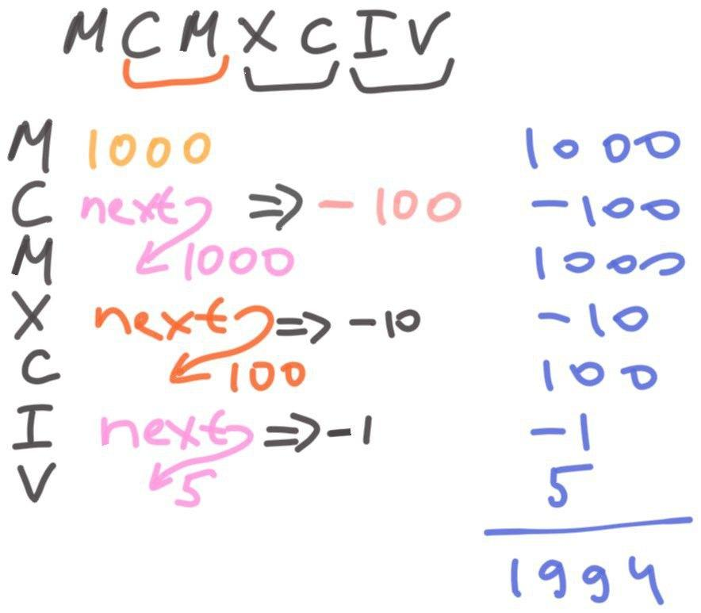

[LeetCode problem](https://leetcode.com/problems/roman-to-integer/)

Roman numerals are represented by seven different symbols: `I`, `V`, `X`, `L`, `C`, `D` and `M`.

    Symbol       Value
    I             1
    V             5
    X             10
    L             50
    C             100
    D             500
    M             1000

For example, `2` is written as `II` in Roman numeral, just two ones added together. 12 is written as `XII`, which is simply `X + II`. The number 27 is written as `XXVII`, which is `XX + V + II`.

Roman numerals are usually written largest to smallest from left to right. However, the numeral for four is not `IIII`. Instead, the number four is written as IV. Because the one is before the five we subtract it making four. The same principle applies to the number nine, which is written as IX. There are six instances where subtraction is used:

I can be placed before `V` (5) and `X` (10) to make 4 and 9.
X can be placed before `L` (50) and `C` (100) to make 40 and 90.
C can be placed before `D` (500) and `M` (1000) to make 400 and 900.

Given a roman numeral, convert it to an integer.

**Example 1:**

    Input: s = "III"
    Output: 3
    Explanation: III = 3.

**Example 2:**

    Input: s = "MCMXCIV"
    Output: 1994
    Explanation: M = 1000, CM = 900, XC = 90 and IV = 4.

## First accepted



```python
class Solution:
    def romanToInt(self, s: str) -> int:
        dict = {'I':1,'V':5,'X':10,'L':50,'C':100,'D':500,'M':1000}
        n_sum = 0
        prev = 0
        for c in reversed(s):
            n = dict[c]
            n = -n if n in (1,10,100) and prev in (n*5, n*10) else n
            n_sum += n
            prev = abs(n)
        return n_sum
```
