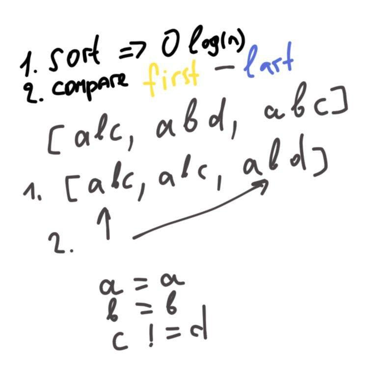

[LeetCode problem](https://leetcode.com/problems/longest-common-prefix/)

Write a function to find the longest common prefix string amongst an array of strings.

If there is no common prefix, return an empty string `""`.

**Example 1:**

    Input: strs = ["flower","flow","flight"]
    Output: "fl"

**Example 2:**

    Input: strs = ["dog","racecar","car"]
    Output: ""
    Explanation: There is no common prefix among the input strings.

## First accepted

**Idea:**



```python
class Solution:
    def longestCommonPrefix(self, strs: List[str]) -> str:
        strs.sort()
        l = strs[0]
        r = strs[-1]
        if l == r:
            return l
        res = ""
        for i in range(0, len(l)):
            if l[i] == r[i]:
                res += l[i]
            else:
                return res
        return res
```
