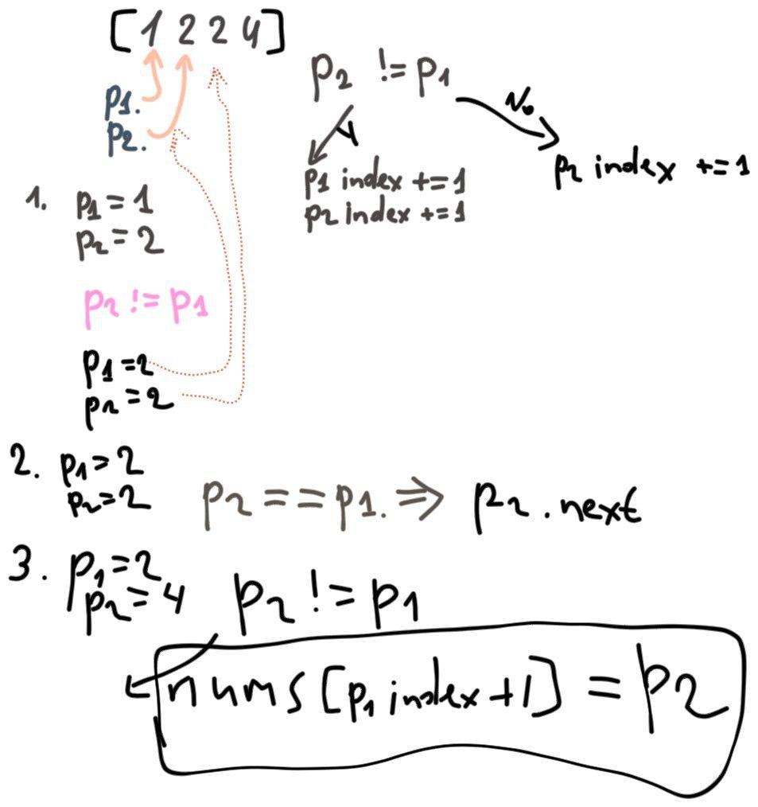

[LeetCode problem](https://leetcode.com/problems/remove-duplicates-from-sorted-array/)

Given an integer array `nums` sorted in non-decreasing order, remove the duplicates in-place such that each unique element appears only once. The relative order of the elements should be kept the same.

Since it is impossible to change the length of the array in some languages, you must instead have the result be placed in the first part of the array `nums`. More formally, if there are k elements after removing the duplicates, then the first k elements of `nums` should hold the final result. It does not matter what you leave beyond the first k elements.

Return k after placing the final result in the first k slots of `nums`.

Do not allocate extra space for another array. You must do this by modifying the input array in-place with O(1) extra memory.

Custom Judge:

The judge will test your solution with the following code:

    int[] nums = [...]; // Input array
    int[] expectedNums = [...]; // The expected answer with correct length

    int k = removeDuplicates(nums); // Calls your implementation

    assert k == expectedNums.length;
    for (int i = 0; i < k; i++) {
        assert nums[i] == expectedNums[i];
    }

If all assertions pass, then your solution will be accepted.

**Example 1:**

    Input: nums = [1,1,2]
    Output: 2, nums = [1,2,_]
    Explanation: Your function should return k = 2, with the first two elements of nums being 1 and 2 respectively.
    It does not matter what you leave beyond the returned k (hence they are underscores).

**Example 2:**

    Input: nums = [0,0,1,1,1,2,2,3,3,4]
    Output: 5, nums = [0,1,2,3,4,_,_,_,_,_]
    Explanation: Your function should return k = 5, with the first five elements of nums being 0, 1, 2, 3, and 4 respectively.
    It does not matter what you leave beyond the returned k (hence they are underscores).


## First accepted

**Idea:**



```python
class Solution:
    def removeDuplicates(self, nums: List[int]) -> int:
        k = 1
        if len(nums) == 1:
            return k
        
        p1 = 0
        p2 = 1
        
        while p2 < len(nums):
            if nums[p1] == nums[p2]:
                p2 += 1
            else:
                p1 += 1
                nums[p1] = nums[p2]
                p2 += 1
                k += 1
        
        return k
```

## Better solution

```python
class Solution:
    def removeDuplicates(self, nums: List[int]) -> int:
        if len(nums) == 1:
            return 1
        
        k = 1
        i = 1
        for n in nums:
            if nums[i-1] != n:
                nums[i] = n
                i += 1
                k += 1
        
        return k
```
