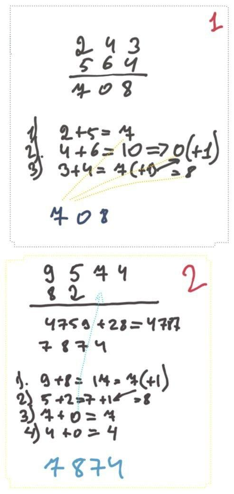

You are given two non-empty linked lists representing two non-negative integers. The digits are stored in reverse order, and each of their nodes contains a single digit. Add the two numbers and return the sum as a linked list.

You may assume the two numbers do not contain any leading zero, except the number 0 itself.

**Example 1:**

    Input: l1 = [2,4,3], l2 = [5,6,4]
    Output: [7,0,8]
    Explanation: 342 + 465 = 807.

## First accepted

**Idea:**

1. Loop through lists
2. add each value to the list
3. reverse list
4. calculate sum
5. create linked list from reversed sum

```python
class Solution:
    def addTwoNumbers(self, l1: Optional[ListNode], l2: Optional[ListNode]) -> Optional[ListNode]:

        def createLinkedNode(values):
            head = ListNode(values[0])
            current = head
            for i in values[1:]:
                node = ListNode(i)
                current.next = node
                current = current.next
            return head
        

        res = None

        vals_l1 = []
        cur = l1
        while cur:
            vals_l1.append(cur.val)
            cur = cur.next

        vals_l2 = []
        cur = l2
        while cur:
            vals_l2.append(cur.val)
            cur = cur.next

        s_l1 = ''
        for i in reversed(vals_l1):
            s_l1 += str(i)

        s_l2 = ''
        for i in reversed(vals_l2):
            s_l2 += str(i)

        ll_sum = int(s_l1) + int(s_l2)
        values = []
        for val in reversed(str(ll_sum)):
            values.append(int(val))

        res = createLinkedNode(values)
        return res
```

## Better solution


**Idea:**

Just like how you would sum two numbers on a piece of paper.



```python
class Solution:
    def addTwoNumbers(self, l1: Optional[ListNode], l2: Optional[ListNode]) -> Optional[ListNode]:
        dummyHead = ListNode(0)
        curr = dummyHead
        carry = 0
        while l1 != None or l2 != None or carry != 0:
            l1Val = l1.val if l1 else 0
            l2Val = l2.val if l2 else 0
            columnSum = l1Val + l2Val + carry
            carry = columnSum // 10
            newNode = ListNode(columnSum % 10)
            curr.next = newNode
            curr = newNode
            l1 = l1.next if l1 else None
            l2 = l2.next if l2 else None
        return dummyHead.next
```
