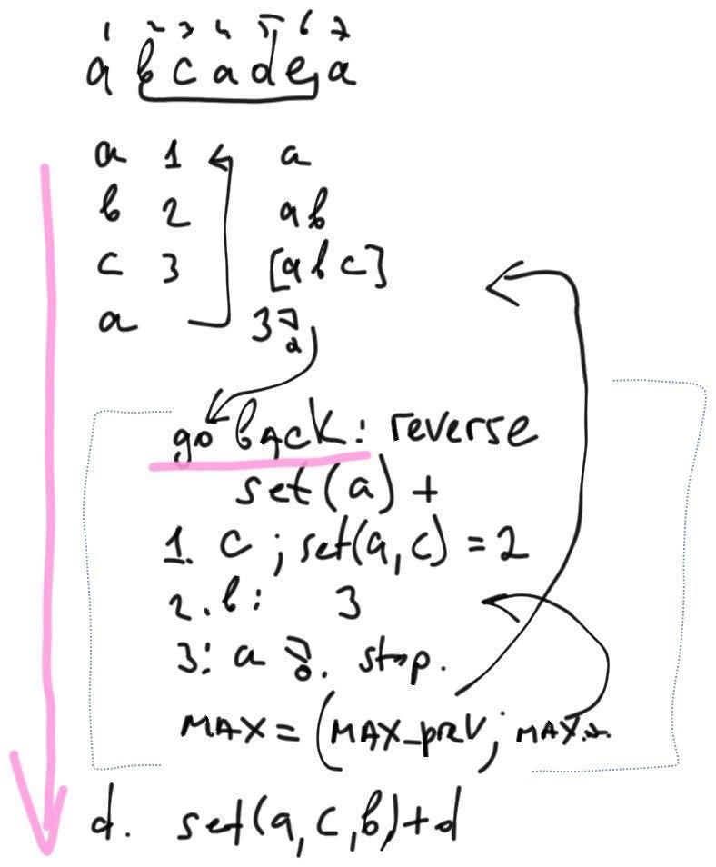

[LeetCode problem](https://leetcode.com/problems/longest-substring-without-repeating-characters/)

Given a string `s`, find the length of the longest substring without repeating characters.

**Example 1:**

    Input: s = "abcabcbb"
    Output: 3
    Explanation: The answer is "abc", with the length of 3.

## First accepted

**Idea:**

1. Loop through string
2. Calculate max count of elements in substring
3. If get double element, then go back until get this element and do step 2.
4. Proceed the main loop



```python
class Solution:
    def lengthOfLongestSubstring(self, s: str) -> int:
        uniqs = set()
        len_max = 0
        len_current = 0
        idx = 0
        for i in s:
            if i in uniqs:
                len_max = max(len_max, len_current)
                len_current = 1
                uniqs = set(i)
                for j in reversed(s[:idx]):
                    if j == i:
                        break
                    else:
                        len_current += 1
                        uniqs.add(j)
                    
            else:
                uniqs.add(i)
                len_current += 1
            len_max = max(len_max, len_current)
            idx += 1
        return len_max
```

## Better solution

> Sliding Window - [template](../#sliding-window)

**Window Sliding Technique** is a computational technique which aims to reduce the use of nested loop and replace it with a single loop, thereby reducing the time complexity.
The Sliding window technique can reduce the time complexity to O(n).

Tips for identifying this kind of problem where we could use the sliding window technique:

The problem will be based on an array, string, or list data structure.
You need to find the subrange in this array or string that should provide the longest, shortest, or target values.
A classic problem: to find the largest/smallest sum of given k (for example, three) consecutive numbers in an array.

```python
class Solution:
    def lengthOfLongestSubstring(self, s: str) -> int:
        n = len(s)
        res = 0
        # mp stores the current index of a character
        mp = {}

        i = 0
        # try to extend the range [i, j]
        for j in range(n):
            if s[j] in mp:
                i = max(mp[s[j]], i)

            res = max(res, j - i + 1)
            mp[s[j]] = j + 1

        return res
```

```python
class Solution:
    def lengthOfLongestSubstring(self, s: str) -> int:
        chars = [None] * 128
        left = right = 0
        res = 0
        while right < len(s):
            r = s[right]

            index = chars[ord(r)]
            if index is not None and left <= index < right:
                left = index + 1

            res = max(res, right - left + 1)

            chars[ord(r)] = right
            right += 1
        return res
```

```python
class Solution():
    def lengthOfLongestSubstring(self, s):
        max_len = 0
        substr = ''
        for char in s:
            if char not in substr:
                substr += char
                max_len = max(max_len, len(substr))
            else:
                start = substr.index(char) + 1
                substr = substr[start:] + char
        return max_len
```

## Resources

- <https://leetcode.com/problems/longest-substring-without-repeating-characters/discuss/2694302/JS-or-98-or-Sliding-window-or-With-exlanation>
- <https://leetcode.com/problems/longest-substring-without-repeating-characters/discuss/2133524/JavaC%2B%2B-A-reall-Detailed-Explanation>
