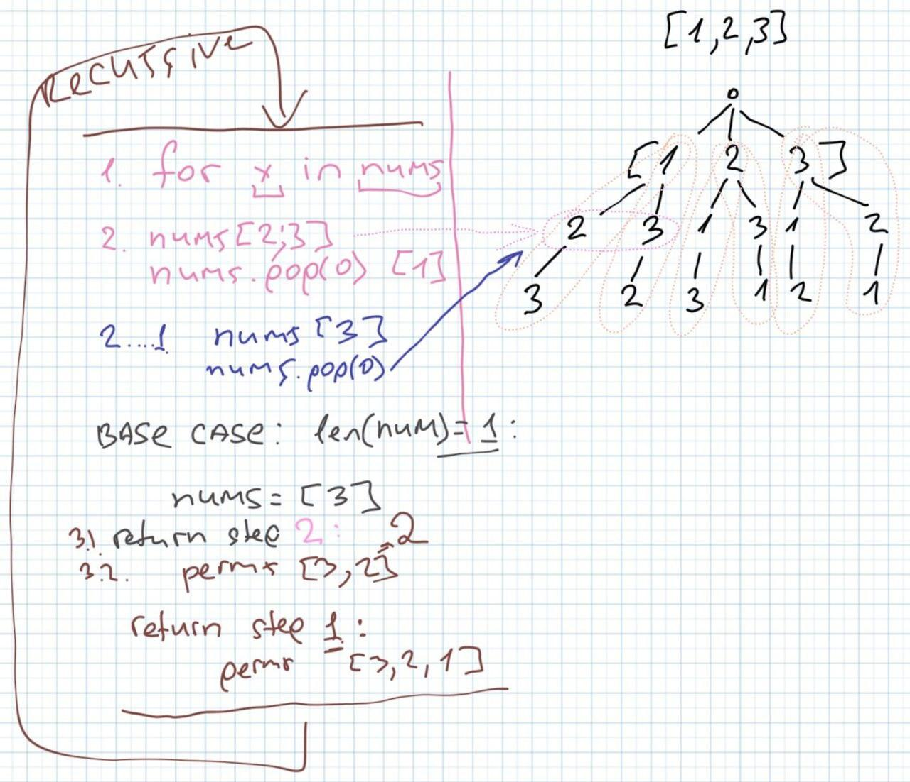

[LeetCode problem](https://leetcode.com/problems/permutations/)

Given an array `nums` of distinct integers, return *all the possible permutations*. You can return the answer in **any order**.

**Example 1:**

    Input: nums = [1,2,3]
    Output: [[1,2,3],[1,3,2],[2,1,3],[2,3,1],[3,1,2],[3,2,1]]

**Example 2:**

    Input: nums = [0,1]
    Output: [[0,1],[1,0]]

**Example 3:**

    Input: nums = [1]
    Output: [[1]]

**Idea:**

1. Draw a decigion tree
2. Fix when *branch* is *ready* to return



Implementation:

1. Recursive:
   1. Go through every value in `nums`
   2. Pop value
   3. call `perm()` with updated `nums`
   4. from each call(step) append 'poped' value from step 2

```python
class Solution:
    def permute(self, nums: List[int]) -> List[List[int]]:

        result_permutation = []

        if len(nums) == 1: # base case
            return [nums[:]]

        for _ in nums:
            tmp_removed = nums.pop(0) # remove current element before next step

            permutations = self.permute(nums)

            for perm in permutations:
                perm.append(tmp_removed)

            nums.append(tmp_removed)
            result_permutation.extend(permutations)

        return result_permutation
```

## Resources

- <https://www.youtube.com/watch?v=s7AvT7cGdSo>
- <https://walkccc.me/LeetCode/problems/0046/>
