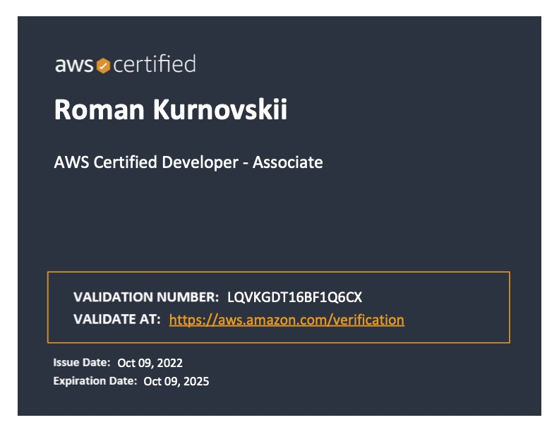

## TL;DR

1. Passed exam in one month.
2. Created an [app with questions and progress](https://www.cloud-exam-prepare.com/) that helped me a lot

## Note

> The AWS Certified Developer - Associate exam is changing February 28, 2023. The last date to take the current exam is February 27, 2023.

> To keep the docs up to date I will add new and latest information.

## DVA-C01 vs DVA-C02

- new domain: **Domain 3: Deployment**
  - focus will be on testing and deploying your code into different environments including development, test, and production environments. You’ll need to know how CloudFormation, the AWS Cloud Development Kit (CDK), and AWS SAM are used to deploy applications.
- Domains 4 and 5 (“Refactoring” along with “Monitoring and Troubleshooting”) from the DVA-C01 exam guide have been consolidated into Domain 4 (“Troubleshooting and Optimization”) in the DVA-C02 exam guide
- Plus 2% questions in **Development with AWS Services** domain

Test questions for DVA-C02 - [here](https://explore.skillbuilder.aws/learn/course/external/view/elearning/13757/aws-certified-developer-associate-official-question-set-dva-c02-english) and [here](https://d1.awsstatic.com/training-and-certification/docs-dev-associate/AWS-Certified-Developer-Associate_Sample-Questions_C02.pdf)

## Criteria

In order to pass the exam, you must score more than 720/1000 (unspecified) points. Criterion will be a minimum threshold of **75/100%**, unless conditions change in preparation.

### Study Plan

1. Find out what the exam requirements are
2. Have a list of topics that will be on the exam
3. Practice each service for comprehension
4. Read extra theory that will not be covered during practice
5. Go through the test general questions
6. Repeat 3-5 repeat until the result of *failed* block greater than 80 points

**Entrypoint:**

- [AWS Certified Developer Exam Information](https://aws.amazon.com/certification/certified-developer-associate/)

## Prepare

The AWS website has:

- [Exam Preparation Guide DVA-C01](https://d1.awsstatic.com/training-and-certification/docs-dev-associate/AWS-Certified-Developer-Associate_Exam-Guide.pdf)
- *From 27 Feb 2023* [Exam Preparation Guide DVA-C02](https://d1.awsstatic.com/training-and-certification/docs-dev-associate/AWS-Certified-Developer-Associate_Exam-Guide_C02.pdf)

To pass the exam, you need to know certain services from the 4 domains: `Development with AWS Services`, `Security`, `Deployment`, ~~`Refactoring`~~, `Monitoring and Troubleshooting`

### List of services on the exam

> ~~Version 2.1 DVA-C01~~
> Version 1.0 DVA-C02

Analytics:

- Amazon Athena (new in DVA-C02)
- Amazon OpenSearch Service (Amazon Elasticsearch Service)
- Amazon Kinesis

Application Integration:

- AWS AppSync (new in DVA-C02)
- Amazon EventBridge (Amazon CloudWatch Events)
- Amazon Simple Notification Service (Amazon SNS)
- Amazon Simple Queue Service (Amazon SQS)
- AWS Step Functions

Compute:

- Amazon EC2
- AWS Elastic Beanstalk
- AWS Lambda
- AWS Serverless Application Model (AWS SAM) (new in DVA-C02)

Containers:

- AWS Copilot (new in DVA-C02)
- Amazon Elastic Container Registry (Amazon ECR)
- Amazon Elastic Container Service (Amazon ECS)
- Amazon Elastic Kubernetes Services (Amazon EKS)

Database:

- Amazon Aurora (new in DVA-C02)
- Amazon DynamoDB
- Amazon ElastiCache
- Amazon MemoryDB for Redis (new in DVA-C02)
- Amazon RDS

Developer Tools:

- AWS Amplify (new in DVA-C02)
- AWS Cloud9 (new in DVA-C02)
- AWS CloudShell (new in DVA-C02)
- AWS CodeArtifact
- AWS CodeBuild
- AWS CodeCommit
- AWS CodeDeploy
- Amazon CodeGuru
- AWS CodePipeline
- AWS CodeStar
- AWS Fault Injection Simulator
- AWS X-Ray

Management and Governance:

- AWS AppConfig (new in DVA-C02)
- AWS Cloud Development Kit (AWS CDK) (new in DVA-C02)
- AWS CloudFormation
- AWS CloudTrail (new in DVA-C02)
- Amazon CloudWatch
- Amazon CloudWatch Logs (new in DVA-C02)
- AWS Command Line Interface (AWS CLI) (new in DVA-C02)
- AWS Systems Manager (new in DVA-C02)

Networking and Content Delivery:

- Amazon API Gateway
- Amazon CloudFront
- Elastic Load Balancing
- Amazon Route 53 (new in DVA-C02)
- Amazon VPC (new in DVA-C02)

Security, Identity, and Compliance:

- AWS Certificate Manager (ACM) (new in DVA-C02)
- AWS Certificate Manager Private Certificate Authority (new in DVA-C02)
- Amazon Cognito
- AWS Identity and Access Management (IAM)
- AWS Key Management Service (AWS KMS)
- AWS Secrets Manager (new in DVA-C02)
- AWS Security Token Service (AWS STS) (new in DVA-C02)
- AWS WAF (new in DVA-C02)

Storage:

- Amazon Elastic Block Store (Amazon EBS) (new in DVA-C02)
- Amazon Elastic File System (Amazon EFS) (new in DVA-C02)
- Amazon S3
- Amazon S3 Glacier (new in DVA-C02)

### Training plan

Opened a training plan for any tutorial to understand where to start learning. Have chosen **cloudacademy** service (but for example FreeCodeCamp has a free course with content).

Another option is to use free [AWS Workshops](https://workshops.aws/)

[AWS Developer - Associate (DVA-C01) Certification Preparation](https://cloudacademy.com/learning-paths/aws-developer-associate-dva-c01-certification-preparation-4364/)

Don't see coverage of the following services, so I add them to the block when related topics are covered:

**Analytics**:

- Amazon Elasticsearch Service (Amazon ES) -> OpenSearch Service

**Developer Tools**:

- AWS CodeArtifact
- AWS Fault Injection Simulator

## My roadmap

The following is my roadmap for the study. There may be adjustments.

1. [AWS Identity and Access Management (IAM)](iam)
2. [Amazon EC2](ec2)
3. [AWS Elastic Beanstalk](elasticbeanstalk)
4. [AWS Lambda](lambda)
5. [Amazon S3](s3)
6. [Amazon DynamoDB](dynamodb)
7. [Amazon ElastiCache](elasticache)
8. [Amazon RDS](rds)
9. [Amazon API Gateway](api-gateway)
10. [Amazon CloudFront](cloudfront)
11. [Elastic Load Balancing (ELB)](elasticloadbalancing)
12. [Amazon Kinesis](kinesis)
13. [Amazon OpenSearch Service (Amazon Elasticsearch Service)](opensearch-service)
14. [Amazon CloudWatch](cloudwatch)
15. [AWS CloudFormation](cloudformation)
16. [AWS CodeCommit](codecommit)
17. [AWS CodeDeploy](codedeploy)
18. [AWS CodeBuild](codebuild)
19. [AWS CodePipeline](codepipeline)
20. [Amazon CodeGuru](codeguru)
21. [AWS CodeStar](codestar)
22. [AWS CodeArtifact](codeartifact)
23. [AWS X-Ray](xray)
24. [AWS Fault Injection Simulator](fis)
25. [Amazon Elastic Container Registry (Amazon ECR)](ecr)
26. [Amazon Elastic Container Service (Amazon ECS)](ecs)
27. [AWS Fargate](fargate)
28. [Amazon Elastic Kubernetes Services (Amazon EKS)](eks)
29. [Amazon Cognito](cognito)
30. [Route 53](route53)
31. [AWS Key Management Service (AWS KMS)](kms)
32. [Amazon EventBridge (Amazon CloudWatch Events)](eventbridge)
33. [Amazon Simple Notification Service (Amazon SNS)](sns)
34. [Amazon Simple Queue Service (Amazon SQS)](sqs)
35. [AWS Step Functions](step-functions)

## Resources

- [AWS Certified Developer](https://aws.amazon.com/certification/certified-developer-associate/)
- [A brief overview of the official documentation](https://docs.aws.amazon.com/index.html)
- [Exam Preparation Guide](https://d1.awsstatic.com/training-and-certification/docs-dev-associate/AWS-Certified-Developer-Associate_Exam-Guide.pdf)
- [Sample Exam Questions](https://d1.awsstatic.com/training-and-certification/docs-dev-associate/AWS-Certified-Developer-Associate_Sample-Questions.pdf)
- [https://github.com/itsmostafa/certified-aws-developer-associate-notes](https://github.com/itsmostafa/certified-aws-developer-associate-notes)
- [https://github.com/arnaudj/mooc-aws-certified-developer-associate-2020-notes](https://github.com/arnaudj/mooc-aws-certified-developer-associate-2020-notes)
- [FreeCodeCamp Youtube - AWS Certified Developer - Associate 2020](https://www.youtube.com/watch?v=RrKRN9zRBWs)
- [How-To Labs from AWS](https://aws.amazon.com/getting-started/hands-on/?getting-started-all.sort-by=item.additionalFields.sortOrder&getting-started-all.sort-order=asc&awsf.getting-started-category=*all&awsf.getting-started-level=*all&awsf.getting-started-content-type=*all)
- [AWS Ramp-Up guides](https://aws.amazon.com/training/ramp-up-guides): Downloadable AWS Ramp-Up Guides offer a variety of resources to help you build your skills and knowledge of the AWS Cloud.
- [Coursera's AWS Courses(Free to enroll via audit)](https://www.coursera.org/aws): AWS also provides various specializations in partnership with coursera
- [AWS Architecture center](https://aws.amazon.com/architecture/?nc2=h_ql_le_arc&cards-all.sort-by=item.additionalFields.sortDate&cards-all.sort-order=desc&awsf.content-type=*all&awsf.methodology=*all&awsf.tech-category=*all&awsf.industries=*all): Provides reference architecture diagrams, vetted architecture solutions, Well-Architected best practices, patterns, icons, and more. This expert guidance was contributed by cloud architecture experts from AWS, including AWS Solutions Architects, Professional Services Consultants, and Partners.
- [AWS Whitepapers](https://aws.amazon.com/whitepapers): Expand your knowledge of the cloud with AWS technical content authored by AWS and the AWS community, including technical whitepapers, technical guides, reference material, and reference architecture diagrams.
- [Back to Basics](https://aws.amazon.com/architecture/back-to-basics): Back to Basics' is a video series that explains, examines, and decomposes basic cloud architecture pattern best practices.
- [AWS Heroes Content Library](https://aws.amazon.com/developer/community/heroes/content-library): AWS Hero authored content including blogs, videos, slide presentations, podcasts, and more.
- <https://amazon.qwiklabs.com/catalog>
- [AWS Workshops](https://workshops.aws): This website lists workshops created by the teams at Amazon Web Services (AWS). Workshops are hands-on events designed to teach or introduce practical skills, techniques, or concepts which you can use to solve business problems.
- <https://wellarchitectedlabs.com/>
- <https://testseries.edugorilla.com/tests/1359/aws-certified-developer-associate>

### Community posts

- <https://dev.to/romankurnovskii/aws-certified-developer-associate-prepare-2np>
- <https://www.reddit.com/user/romankurnovskii/comments/x8rgig/what_is_the_topics_order_to_cover_to_get_prepared/?utm_source=share&utm_medium=web2x&context=3>
- <https://twitter.com/romankurnovskii/status/1567746601136832512>
