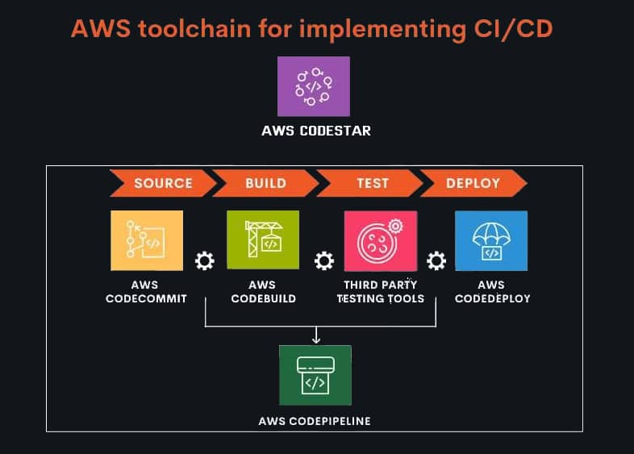

## About

AWS CodeStar enables you to quickly develop, build, and deploy applications on AWS. AWS CodeStar provides a unified user interface, enabling you to easily manage your software development activities in one place.

- [Documentation](https://aws.amazon.com/codestar/)
- [User Guide](https://docs.aws.amazon.com/codestar/?id=docs_gateway)

CodeStar enables to quickly develop, build, & deploy applic­ations on AWS.

With AWS CodeStar, you can create, manage, and scale automated code reviews with a single click. You can also monitor the performance and scalability of your code review process with the built-in metrics dashboard.

Each AWS CodeStar project comes with a project management dashboard, including an integrated issue tracking capability powered by Atlassian JIRA Software.

### Alternatives

Alternatives to AWS CodeStar:

- Jenkins.
- Azure DevOps Projects.
- GitHub.
- GitLab.
- CircleCI.
- CloudBees CI.
- Plesk.
- Copado CI/CD.

## Price

There is no additional charge for using AWS CodeStar. You only pay for the AWS resources that you provision for developing and running your application (for example, Amazon EC2 instances).

[Current price](https://aws.amazon.com/codestar/pricing/)

## Practice

[Develop and Deploy an Application with AWS CodeStar](develop-and-deploy-app-with-codestar)
