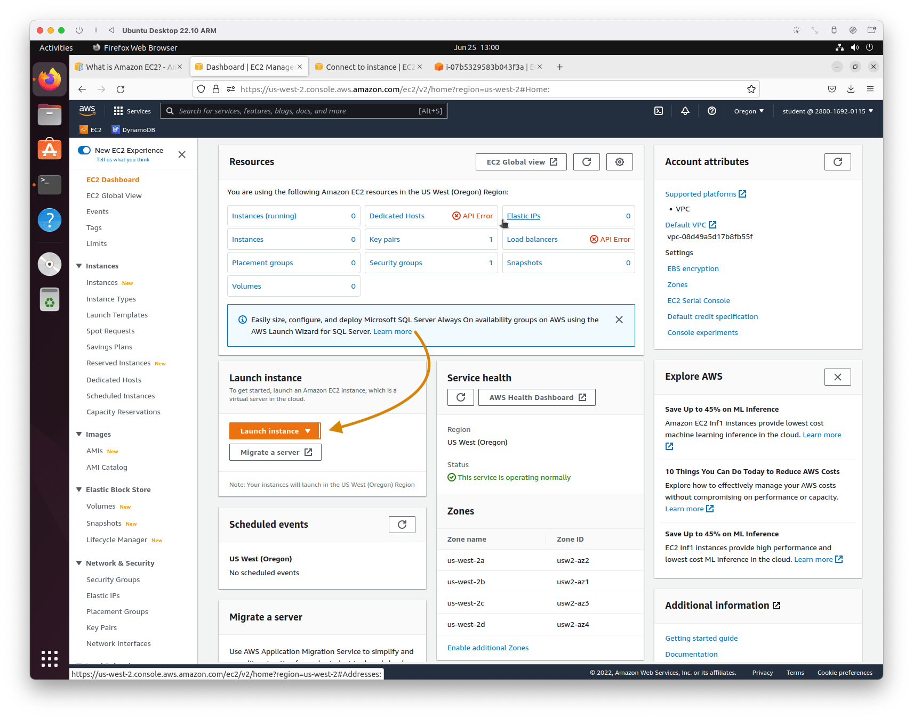
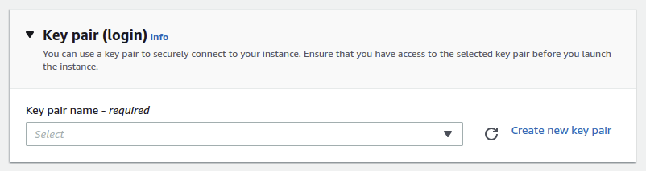
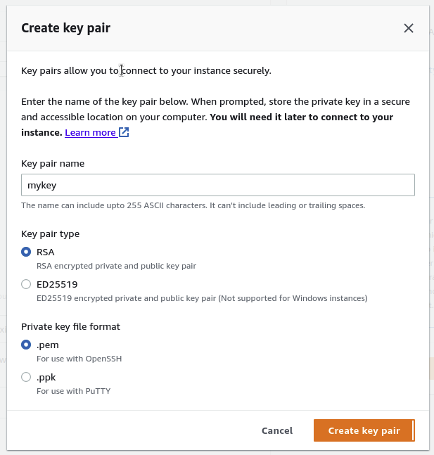
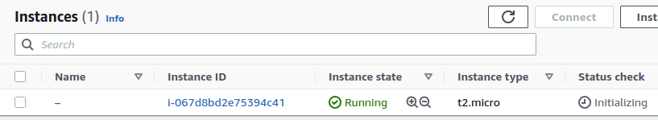
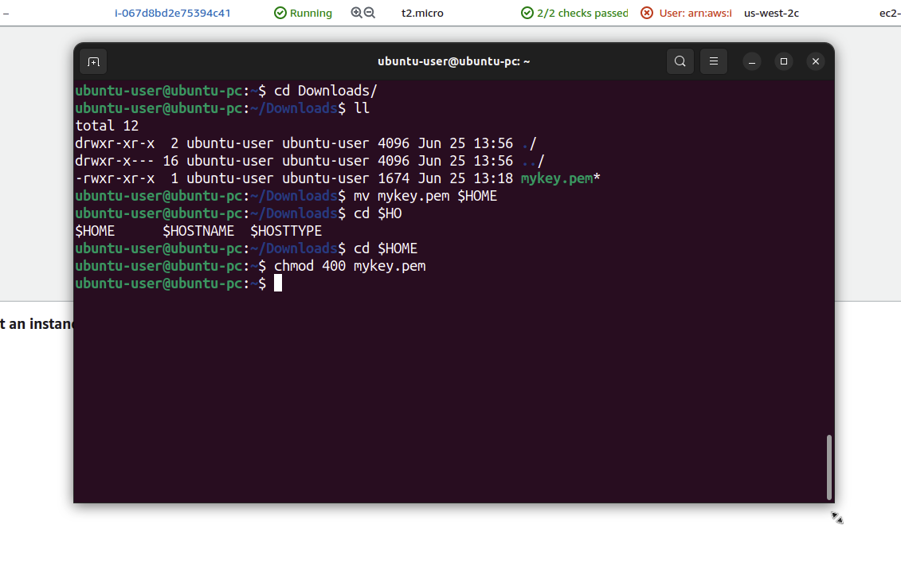

# Amazon EC2

- [Документация Amazon EC2 - 1](https://aws.amazon.com/ec2/)
- [Документация Amazon EC2 - 2](https://docs.aws.amazon.com/ec2/?id=docs_gateway)

Amazon Elastic Compute Cloud (EC2) - одна из самых популярных служб AWS. EC2 позволяет запускать различные типы облачных экземпляров и оплачивать их по модели "оплата за использование". EC2 позволяет контролировать вычислительные ресурсы на уровне операционной системы, работая в вычислительной среде Amazon.

## Цены

[Актуальный прайс](https://aws.amazon.com/ec2/pricing/)

## Практика

### Создание EC2 инстанса

Заходим на [страницу EC2](https://us-west-2.console.aws.amazon.com/ec2/v2/home?region=us-west-2) -> Launch Instance



#### Образ EC2

Выбираем нужный нам образ


#### Создание ключей

Создадим ключ, чтобы использовать его для подключения к инстансу извне


Вводим любое имя. Остальные параметры оставляю по умолчанию

После создания ключа начнется автоматическое скачивание. Ключ понадобится далее для подключения к EC2  с локального терминала

#### Сетевые настройки

В разделе **Network Settings** оставляю включенным **Allow SSH traffic from**


#### Создание

Нажимаем **Launch Instance**

Инстанс создан и доступен для подключения



### Подключение к EC2 с терминала

Подключимся к EC2 с локального терминала

Перенесем созданный и скачанный ранее ключ <mark>mykey</mark> в папку home текущего пользователя и дадим права на файл `CHMOD 400`

```bash
cd ~
cd Downloads/
mv mykey.pem $HOME
cd ..
chmod 400 mykey.pem 
```



Для подключения нам необходим публичный iPv4 адрес. Находим на странице с инстансом


Подключаемся с помощью команды `ssh`

```bash
ssh -i mykey.pem ec2-user@52.24.109.78
```


## Вопросы

### Вопрос 1

**A company is migrating a legacy application to Amazon EC2. The application uses a username and password stored in the source code to connect to a MySQL database. The database will be migrated to an Amazon RDS for MySQL DB instance. As part of the migration, the company wants to implement a secure way to store and automatically rotate the database credentials.**

**Which approach meets these requirements?**

- A) Store the database credentials in environment variables in an Amazon Machine Image (AMI). Rotate the credentials by replacing the AMI.
- B) Store the database credentials in AWS Systems Manager Parameter Store. Configure Parameter Store to automatically rotate the credentials.
- C) Store the database credentials in environment variables on the EC2 instances. Rotate the credentials by relaunching the EC2 instances.
- D) Store the database credentials in AWS Secrets Manager. Configure Secrets Manager to automatically rotate the credentials

<details>
<summary>Ответ</summary>
<div>
<h4>Правильный ответ: D</h4>

D – [AWS Secrets Manager](https://aws.amazon.com/secrets-manager/) helps to protect the credentialsneeded to access databases, applications,services, and other IT resources. The service enables users to easily rotate, manage, and retrieve database credentials, API keys, and other secrets throughout their lifecycle. Users and applications retrieve secrets with a call to the Secrets Manager APIs, eliminating the need to hardcode sensitive information in plaintext. Secrets Manager offers [secret rotation](https://aws.amazon.com/blogs/security/rotate-amazon-rds-database-credentials-automatically-with-aws-secrets-manager/) with built-in integration for Amazon RDS, Amazon Redshift, and Amazon DocumentDB.

</div>
</details>
