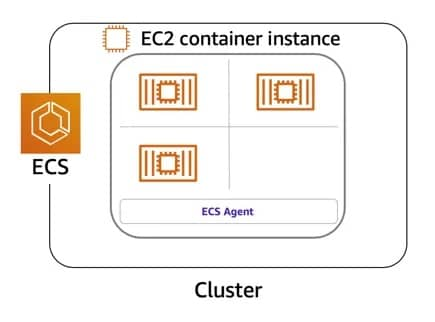
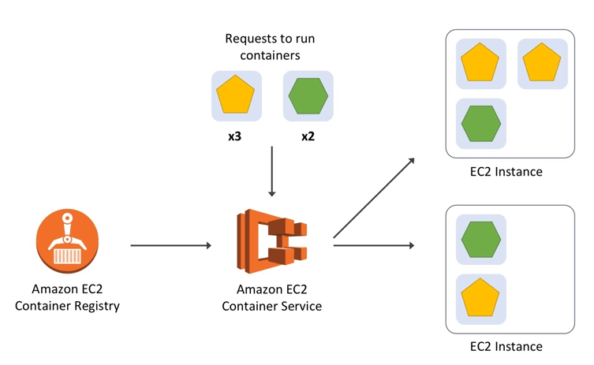

## About

- [Documentation](https://aws.amazon.com/ecs/)
- [User Guide](https://docs.aws.amazon.com/ecs/?id=docs_gateway)

Highly secure, reliable, & scalable way to run contai­ners

### Alternatives

- Google Container Engine (GKE)
- Azure Container Service
- IBM Bluemix Container Service
- Jelastic Multi-Cloud PaaS

### Terminology

| Amazon ECS      | Term Definition                                                                         |
| --------------- | --------------------------------------------------------------------------------------- |
| Cluster         | Logical Grouping of EC2 Instances                                                       |
| Container       | Instance EC2 instance running the ECS agent                                             |
| Task Definition | Blueprint that describes how a docker container should launch                           |
| Task            | A running container using settings in a Task Definition                                 |
| Service         | Defines long running tasks – can control task count with Auto Scaling and attach an ELB |

## Digest

- Microservices are built in multiple programming languages
- Containers simplify deployment of microservices:
  - Step 1 : Create a self contained Docker image
    - Application Runtime (JDK or Python), Application code and Dependencies
  - Step 2 : Run it as a container any where Local machine OR Corporate data center OR Cloud
- Use On-Demand instances or Spot instances
- Launch type: EC2 or Fargate
- Data volumes attached to containers
- Deployment type:
  - Rolling update
  - Blue/green deployment (powered by AWS CodeDeploy)
- Task Placement Strategies:
  - **binpack** - Leave least amount of unused CPU or memory. **Minimizes number of container instances in use**
  - **random** - Random task placement
  - **spread** - Based on specified values:
    - Host (instanceId)
    - (OR) Availability Zone(attribute:ecs.availability-zone)
    - (Alowed) Combine strategies and prioritize
- How do you manage 100s of containers?
- ECS - Fully managed service for container orchestration
  - Step 1 : Create a Cluster (Group of one or more EC2 instances)
  - Step 2: Deploy your microservice containers
- AWS Fargate: Serverless ECS. DON'T worry about EC2 instances.
- Cloud Neutral: Kubernetes
  - AWS - AWS Elastic Kubernetes Service (EKS)
- Load balancing:
  - Performed using Application Load Balancers
    - **Dynamic host port mapping**: Multiple tasks from the same service are allowed per EC2 (container) instance
    - **Path-based routing**: Multiple services can use the same listener port on same ALB and be routed based on path (<www.myapp.com/microservice-a> and <www.myapp.com/microservice-b>)

## Price

[Current price](https://aws.amazon.com/ecs/pricing/)

## Use Cases

Type: Containers

Same type services: Elastic Container Service (ECS), Elastic Container Registry (ECR), Elastic Kubernetes Service (EKS), Fargate

Best practice:

- 10 Microservices => 10 Task Definitions => 10 Task IAM Roles with individual permissions needed by each microservice
  
### ECS vs EKS

Amazon also provides the Elastic Container Service for Kubernetes (Amazon EKS) which can be used to deploy, manage, and scale containerized applications using Kubernetes on AWS.

| Amazon ECS                                                                                       | Amazon EKS                                                                                           |
| ------------------------------------------------------------------------------------------------ | ---------------------------------------------------------------------------------------------------- |
| Managed, highly available, highly scalable container platform                                    | Managed, highly available, highly scalable container platform                                        |
| AWS-specific platform that supports Docker Containers                                            | Compatible with upstream Kubernetes so it’s easy to lift and shift from other Kubernetes deployments |
| Considered simpler and easier to use                                                             | Considered more feature-rich and complex with a steep learning curve                                 |
| Leverages AWS services like Route 53, ALB, and CloudWatch                                        | A hosted Kubernetes platform that handles many things internally                                     |
| “Tasks” are instances of containers that are run on underlying compute but more of less isolated | “Pods” are containers collocated with one another and can have shared access to each other           |
| Limited extensibility                                                                            | Extensible via a wide variety of third-party and community add-ons.                                  |

## Questions

### Q1

**You are asked to establish a baseline for normal Amazon ECS performance in your environment by measuring performance at various times and under different load conditions. To establish a baseline, Amazon recommends that you should at a minimum monitor the CPU and ____ for your Amazon ECS clusters and the CPU and ____ metrics for your Amazon ECS services.**

1. memory reservation and utilization; concurrent connections
2. memory utilization; memory reservation and utilization
3. concurrent connections; memory reservation and utilization
4. memory reservation and utilization; memory utilization

Explanation

[https://docs.aws.amazon.com/AmazonECS/latest/developerguide/ecs_monitoring.html](https://docs.aws.amazon.com/AmazonECS/latest/developerguide/ecs_monitoring.html)

<mark style="color:white">1, 2</mark>

