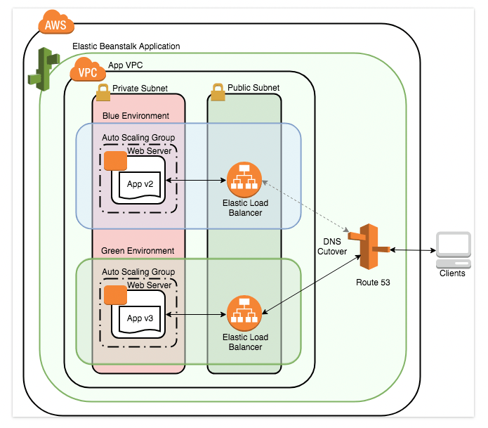
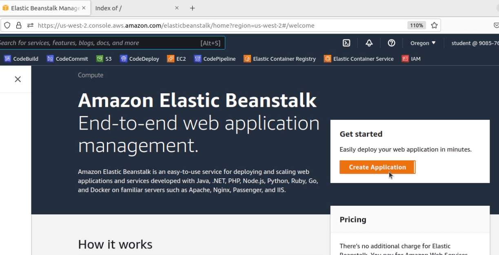
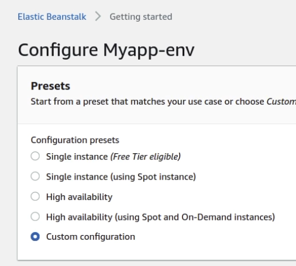
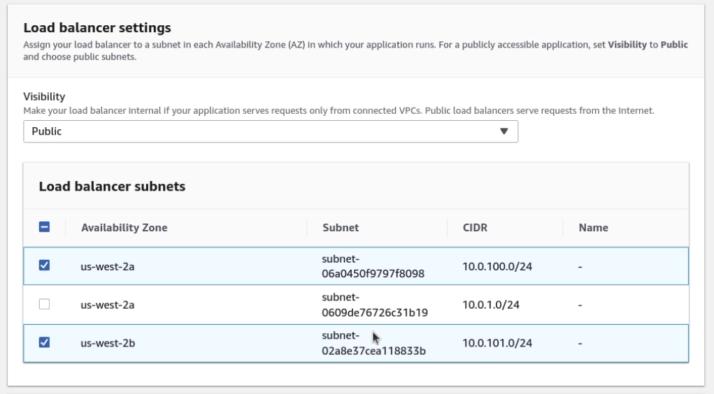
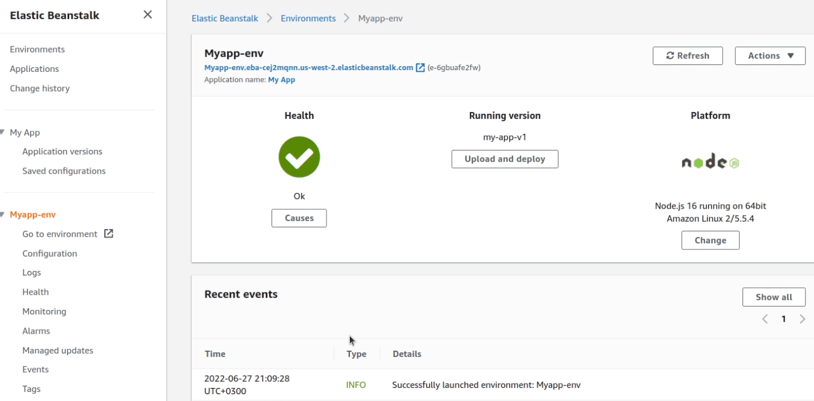
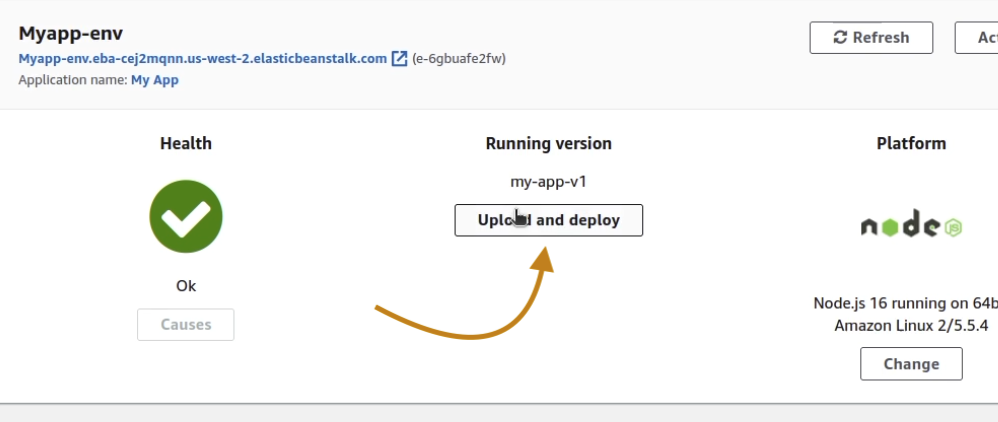
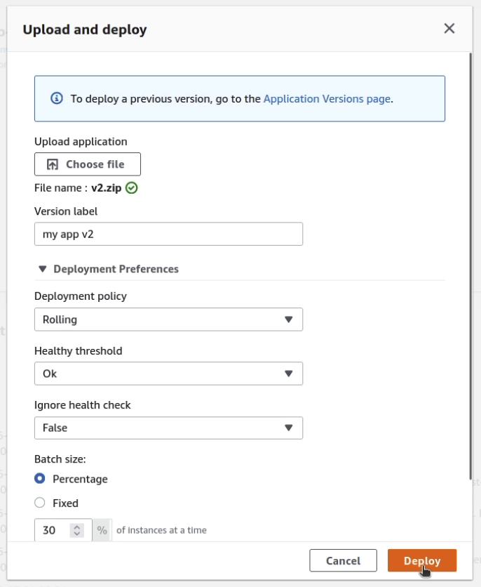

# AWS Elastic Beanstalk

- [Документация AWS Elastic Beanstalk](https://aws.amazon.com/elasticbeanstalk/)
- [Документация AWS Elastic Beanstalk](https://docs.aws.amazon.com/elasticbeanstalk/?id=docs_gateway)

## Цены

Дополнительная плата за AWS Elastic Beanstalk не взимается. Оплате подлежат только ресурсы AWS, необходимые для хранения и работы приложений.

## Практика

### Контролируемое развертывание с AWS Elastic Beanstalk

- [Ссылка на лабораторную работу](https://cloudacademy.com/lab/run-controlled-deploy-aws-elastic-beanstalk/?context_resource=lp&context_id=4364)

В этой лабораторной работе  развернем несколько обновлений версий приложения в среде с балансировкой нагрузки и автоматическим масштабированием.

Первое обновление развертывается с помощью простого развертывания. Второе обновление развертывается с помощью `blue-green` развертывания, когда создается отдельная среда для запуска новой версии приложения, а DNS свитчер переключает входящий трафик на новую среду.

Итоговая архитектура развертывания будет выглядеть следующим образом

#### Загрузка приложения

В данном обзоре я использую код, который предоставил мне Cloudacademy, но у меня есть готовый скрипт для запуска, который вы можете загрузить в Elastic Beanstalk: [скачать](./files/nodejs.zip)

##### Создание

Заходим на страницу **Elastic Beanstalk** и нажимаем `Create Application`

##### Название

Указываем название нового приложения

##### Выбор платформы

В разделе `Platform` выбираем нужную платформу приложения. В нашем случае - `Node.js`

##### Загрузка исходников

В разделе `Source code origin` указываем версию приложения и загружаем архив с приложением.  [Пример](./files/nodejs.zip)

##### Конфигурация приложения

Изменяем предустановку `Configuration` на `Custom configuration`:

Нажимаем **Edit** в разделе **Rolling updates and deployments**

В конфигурации по умолчанию обновления распространяются на все экземпляры одновременно. Это приводит к простою приложения, что неприемлемо для производственных сред.

Мы установим `Rolling` и `Batch size` 30%

##### Сеть

Вернувшись к основной форме приложения, нажмите **Edit** в конфигурации **Network**.

На форме **Modify network** настроим следующие значения, затем  **Save**.

- **VPC**: Выберите VPC с блоком CIDR **10.0.0.0/16**. Это не будет VPC по умолчанию.
- **Load balancer settings**:
  - **Load balancer subnets**: Выберите подсети с блоками CIDR **10.0.100.0/24**(**us-west-2a**)и **10.0.101.0/24** (**us-west-2b**). Это публичные подсети. Балансировщику нагрузки приложений требуется как минимум две подсети в разных зонах доступности
- **Instance settings**:
  - **Instance subnets**: Выберите подсеть с блоком CIDR **10.0.1.0/24**. Это частная подсеть.

##### Подтверждение

Нажимаем `Create app`

Процесс создания приложения занимает от 5 минут.

Далее переходим в раздел Dasboard

На этом этап загрузки приложения в Elastic Beanstalk закончен. Далее разберем как переключать загрузку новой версии приложения клиентам.

#### Загрузка 2-й версии приложения

##### Загрузка версии 2.0

Нажимаем `Upload and deploy` и загружаем обновленный код. _Например, можно том же исходнике изменить текст для сравнения.

Указываем новую версию и настройки публикации

#### Сравнение версий

Теперь можем сверить обе версии, пройдя по ссылкам. В моем случае приложения выглядят следующим образом

#### Смена url у приложений

Теперь поменяем приложения местами. Чтобы пользователь, который ранее заходил по одному адресу, теперь видел 2-ю версию приложения.

В разделе `Actions` нажимаем `Swap environment URLs` и далее выбираем приложение с которым происходит смена

##### Удаление ресурсов Elastic Beanstalk

Elastic Beanstalk для развертывания приложений запускает EC2 инстансы, а также прочие сервисы. Но удалить все сервисы можно из одного окна.

1. Идем в раздел Applications
2. Выбираем приложение
3. Нажимаем Actions -> Terminate environment

## Ресурсы

<https://docs.aws.amazon.com/elasticbeanstalk/latest/dg/tutorials.html>
