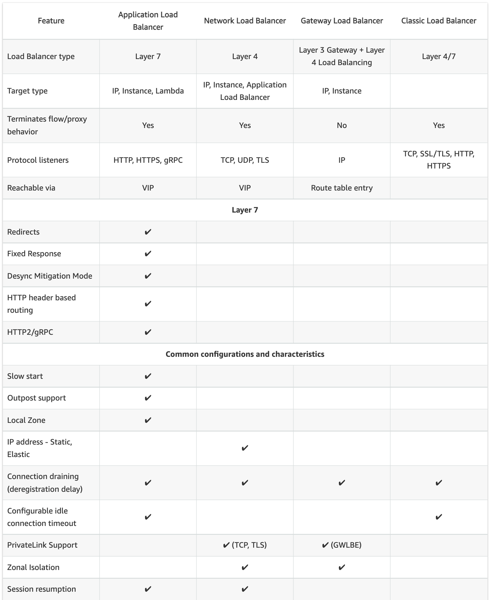
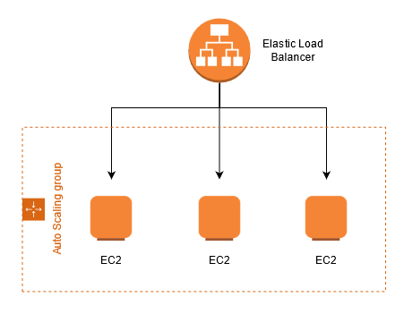
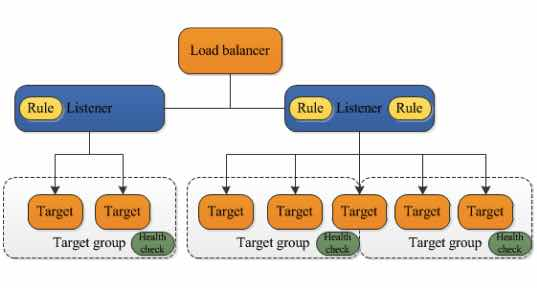
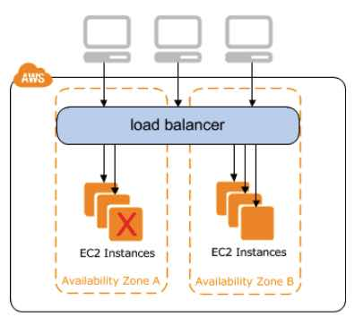

## About

Elastic Load Balancing (ELB) automa­tically distri­butes incoming applic­ation traffic across multiple targets, such as EC2's, contai­ners, IP addresses, & Lambda functions.

Elastic Load Balancing is a best practice to assign incoming traffic to a single target, such as an EC2 Instance, and then distribute the rest of the traffic across the target's resources. An elastic load balancer distributes traffic across an arbitrary number of targets. 

- [Documentation](https://aws.amazon.com/elasticloadbalancing/)
- [User Guide](https://docs.aws.amazon.com/elasticloadbalancing/?id=docs_gateway)

### Types of Load Balancers

   | Type                            | Description                                                                                                                                                                                                                                                                       |
   | ------------------------------- | --------------------------------------------------------------------------------------------------------------------------------------------------------------------------------------------------------------------------------------------------------------------------------- |
   | Application Load Balancer (ALB) | Operates at the Application Layer (OSI L7), handling HTTP/HTTPS traffic. Allows routing requests to specific web servers.                                                                                                                                                         |
   | Network Load Balancer (NLB)     | Operates at the Network Layer (OSI L4), handling TCP traffic. Recommended for performance.                                                                                                                                                                                        |
   | Classic Load Balancer (CLB)     | Operates at OSI L7 and OSI L4, however has limited functions. Requests are forwarded by the load balancer without “looking into” any of these requests. They just get forwarded to the backend section. Not recommended for use except for apps built in the EC2-Classic network. |

### Compare ALB vs NLB vs CLB

| Basic load balancing features       | ALB  | NLB       | CLB  |
| ----------------------------------- | ---- | --------- | ---- |
| Balance load between targets        | Yes  | Yes       | Yes  |
| Perform health checks on targets    | Yes  | Yes       | Yes  |
| Highly available                    | Yes  | Yes       | Yes  |
| Elastic                             | Yes  | Yes       | Yes  |
| TLS Termination                     | Yes  | Yes       | Yes  |
| Performance                         | Good | Very high | Good |
| Send logs and metrics to CloudWatch | Yes  | Yes       | Yes  |
| Layer 4 (TCP)                       | No   | Yes       | Yes  |
| Layer 7 (HTTP)                      | Yes  | No        | Yes  |
| Running costs                       | Low  | Low       | Low  |

| Advanced load balancing features                    | ALB | NLB | CLB |
| --------------------------------------------------- | --- | --- | --- |
| Advanced routing options                            | Yes | N/A | No  |
| Can send fixed response without backend             | Yes | No  | No  |
| Supports user authentication                        | Yes | No  | No  |
| Can serve multiple domains over HTTPS               | Yes | Yes | No  |
| Preserve source IP                                  | No  | Yes | No  |
| Can be used in EC2-Classic                          | No  | No  | Yes |
| Supports application-defined sticky session cookies | No  | N/A | Yes |
| Supports Docker containers                          | Yes | Yes | Yes |
| Supports targets outside AWS                        | Yes | Yes | No  |
| Supports websockets                                 | Yes | N/A | No  |
| Can route to many ports on a given target           | Yes | Yes | No  |

### Scaling

**Vertical Scaling**

* Increasing the size of the instances (ie- increase in RAM and vCPUs )
* Ex: from t2.micro to t3.2xlarge (doesn't have to be the same instance family)
* In vertical scaling, you scale up/down
* Vertical scaling usually happens in databases, to handle high workloads as your application grows

***Horizontal Scaling**

* Increasing the no. of instances
* In horizontal scaling, you scale out/in
* Ex: ASG scaling out EC2 instances to match increased workload for your web application

### Cross Zone Load Balancing

**ALB**

- Enabled by default. Cannot disable it
- Not charges for data transfer between AZs (inter AZ data transfer)

**CLB**

- Enabled by default. Can disable it
- Not charged for data transfer between AZs
 

**NLB**

- Disabled by default. Can enable it
- Charged for data transfer between AZs

## Digest

- ELB(Elastic Load Balancing) distributes application or network traffic across multiple targets, such as EC2 instances, containers(ECS), and IP addresses, in multiple AZs.
- Cross Zone Load Balancing – when enabled, each load balancer node distributes traffic across the registered targets in all enabled AZs.
- 3 Types of Load balancers - Application, Network, Classic
- Deleting ELB won't delete the instances registered to it.
- Termination protection will be disabled by default; enable it to prevent accidental delete.
- 504 error means the gateway has timed out and the application is not responding within the idle timeout period
- Look for the X-Forwarded-For header, if you need the end user IPv4 address
- ASG (Auto Scaling Group) ensures you've the correct number of EC2 instances available. Specify minimum, maximum and desired number of instances.
- Lifecycle hook - perform custom actions when instances launch or terminate
- Cool down period - ensure not to launch additional instances before previous scaling activities complete
- Launch configuration - Instance configuration template the ASG uses to launch EC2 instances

## Price

[Current price](https://aws.amazon.com/elasticloadbalancing/pricing/)

## Use Cases

Type: Scale your network design

- AWS discourages the use of Classic Load Balancer in favor of its newer load balancers

- Application Load Balancer is typically used for web applications. 

- Network Load Balancer would be used for anything that ALBs don’t cover. A typical use case would be a near real-time data streaming service (video, stock quotes, etc.) Another typical case is that you would need to use an NLB if your application uses non-HTTP protocols

## Practice

[Create Classic Load Balancer](create-amazon-load-balancing)

## Questions

### Q1

**Which load balancer would you use for services which use HTTP or HTTPS traffic?**

Explanation

Application Load Balancer (ALB).

### Q2

**What are possible target groups for ALB (Application Load Balancer)?**

Explanation

- EC2 tasks
- ECS instances
- Lambda functions
- Private IP Addresses

### Q3

**Your would like to optimize the performance of their web application by routing inbound traffic to api.mysite.com to Compute Optimized EC2 instances and inbound traffic to mobile.mysite.com to Memory Optimized EC2 instances.**

**Which solution below would be best to implement for this?**

1. Enable X-Forwarded For on the web servers and use a Classic Load Balancer
1. Configure proxy servers to forward the traffic to the correct instances
1. Use an Application Load Balancer with path-based routing rules to forward the traffic to the correct instances
1. Use an Application Load Balancer with host-based routing rules to forward the traffic to the correct instances

Explanation

Application Load Balancer with host-based routing rules

[https://aws.amazon.com/blogs/aws/new-host-based-routing-support-for-aws-application-load-balancers/](https://aws.amazon.com/blogs/aws/new-host-based-routing-support-for-aws-application-load-balancers/)

<mark style="color:white">4</mark>

### Q4

**What is the primary reason why you should be using an elastic load balancer for a website with high activity?**

1. ELBs help you scale servers easily without manual intervention
2. ELBs can distribute traffic equally to your backend targets to handle the incoming traffic load
3. ELBs help tighten security through the use of security groups
4. ELBs boost your website’s overall performance

Explanation

Elastic Load Balancing automatically distributes incoming application traffic across multiple targets, such as Amazon EC2 instances, containers, IP addresses, and Lambda functions. It can handle the varying load of your application traffic in a single Availability Zone or across multiple Availability Zones.

Elastic Load Balancing offers three types of load balancers that all feature the high availability, automatic scaling, and robust security necessary to make your applications fault-tolerant. They are Application Load Balancer, Network Load Balancer, Classic Load Balancer, and Gateway Load Balancer.

<mark style="color:white">2</mark>

### Q5

**After a year of development, the company’s 100-node high-performance computing (HPC) application is now ready to be deployed to an Amazon Elastic Kubernetes Service (Amazon EKS) cluster with Horizontal Pod Autoscaler (HPA). The application must be capable of receiving millions of UDP traffic per second from the public Internet while maintaining low latency.**

**Which of the following is the most operationally efficient solution that should be implemented to meet the above requirements?**

1. Launch a Gateway Load Balancer and integrate an Elastic Fabric Adapter (EFA) to each Kubernetes pod deployed in the Amazon EKS cluster
2. Integrate the AWS Load Balancer Controller add-on to the EKS cluster. Launch a Network Load Balancer to load balance network traffic to individual Kubernetes pods.
3. Install the AWS Load Balancer Controller add-on to the EKS cluster and launch an Application Load Balancer to distribute the incoming traffic to the Kubernetes pods.
4. Set up the `kube-proxy` Amazon EKS add-on to the cluster and configure the Source Network Address Translation ([SNAT](https://docs.microsoft.com/en-us/azure/load-balancer/load-balancer-outbound-connections)) of the Kubernetes pods by setting the `AWS_VPC_K8S_CNI_EXTERNALSNAT` configuration to true.

Explanation

Network Load Balancer operates at the connection level (Layer 4), routing connections to targets – Amazon EC2 instances, microservices, and containers – within Amazon Virtual Private Cloud (Amazon VPC) based on IP protocol data. 

Ideal for load balancing of both TCP and UDP traffic, Network Load Balancer is capable of handling millions of requests per second while maintaining ultra-low latencies. Network Load Balancer is optimized to handle sudden and volatile traffic patterns while using a single static IP address per Availability Zone.

It is integrated with other popular AWS services such as Auto Scaling, Amazon EC2 Container Service (ECS), Amazon CloudFormation, and AWS Certificate Manager (ACM).

Network Load Balancer preserves the client-side source IP address, allowing the back-end EC2 instances to see the IP address of the client. This can then be used by applications for further processing.

Network traffic is load balanced at L4 of the OSI model. To load balance application traffic at L7, you deploy a Kubernetes ingress, which provisions an AWS Application Load Balancer. An AWS Network Load Balancer can load balance network traffic to pods deployed to Amazon EC2 IP and instance targets or to AWS Fargate IP targets.

The AWS Load Balancer Controller manages AWS Elastic Load Balancers for a Kubernetes cluster. The controller provisions the following resources:

– An AWS Application Load Balancer (ALB) when you create a Kubernetes Ingress.

– An AWS Network Load Balancer (NLB) when you create a Kubernetes service of type LoadBalancer.

<mark style="color:white">2</mark>

