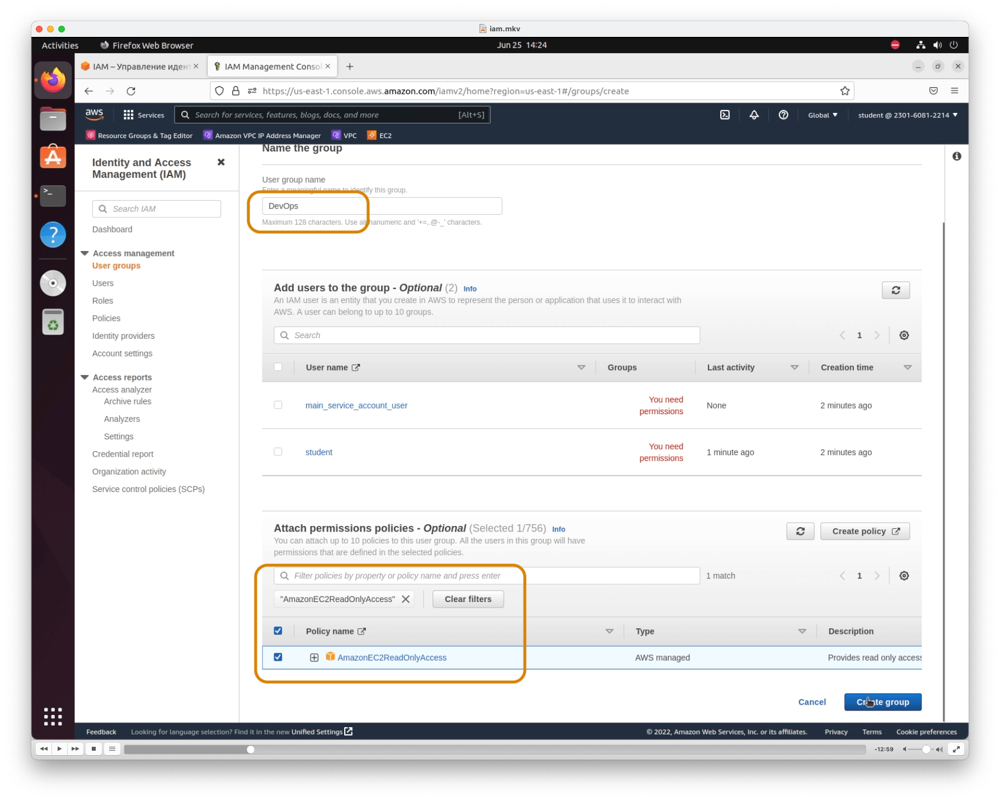
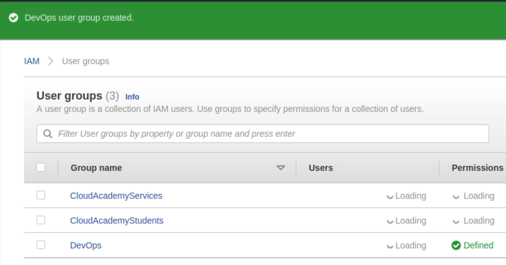

# AWS Identity and Access Management

- [Документация AWS IAM](https://aws.amazon.com/iam/)
- [Документация AWS IAM](https://docs.aws.amazon.com/iam/?id=docs_gateway)

AWS Identity and Access Management (IAM) позволяет безопасно контролировать доступ пользователей к службам и ресурсам AWS. Эта услуга предназначена для организаций с множеством пользователей или систем, использующих такие продукты AWS, как Amazon EC2, Amazon RDS и AWS Management Console. С помощью IAM вы можете централизованно управлять пользователями, учетными данными безопасности, такими как ключи доступа, и разрешениями, контролирующими доступ пользователей к ресурсам AWS.

## Практика

Переходим на [страницу IAM](https://us-east-1.console.aws.amazon.com/iam/home#/)

### Создание групп IAM
На странице **User Groups** нажимаем **Create group**

1. Указываем имя группы. Мое: **DevOps**
2. Добавляем разрешение на просмотр EC2: **AmazonEC2ReadOnlyAccess**
3. Create

Группа создана

### Создание пользователей IAM

На странице **Users** нажимаем **Create user**

Вводим имя пользователя(логин)

### Permissions
Добавляем пользователя в созданную группу

### Tags
Пропускаем раздел или ставим tags. Полезно и популярно устанавливать теги ресурсам в компаниях, где много подключено ресурсов AWS

### Логин/Пароль
На последнем этапе скачиваем `.csv` файл с логином, ключами и паролем. Пароль понадобится далее, чтобы войти в систему под данным пользователем.
На данной странице имеется ссылка для входа. Ею воспользуемся на следующем шаге

### Вход новым пользователем

### Проверка прав
У данного пользователя есть доступ на просмотр EC2 инстансов. Проверим наличие/отсутствие доступа к S3 корзинам.

Попробуем создать S3 корзину

После попытки создать корзину получаем окно с указанием на отсутствие прав

