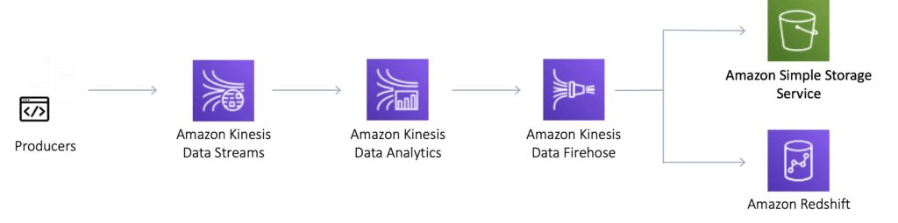

## About

Kinesis makes it easy to collect, process, & analyze real-time, streaming data, so one can get timely insights.

- [Documentation](https://aws.amazon.com/kinesis/)
- [User Guide](https://docs.aws.amazon.com/kinesis/?id=docs_gateway)

Amazon Kinesis enables you to process and analyze data as it arrives and respond instantly instead of having to wait until all your data is collected before the processing can begin.

- Real-time-based
- Fully managed
- Scalable

### Capabilities

#### Kinesis Video Streams

Capture, process, and store video streams

#### Kinesis Data Streams

Capture, process, and store data streams
  

#### Kinesis Data Firehose

Load data streams into AWS data stores

The easiest way to capture, transform, and load data streams into AWS data stores for near real-time analytics

#### Kinesis Data Analytics

Analyze data streams with SQL or Apache Flink

## Digest

- Kinesis data stream.
- Hot shard vs cold shard.
- Merging shards will decrease streams capacity.
- Kinesis adapter is the recommended way to consume streams from [DynamoDB](../dynamodb).
- Incoming write bandwidth and outgoing read bandwidth are used to calculate initial number of shards for kinesis stream.
- A single Kinesis Shard can handle 1MB per second write. 2MB per second read. It can also handle 1000 writes per second, and 5 read transactions a second

## Price

[Current price](https://aws.amazon.com/kinesis/pricing/)

## Use Cases

Type: Analytics

Same type services: Athena, EMR, Redshift, Kinesis, Elasti­cSearch Service, Quicksight

> Netflix uses Amazon Kinesis to monitor the communications between all of its applications so it can detect and fix issues quickly, ensuring high service uptime and availability to its customers.

## Practice

## Questions

### Q1

**You built a data analysis application to collect and process real-time data from smart meters. Amazon Kinesis Data Streams is the backbone of your design. You received an alert that a few shards are hot.**

**What steps will you take to keep a strong performance?**

1. Remove the hot shards
1. Merge the hot shards
1. Split the hot shards
1. Increase the shard capacity

Explanation

[https://docs.aws.amazon.com/streams/latest/dev/kinesis-using-sdk-java-resharding-strategies.html](https://docs.aws.amazon.com/streams/latest/dev/kinesis-using-sdk-java-resharding-strategies.html)

Split the hot shards

<mark style="color:white">3</mark> 

### Q2

**Jasmin needs to perform ad-hoc business analytics queries on well-structured data. Data comes in constantly at a high velocity. Jasmin's team can understand SQL.**

**What AWS service(s) should Jasmin look to first?**

1. [EMR](https://aws.amazon.com/emr/) using [Hive](https://aws.amazon.com/emr/features/hive/)
2. EMR running [Apache Spark](https://aws.amazon.com/emr/features/spark/)
3. Kinesis Firehose + [RDS](https://aws.amazon.com/rds/)
4. Kinesis Firehose + [RedShift](https://aws.amazon.com/redshift/)

Explanation

RedShift supports ad-hoc queries over well-structured data using a SQL-compliant wire protocol

https://aws.amazon.com/kinesis/data-firehose/features/

<mark style="color:white">4</mark> 

## Resources

- [FAQ](https://aws.amazon.com/kinesis/streams/fags/)
- [OpenGuide](https://github.com/open-guides/og-aws#inesis-streams)
- [HowTo](https://docs.aws.amazon.com/streams/latest/dev/examples.html)
- [Introduction to Amazon Kinesis](https://www.youtube.com/watch?v=MbEfiX4sMXc)
- [AWS Webcast - Introduction to Amazon Kinesis](https://www.youtube.com/watch?v=FxCF34txNfk)
