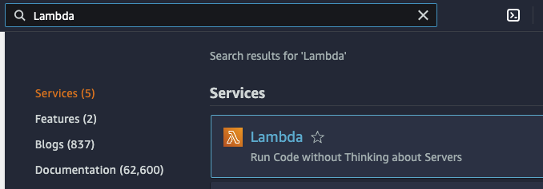
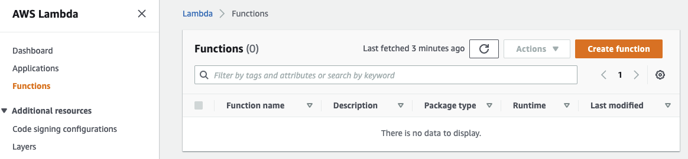
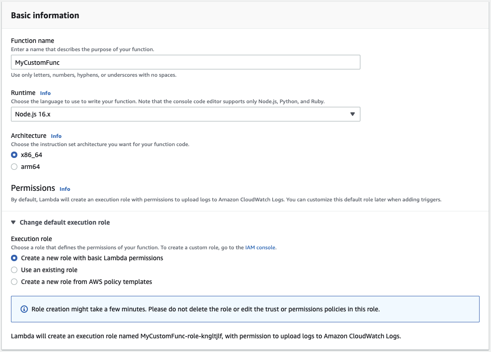
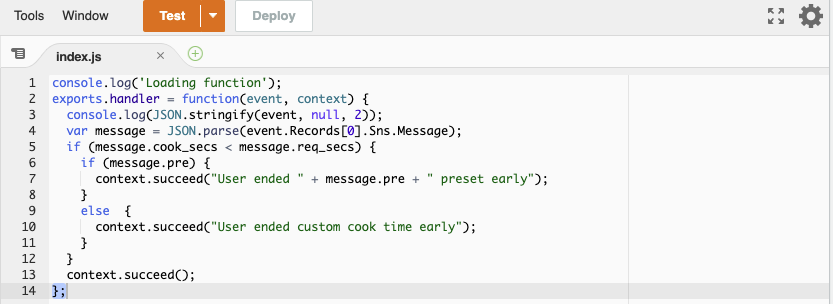
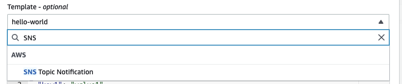
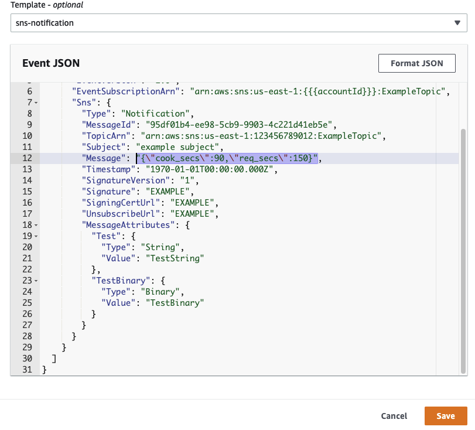

[https://docs.aws.amazon.com/lambda/?id=docs_gateway](https://docs.aws.amazon.com/lambda/?id=docs_gateway)

[https://aws.amazon.com/lambda/](https://aws.amazon.com/lambda/)

AWS Lambda – это сервис [бессерверных вычислений](https://aws.amazon.com/serverless/), который запускает программный код в ответ на определенные события и отвечает за автоматическое выделение необходимых вычислительных ресурсов.

AWS Lambda автоматически запускает программный код в ответ на [различные события](http://docs.aws.amazon.com/lambda/latest/dg/intro-core-components.html#intro-core-components-event-sources), такие как HTTP‑запросы через [Amazon API Gateway](https://aws.amazon.com/api-gateway/), изменение объектов в корзинах [Amazon Simple Storage Service](https://aws.amazon.com/s3/) (Amazon S3), обновление таблиц в [Amazon DynamoDB](https://aws.amazon.com/dynamodb/) или смена состояний в [AWS Step Functions](https://aws.amazon.com/step-functions/).

Поддержка языков Java, Go, PowerShell, Node.js, C#, Python и Ruby

## Цены

[Актуальный прайс](https://aws.amazon.com/lambda/pricing/)

Цена x86

- 0,0000166667 USD за каждую гигабайт-секунду
- 0,20 USD за 1 млн запросов

Цена Arm

- 0,0000133334 USD за каждую гигабайт-секунду
- 0,20 USD за 1 млн запросов

## Практика

В строке поиска Консоли управления AWS введите Lambda и выбираем Lambda в разделе «****Services****»:



[https://us-west-2.console.aws.amazon.com/lambda/home?region=us-west-2#](https://us-west-2.console.aws.amazon.com/lambda/home?region=us-west-2#)

На странице **Functions** нажимаем **Create a function**



**Author from scratch** is selected and enter the following values in the bottom form:

- **Function name**: *MyCustomFunc*
- **Runtime**: Node.js 16.X

Я выбираю этот раздел, потому что использую аккаунт cloudacademy. Данная роль дает разрешение на создание функций

- **Permissions**: **Change default execution role**
  - **Execution Role**: Select **Use an existing role**
  - **Existing role**: Select the role beginning with **cloudacademylabs-LambdaExecutionRole**



→ **Create function**

Пишу функцию, чтобы просмотреть лог, добавлю печать в терминал. А также добавлю обработку получаемого сообщения (В следующем шаге в разделе тестирования)

функция принимает в качестве объекта `event` который содержит массив Records. На 1-й (0) позиции Объект `Sns` (название сервиса SNS Notifications).

В самом объекте будет 2 значения:

- cook_secs - время варки (микроволновки)
- req_secs - время приготовления

```javascript
console.log('Loading function');
exports.handler = function(event, context) {
  console.log(JSON.stringify(event, null, 2));
  const message = JSON.parse(event.Records[0].Sns.Message);
  if (message.cook_secs < message.req_secs) {
    if (message.pre) {
      context.succeed("User ended " + message.pre + " preset early");
    }
    else  {
      context.succeed("User ended custom cook time early");
    }
  }
  context.succeed();
};
```

→ **Deploy**



→ **Test**

Данная функциональность позволяет протестировать как функция реагирует на определенные события. Попробуем добавить событие от SNS Notifications.

Выберем из списка



Получаем шаблон, в котором внесем правки, подправим поле `Message` - то самое, которое мы будем обрабатывать в нашей функции.

Поле `Message`- строка, поэтому наш объект надо будет обернуть в кавычки

Чтобы обработчик понимал, что мы ставим кавычки внутри кавычек, необходимо поставить специальный символ `\` перед кавычкой.

В итоге обновляем одну строку и сохраняем → **Create**



Теперь нажимаем на кнопку **Test**

Так как `cook_secs` в нашем евенте был меньше, чем `req_secs`, то функция распечатала первое условие, а ниже в разделе **Function Logs** видим сообщение, которые мы распечатываем при инициализации функции `Loading function`


