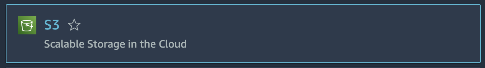
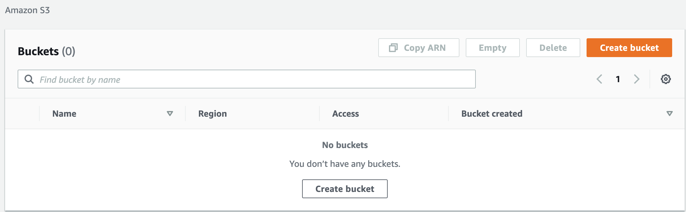
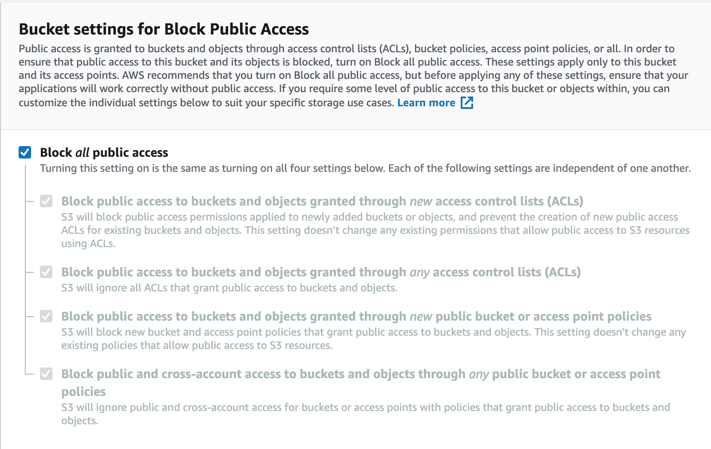
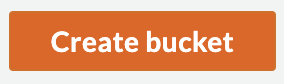
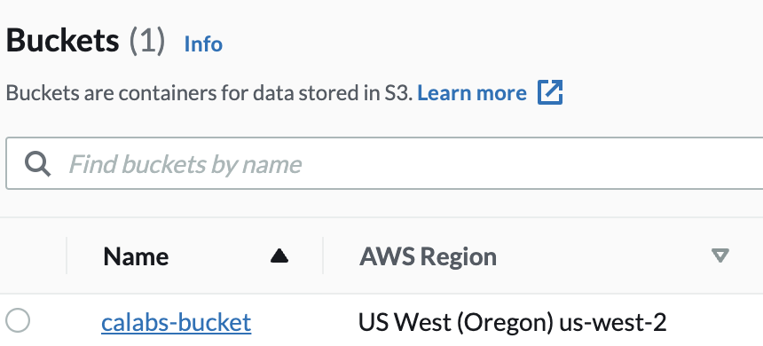
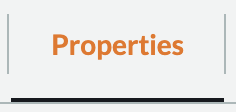

## Creating an Amazon S3 Bucket

### Introduction

You can create an Amazon S3 bucket using the AWS Management Console. As with many other AWS services, you can use the AWS API or CLI (command-line interface) as well.

In this lab step, you will create a new Amazon S3 bucket.

### Instructions

1. In the AWS Management Console search bar, enter _S3_, and click the **S3** result under **Services**:

You will be placed in the S3 console.

2. From the S3 console, click the orange **Create Bucket** button:

1. Enter a unique **Bucket name** on the **Name and region** screen of the wizard:

* **Region**: US West (Oregon) (This should be set for you. If not, please select this region.)

**_Important!_**Bucket names must be globally unique, regardless of the AWS region in which you create the bucket. Buckets must also be DNS-compliant.

The rules for DNS-compliant bucket names are:

* Bucket names must be at least 3 and no more than 63 characters long.
* Bucket names can contain lowercase letters, numbers, periods, and/or hyphens. Each label must start and end with a lowercase letter or a number.
* Bucket names must not be formatted as an IP address (for example, 192.168.1.1).

The following examples are valid bucket names: calabs-bucket-1, cloudacademybucket , cloudacademy.bucket , calabs.1 or ca-labs-bucket.

_Troubleshooting Tip_: If you receive an error because your bucket name is not unique, append a unique number to the bucket name in order to guarantee its uniqueness:

For example, change "calabs-bucket" to "calabs-bucket-1" (or a unique number/character string) and try again.

4. Leave the **Block public access (bucket settings)** at the default values:

No changes are needed. This is where you can set public access permissions.

5. Click on **Create bucket:**

A page with a table listing buckets will load and you will see a green notification that your bucket was created successfully.

6. In the **Buckets** table, click the name of your bucket in the **Name** column:

A page will load with a row of tabs at the top.

7. To see details and options for your bucket, click on the **Properties**:

This page allows you to configure your Amazon S3 bucket in many different ways. No changes are needed in this lab at this time.

Feel free to look at the other tabs and see the configuration options that are available.
