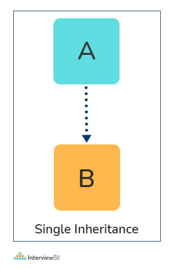
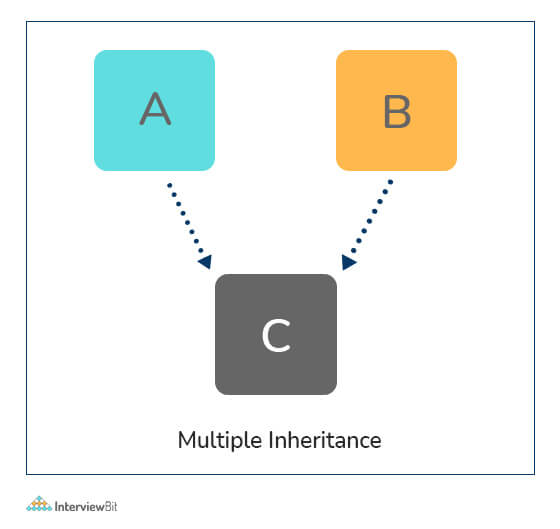
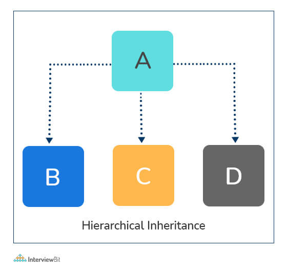

> В процессе заполнения

<mark>[Скачать | PDF](https://romankurnovskii.com/handbooks/python-handbook.pdf)</mark> *обновление 2023/02/17*

## Junior

### 1. Что такое Python? Какие преимущества использования Python?

Python - это высокоуровневый интерпретируемый язык программирования общего назначения. Будучи языком общего назначения, он может быть использован для создания практически любого типа приложений при наличии соответствующих инструментов/библиотек.

Кроме того, python поддерживает объекты, модули, потоки, обработку исключений и автоматическое управление памятью, что помогает моделировать реальные проблемы и создавать приложения для решения этих проблем.

**Преимущества использования Python:**

Python - это язык программирования общего назначения, который имеет простой, легко изучаемый синтаксис, подчеркивающий удобочитаемость и, следовательно, снижающий затраты на сопровождение программ. Более того, язык способен выполнять сценарии, является полностью открытым и поддерживает пакеты сторонних разработчиков, что способствует модульности и повторному использованию кода.

Его высокоуровневые структуры данных в сочетании с динамической типизацией и динамическим связыванием привлекают огромное сообщество разработчиков для быстрой разработки и развертывания приложений.

### 2. Что такое динамически типизированный язык?

Прежде чем понять, что такое динамически типизированный язык, мы должны узнать, что такое типизация. Типизация относится к проверке типов в языках программирования. В языке с сильной типизацией, таком как Python, "1" + 2 приведет к ошибке типа, поскольку эти языки не допускают "приведения типов" (неявного преобразования типов данных). С другой стороны, слабо типизированный язык, такой как JavaScript, просто выведет "12" в качестве результата.

Проверка типов может быть выполнена на двух этапах:

1. Статический - типы данных проверяются перед выполнением.
2. Динамический - типы данных проверяются во время выполнения.

Python - интерпретируемый язык, каждый оператор выполняется построчно, поэтому проверка типов выполняется на лету, во время выполнения. Следовательно, Python является динамически типизированным языком.

### 3. Что такое интерпретируемый язык?

Интерпретированный язык выполняет свои утверждения построчно. Такие языки, как Python, JavaScript, R, PHP и Ruby, являются яркими примерами интерпретируемых языков. Программы, написанные на интерпретируемом языке, выполняются непосредственно из исходного кода, без промежуточного этапа компиляции.

### 4. Что такое PEP 8 и почему он важен?

PEP расшифровывается как Python Enhancement Proposal. PEP - это официальный проектный документ, предоставляющий информацию сообществу Python или описывающий новую функцию для Python или его процессов.

[PEP 8](https://peps.python.org/pep-0008/) особенно важен, поскольку в нем документированы руководящие принципы стиля для кода Python. Очевидно, что вклад в сообщество разработчиков открытого кода Python требует от вас искреннего и строгого следования этим руководящим принципам стиля.

### 5. Что такое область видимости в Python?

Каждый объект в Python функционирует в пределах области видимости. **Область видимости** - это блок кода, в котором объект в Python остается актуальным. Пространства имен однозначно идентифицируют все объекты внутри программы.

В Python существует **3 области видимости**:

1. Локальная
2. Глобальная
3. Нелокальная

Однако эти пространства имен также имеют область видимости, определенную для них, где вы можете использовать их объекты без префикса. Ниже приведено несколько примеров областей видимости, создаваемых во время выполнения кода в Python:

**Локальная область видимости** относится к локальным объектам, доступным в текущей функции.

Локальная область видимости - определенная внутри функции, метода или выражения. Переменные, определенные внутри этой области, недоступны за ее пределами.

```python
x = 10
 
def my_func(a, b):
    print(x)
    print(z)
 
>>>my_func(1, 2)

10
Traceback (most recent call last):
    File "<pyshell#19>", line 1, in <module>
        my_func(1, 2)
    File "<pyshell#18>", line 3, in my_func
        print(z)
NameError: name 'z' is not defined
```

**Глобальная область видимости** относится к объектам, доступным во время выполнения кода с момента их создания.

Глобальная область видимости - определенная вне функций, методов и выражений. Переменные, определенные в глобальной области видимости, доступны везде в коде.

Область видимости на уровне модуля относится к глобальным объектам текущего модуля, доступным в программе.

Глобальная область видимости относится ко всем встроенным именам, вызываемым в программе. Объекты в этой области видимости ищутся в последнюю очередь, чтобы найти имя, на которое ссылаются.

```python
def my_func(a, b):
    global x
    print(x)
    x = 5
    print(x)
 
if __name__ == '__main__':
    x = 10
    my_func(1, 2)
    print(x)

10
5
5
```

🎾 **Примечание:** Объекты локальной области видимости могут быть синхронизированы с объектами глобальной области видимости с помощью таких ключевых слов, как **global**.

В Python 3 было добавлено новое ключевое слово под названием `nonlocal`. С его помощью мы можем добавлять переопределение области во внутреннюю область. Вы можете ознакомиться со всей необходимой на данный счет информацией в PEP 3104. Это наглядно демонстрируется в нескольких примерах. Один из самых простых – это создание функции, которая может увеличиваться:

```python
def counter():
    num = 0
    def incrementer():
        num += 1
        return num
    return incrementer
```

Если вы попробуете запустить этот код, вы получите ошибку UnboundLocalError, так как переменная num ссылается прежде, чем она будет назначена в самой внутренней функции. Давайте добавим nonlocal в наш код:

```python
def counter():
    num = 0
    def incrementer():
        nonlocal num
        num += 1
        return num
    return incrementer

c = counter()
print(c) # <function counter.<locals>.incrementer at 0x7f45caf44048>
 
c() # 1
c() # 2
c() # 3
```

### 6. Что такое списки и кортежи? В чем ключевое различие между ними?

Списки и кортежи - это типы данных последовательности, которые могут хранить коллекцию объектов в Python. Объекты, хранящиеся в обеих последовательностях, могут иметь различные типы данных. Списки представлены квадратными скобками `['sara', 6, 0.19]`, а кортежи - круглыми `('ansh', 5, 0.97)`.

Но в чем реальная разница между ними? Ключевое различие между ними заключается в том, что списки являются изменяемыми, а кортежи, напротив, неизменяемыми объектами. Это означает, что списки можно изменять, добавлять или нарезать на ходу, а кортежи остаются неизменными и не могут быть изменены никаким образом. Вы можете выполнить следующий пример, чтобы убедиться в разнице:

```python
my_tuple = ('sara', 6, 5, 0.97)
my_list = ['sara', 6, 5, 0.97]
print(my_tuple[0])     # output => 'sara'
print(my_list[0])     # output => 'sara'
my_tuple[0] = 'ansh'    # modifying tuple => throws an error
my_list[0] = 'ansh'    # modifying list => list modified
print(my_tuple[0])     # output => 'sara'
print(my_list[0])     # output => 'ansh'
```

### 7. Каковы общие встроенные типы данных в Python?

В Python существует несколько встроенных типов данных. Хотя Python не требует явного определения типов данных при объявлении переменных, ошибки могут возникнуть, если пренебречь знанием типов данных и их совместимости друг с другом. Python предоставляет функции type() и isinstance() для проверки типа этих переменных. Эти типы данных можно сгруппировать в следующие категории-

**Тип None:**

Ключевое слово **None** представляет нулевые значения в Python. Операция булева равенства может быть выполнена с использованием этих объектов **NoneType**.

**NoneType** Представляет значения `NULL` в Python.

**Числовые типы:**

Существует три различных числовых типа - целые числа (integers), числа с плавающей точкой (floating-point) и комплексные числа(complex numbers). Кроме того, булевы числа являются подтипом целых чисел.

- **int** Хранит целочисленные литералы, включая шестнадцатеричные, восьмеричные и двоичные числа, как целые числа
- **float** Хранит литералы, содержащие десятичные значения и/или знаки экспоненты, как числа с плавающей точкой
- **complex** Хранит комплексные числа в виде `(A + Bj)` и имеет атрибуты: real и imag
- **bool** Хранит булево значение (True или False).

**Типы последовательностей:**

Согласно Python Docs, существует три основных типа последовательностей - списки (lists), кортежи (tuples) и объекты диапазона (range objects). Типы последовательностей имеют операторы `in` и `not in`, определенные для обхода их элементов. Эти операторы имеют тот же приоритет, что и операции сравнения.

- **list** Неизменяемая последовательность, используемая для хранения коллекции элементов.
- **tuple** Неизменяемая последовательность, используемая для хранения коллекции элементов.
- **range** Представляет собой неизменяемую последовательность чисел, генерируемую во время выполнения.
- **str** Неизменяемая последовательность кодовых точек Unicode для хранения текстовых данных.

Стандартная библиотека также включает дополнительные типы для обработки:

1. Двоичные данные
2. Текстовые строки, такие как `str`.

**Тип словарь (dict):**

Объект отображения может отображать хэшируемые значения на произвольные объекты в Python. Объекты отображения являются изменяемыми, и в настоящее время существует только один стандартный тип отображения - **dict**.

- **dict** Хранит список пар ключ: значение, разделенных запятыми.

Типы множеств:

В настоящее время в Python есть два встроенных типа множеств - **set** и **frozenset**.

Тип **set** является изменяемым и поддерживает такие методы, как `add()` и `remove()`.

Тип **frozenset** является неизменяемым и не может быть изменен после создания.

- **set** Мутабельная неупорядоченная коллекция отдельных хэшируемых объектов.
- **frozenset** Неизменяемая коллекция отдельных хэшируемых объектов.

**set** является изменяемым и поэтому не может быть использован в качестве ключа словаря. С другой стороны, **frozenset** является неизменяемым и, следовательно, хэшируемым, и может использоваться как ключ словаря или как элемент другого множества.

**Модули:**

**Module** - это дополнительный встроенный тип, поддерживаемый интерпретатором Python. Он поддерживает одну специальную операцию, т.е. доступ к атрибуту: `mymod.myobj`, где `mymod` - модуль, а `myobj` ссылается на имя, определенное в модуле.

Таблица символов модуля находится в специальном атрибуте модуля **dict**, но прямое присвоение этому модулю невозможно и не рекомендуется.

**Типы Callable:**

Callable типы - это типы, к которым может быть применен вызов функции. Это могут быть определяемые пользователем функции, методы экземпляра, функции генератора и некоторые другие встроенные функции, методы и классы.

### 8. Что такое pass в Python?

Ключевое слово **pass** представляет собой нулевую операцию в Python. Обычно оно используется для заполнения пустых блоков кода, который может выполняться во время исполнения, но еще не написан. Без оператора **pass** в следующем коде мы можем столкнуться с некоторыми ошибками во время выполнения кода.

```python
def myEmptyFunc():
   # do nothing
   pass
myEmptyFunc()    # nothing happens
## Without the pass keyword
# File "<stdin>", line 3
# IndentationError: expected an indented block
```

### 9. Что такое модули и пакеты в Python?

Пакеты Python и модули Python - это два механизма, которые позволяют осуществлять модульное программирование в Python. Модулирование имеет несколько преимуществ:

- Простота: Работа над одним модулем помогает сосредоточиться на относительно небольшой части решаемой задачи. Это делает разработку более простой и менее подверженной ошибкам.
- Удобство обслуживания: Модули предназначены для обеспечения логических границ между различными проблемными областями. Если они написаны таким образом, что уменьшают взаимозависимость, то меньше вероятность того, что изменения в модуле могут повлиять на другие части программы.
- Возможность повторного использования: Функции, определенные в модуле, могут быть легко использованы повторно в других частях приложения.
- Разметка: Модули обычно определяют отдельное пространство имен, что помогает избежать путаницы между идентификаторами из других частей программы.

Модули, в общем случае, это просто файлы Python с расширением `.py`, в которых может быть определен и реализован набор функций, классов или переменных. Они могут быть импортированы и инициализированы один раз с помощью оператора `import`. Если требуется частичная функциональность, импортируйте необходимые классы или функции с помощью оператора `import`: `from foo import bar`.

Пакеты позволяют иерархически структурировать пространство имен модуля с помощью точечной нотации. Как модули помогают избежать столкновений между именами глобальных переменных, так и пакеты помогают избежать столкновений между именами модулей.

Создать пакет очень просто, поскольку он использует присущую системе файловую структуру. Просто поместите модули в папку, и вот оно, имя папки как имя пакета. Для импорта модуля или его содержимого из этого пакета требуется, чтобы имя пакета было префиксом к имени модуля, соединенным точкой.

Примечание: технически вы можете импортировать и пакет, но, увы, это не импортирует модули внутри пакета в локальное пространство имен.

### 10. Что такое глобальные, защищенные и приватные атрибуты в Python?

**Глобальные переменные**- это общедоступные переменные, которые определены в глобальной области видимости. Чтобы использовать переменную в глобальной области видимости внутри функции, мы используем ключевое слово **global**.

**Защищенные атрибуты** (Protected attributes) - это атрибуты, определенные с префиксом подчеркивания к их идентификатору, например, `_sara`. К ним все еще можно получить доступ и изменить их извне класса, в котором они определены, но ответственный разработчик должен воздержаться от этого.

**Приватные атрибуты** (Private attributes) - это атрибуты с двойным подчеркиванием в префиксе к их идентификатору, например __ansh. Они не могут быть доступны или изменены извне напрямую, и при такой попытке будет выдана ошибка `AttributeError`.

### 11. Как используется self в Python?

`self` используется для представления экземпляра класса. С помощью этого ключевого слова вы можете получить доступ к атрибутам и методам класса в python.

`self` связывает атрибуты с заданными аргументами. `self` используется в разных местах и часто считается ключевым словом. Но в отличие от C++, `self` не является ключевым словом в Python.

### 12. Что такое **init**?

**init** - это метод-конструктор в Python, который автоматически вызывается для выделения памяти при создании нового объекта/экземпляра. Все классы имеют метод **init**, связанный с ними. Он помогает отличить методы и атрибуты класса от локальных переменных.

```python
# class definition
class Student:
   def __init__(self, fname, lname, age, section):
       self.firstname = fname
       self.lastname = lname
       self.age = age
       self.section = section
# creating a new object
stu1 = Student("Sara", "Ansh", 22, "A2")
```

### 13. Что такое break, continue и pass в Python?

Оператор **break** немедленно завершает цикл, а управление переходит к оператору после тела цикла.

Оператор **continue** завершает текущую итерацию оператора, пропускает остальной код в текущей итерации, а управление переходит к следующей итерации цикла.

Ключевое слово **pass** в Python обычно используется для заполнения пустых блоков и аналогично пустому утверждению, представленному точкой с запятой в таких языках, как Java, C++, Javascript и т.д.

### 14. Что такое модульные тесты в Python?

Юнит-тесты - это структура модульного тестирования в Python.

Юнит-тестирование означает тестирование различных компонентов программного обеспечения по отдельности. Можете ли вы подумать о том, почему модульное тестирование важно? Представьте себе сценарий: вы создаете программное обеспечение, которое использует три компонента, а именно A, B и C. Теперь предположим, что в какой-то момент ваше программное обеспечение ломается. Как вы определите, какой компонент был ответственен за поломку программы? Может быть, это компонент A вышел из строя, который, в свою очередь, вышел из строя компонент B, что и привело к поломке программного обеспечения. Таких комбинаций может быть множество.

Вот почему необходимо должным образом протестировать каждый компонент, чтобы знать, какой компонент может быть ответственен за сбой программного обеспечения.

### 15. Что такое docstring в Python?

docstring - это многострочная строка, используемая для документирования определенного участка кода.

В `docstring` должно быть описано, что делает функция или метод.

### 16.  Что такое срез в Python?

Как следует из названия, "срез" - это взятие частей.

Синтаксис следующий [start : stop : step].

- start - начальный индекс, с которого производится нарезка списка или кортежа
- stop - конечный индекс или место нарезки.
- step - количество шагов для перехода.

Значение по умолчанию для start - 0, stop - количество элементов, step - 1.

Срезы можно выполнять для строк, массивов, списков и кортежей.

```python
numbers = [1, 2, 3, 4, 5, 6, 7, 8, 9, 10]
print(numbers[1 : : 2])  #output : [2, 4, 6, 8, 10]
```

### 17.  Объясните, как можно сделать Python Script исполняемым на Unix?

Файл сценария должен начинаться с #!/usr/bin/env python

### 18.  В чем разница между массивами и списками в Python?

Массивы в python могут содержать элементы только одного типа данных, т.е. тип данных массива должен быть однородным. Это тонкая обертка вокруг массивов языка C, и они потребляют гораздо меньше памяти, чем списки.

Списки в python могут содержать элементы разных типов данных, то есть тип данных списков может быть неоднородным. Их недостатком является потребление большого объема памяти.

```python
import array
a = array.array('i', [1, 2, 3])
for i in a:
    print(i, end=' ')    #OUTPUT: 1 2 3
a = array.array('i', [1, 2, 'string'])    #OUTPUT: TypeError: an integer is required (got type str)

    a = [1, 2, 'string']
for i in a:
   print(i, end=' ')    #OUTPUT: 1 2 string
```

## Middle / Senior

### 19. Как осуществляется управление памятью в Python?

Управление памятью в Python осуществляется менеджером памяти Python. Память, выделяемая менеджером, представляет собой частное пространство кучи, предназначенное для Python. Все объекты Python хранятся в этой куче, и, будучи частной, она недоступна программисту. Тем не менее, Python предоставляет некоторые основные функции API для работы с частным пространством кучи.

Кроме того, Python имеет встроенную сборку мусора для утилизации неиспользуемой памяти для частного пространства кучи.

### 20. Что такое пространства имен Python? Зачем они используются?

Пространство имен в Python гарантирует, что имена объектов в программе уникальны и могут использоваться без каких-либо конфликтов. Python реализует эти пространства имен в виде словарей, в которых "имя как ключ" сопоставлено с соответствующим "объектом как значением". Это позволяет нескольким пространствам имен использовать одно и то же имя и сопоставлять его с отдельным объектом. Ниже приведены несколько примеров пространств имен:

Локальное пространство имен включает локальные имена внутри функции. Пространство имен временно создается для вызова функции и очищается после возвращения функции.

Глобальное пространство имен включает имена из различных импортированных пакетов/модулей, которые используются в текущем проекте. Это пространство имен создается при импорте пакета в скрипт и сохраняется до выполнения скрипта.

Встроенное пространство имен включает встроенные функции ядра Python и встроенные имена для различных типов исключений.

Жизненный цикл пространства имен зависит от области видимости объектов, с которыми они сопоставлены. Если область видимости объекта заканчивается, жизненный цикл этого пространства имен завершается. Следовательно, невозможно получить доступ к объектам внутреннего пространства имен из внешнего пространства имен.

### 21. Что такое разрешение области видимости в Python?

Иногда объекты в одной области видимости имеют одинаковые имена, но функционируют по-разному. В таких случаях разрешение области видимости в Python происходит автоматически. Вот несколько примеров такого поведения:

Модули Python 'math' и 'cmath' имеют множество функций, общих для обоих - log10(), acos(), exp() и т.д. Чтобы разрешить эту двусмысленность, необходимо снабдить их префиксом соответствующего модуля, например, math.exp() и cmath.exp().

Рассмотрим приведенный ниже код, объект temp был инициализирован на 10 глобально и затем на 20 при вызове функции. Однако вызов функции не изменил значение temp глобально. Здесь мы можем заметить, что Python проводит четкую границу между глобальными и локальными переменными, рассматривая их пространства имен как отдельные личности.

```python
temp = 10   # global-scope variable
def func():
     temp = 20   # local-scope variable
     print(temp)
print(temp)   # output => 10
func()    # output => 20
print(temp)   # output => 10
```

Это поведение может быть переопределено с помощью ключевого слова global внутри функции, как показано в следующем примере:

```python
temp = 10   # global-scope variable
def func():
     global temp
     temp = 20   # local-scope variable
     print(temp)
print(temp)   # output => 10
func()    # output => 20
print(temp)   # output => 20
```

### 22. Что такое декораторы в Python?

Декораторы в Python - это, по сути, функции, которые добавляют функциональность к существующей функции в Python без изменения структуры самой функции. В Python они обозначаются @decorator_name и вызываются по принципу "снизу вверх". Например:

```python
# decorator function to convert to lowercase
def lowercase_decorator(function):
   def wrapper():
       func = function()
       string_lowercase = func.lower()
       return string_lowercase
   return wrapper

# decorator function to split words
def splitter_decorator(function):
   def wrapper():
       func = function()
       string_split = func.split()
       return string_split
   return wrapper

@splitter_decorator # this is executed next
@lowercase_decorator # this is executed first
def hello():
    return 'Hello World'
hello()   # output => [ 'hello' , 'world' ]
```

Прелесть декораторов заключается в том, что помимо добавления функциональности к выходу метода, они могут даже принимать аргументы для функций и дополнительно модифицировать эти аргументы перед передачей в саму функцию. Внутренняя вложенная функция, то есть функция-"обертка", играет здесь важную роль. Она реализуется для обеспечения инкапсуляции и, таким образом, скрывает себя от глобальной области видимости.

```python
# decorator function to capitalize names
def names_decorator(function):
   def wrapper(arg1, arg2):
       arg1 = arg1.capitalize()
       arg2 = arg2.capitalize()
       string_hello = function(arg1, arg2)
       return string_hello
   return wrapper

@names_decorator
def say_hello(name1, name2):
   return 'Hello ' + name1 + '! Hello ' + name2 + '!'
say_hello('sara', 'ansh')   # output => 'Hello Sara! Hello Ansh!'
```

### 23. Что такое comprehensions Dict и List?

Python comprehensions, как и декораторы, - это синтаксический сахар, который помогает строить измененные и отфильтрованные списки, словари или множества из заданного списка, словаря или множества. Использование понятий позволяет сэкономить много времени и сэкономить код, который мог бы быть значительно более многословным (содержать больше строк кода). Давайте рассмотрим несколько примеров, в которых понимания могут быть действительно полезны:

Словарные (Dict) comprehension используют фигурные скобки и позволяют создавать новые словари на основе уже существующих.

```python
new_dict = {key: value for key, value in old_dict.items() if value > 2}
```

Выполнение математических операций над всем списком

```python
my_list = [2, 3, 5, 7, 11]
squared_list = [x**2 for x in my_list]    # list comprehension
# output => [4 , 9 , 25 , 49 , 121]
squared_dict = {x:x**2 for x in my_list}    # dict comprehension
# output => {11: 121, 2: 4 , 3: 9 , 5: 25 , 7: 49}
```

Выполнение операций условной фильтрации для всего списка

```python
my_list = [2, 3, 5, 7, 11]
squared_list = [x**2 for x in my_list if x%2 != 0]    # list comprehension
# output => [9 , 25 , 49 , 121]
squared_dict = {x:x**2 for x in my_list if x%2 != 0}    # dict comprehension
# output => {11: 121, 3: 9 , 5: 25 , 7: 49}
```

Объединение нескольких списков в один

```python
a = [1, 2, 3]
b = [7, 8, 9]
[(x + y) for (x,y) in zip(a,b)]  # parallel iterators
# output => [8, 10, 12]
[(x,y) for x in a for y in b]    # nested iterators
# output => [(1, 7), (1, 8), (1, 9), (2, 7), (2, 8), (2, 9), (3, 7), (3, 8), (3, 9)] 
```

Преобразование многомерного массива в одномерный

Аналогичный подход вложенных итераторов (как описано выше) может быть применен для сглаживания многомерного списка или работы с его внутренними элементами.

```python
my_list = [[10,20,30],[40,50,60],[70,80,90]]
flattened = [x for temp in my_list for x in temp]
# output => [10, 20, 30, 40, 50, 60, 70, 80, 90]
```

Примечание: генератор списков имеет тот же эффект, что и метод map в других языках. Они используют математическую нотацию построителя множеств, а не функции `map` и `filter` в Python.

### 24. Что такое лямбда в Python? Почему это используется?

Лямбда - это анонимная функция в Python, которая может принимать любое количество аргументов, но может иметь только одно выражение. Обычно она используется в ситуациях, когда требуется анонимная функция на короткий промежуток времени. Лямбда-функции можно использовать одним из двух способов:

Присвоение лямбда-функций переменной:

```python
mul = lambda a, b : a * b
print(mul(2, 5))    # output => 10
```

Обертывание лямбда-функций внутри другой функции:

```python
def myWrapper(n):
    return lambda a : a * n
mulFive = myWrapper(5)
print(mulFive(2))    # output => 10
```

### 25. Как скопировать объект в Python?

В Python оператор присваивания (`=`) не копирует объекты. Вместо этого он создает связь(ссылку) между существующим объектом и именем целевой переменной. Чтобы создать копии объекта в Python, необходимо использовать модуль `copy`. Существует два способа создания копий для данного объекта с помощью модуля `copy`.

**Shallow Copy** - это побитовая копия объекта. Созданный скопированный объект имеет точную копию значений в исходном объекте. Если одно из значений является ссылкой на другие объекты, копируются только адреса ссылок на них.

**Глубокое копирование** рекурсивно копирует все значения от исходного объекта к целевому, т.е. дублирует даже объекты, на которые ссылается исходный объект.

```python
from copy import copy, deepcopy
list_1 = [1, 2, [3, 5], 4]
## shallow copy
list_2 = copy(list_1) 
list_2[3] = 7
list_2[2].append(6)
list_2    # output => [1, 2, [3, 5, 6], 7]
list_1    # output => [1, 2, [3, 5, 6], 4]
## deep copy
list_3 = deepcopy(list_1)
list_3[3] = 8
list_3[2].append(7)
list_3    # output => [1, 2, [3, 5, 6, 7], 8]
list_1    # output => [1, 2, [3, 5, 6], 4]
```

### 26. В чем разница между xrange и range в Python?

`xrange()` и `range()` довольно похожи по функциональности. Они оба генерируют последовательность целых чисел, с той лишь разницей, что `range()` возвращает список Python, тогда как `xrange()` возвращает объект `xrange`.

В отличие от `range()`, `xrange()` не генерирует статический список, а создает значение на ходу. Эта техника обычно используется с генератором объектного типа и называется "**yielding**".

Выдача очень важна в приложениях, где память ограничена. Создание статического списка, как в `range()`, может привести к ошибке памяти в таких условиях, в то время как `xrange()` может справиться с этим оптимально, используя только достаточное количество памяти для генератора (значительно меньше по сравнению с другими).

```python
for i in xrange(10):    # numbers from o to 9
    print i       # output => 0 1 2 3 4 5 6 7 8 9
for i in xrange(1,10):    # numbers from 1 to 9
    print i       # output => 1 2 3 4 5 6 7 8 9
for i in xrange(1, 10, 2):    # skip by two for next
    print i       # output => 1 3 5 7 9
```

Примечание: `xrange` была устаревшей начиная с Python 3.x. Теперь `range` делает то же самое, что делала `xrange` в Python 2.x, поскольку в Python 2.x было гораздо лучше использовать `xrange()`, чем оригинальную функцию `range()`.

### 27. Что такое `pickling` и `unpickling`?

Библиотека Python предлагает **функцию сериализации** из коробки. Сериализация объекта означает преобразование его в формат, который можно хранить, чтобы впоследствии можно было десериализовать его и получить исходный объект.

**Pickling** - это название процесса сериализации в Python. Любой объект в Python может быть сериализован в поток байтов и выгружен в память в виде файла. Процесс `pickling` компактен, но объекты `pickle` могут быть сжаты еще больше.  `pickle` отслеживает объекты, которые он сериализовал, и сериализация переносима между версиями.

Для этого процесса используется функция `pickle.dump()`.

Распаковка (**Unpickling**) - является полной противоположностью `pickle`. Он десериализует поток байтов для воссоздания объектов, хранящихся в файле, и загружает объект в память.

Для этого используется функция `pickle.load()`.

### 28. Что такое генераторы в Python?

Генераторы - это функции, которые возвращают итерируемую коллекцию элементов, по одному за раз, заданным образом. Генераторы, в общем случае, используются для создания итераторов с другим подходом. Они используют ключевое слово `yield`, а не `return` для возврата объекта генератора.

Построим генератор для чисел Фибоначчи:

```python
## generate fibonacci numbers upto n
def fib(n):
    p, q = 0, 1
    while(p < n):
        yield p
        p, q = q, p + q

x = fib(10)    # create generator object 
 
## iterating using __next__(), for Python2, use next()
x.__next__()    # output => 0
x.__next__()    # output => 1
x.__next__()    # output => 1
x.__next__()    # output => 2
x.__next__()    # output => 3
x.__next__()    # output => 5
x.__next__()    # output => 8
x.__next__()    # error
 
## iterating using loop
for i in fib(10):
    print(i)    # output => 0 1 1 2 3 5 8
```

### 29. Что такое PYTHONPATH в Python?

`PYTHONPATH` - это переменная окружения, которую можно установить, чтобы добавить дополнительные каталоги, в которых Python будет искать модули и пакеты.

Это особенно полезно при работе с библиотеками Python, которые вы не хотите устанавливать в глобальном месте по умолчанию.

### 30. Как используются функции help() и dir()?

Функция `help()` в Python используется для отображения документации по модулям, классам, функциям, ключевым словам и т.д. Если функции `help()` не передан ни один параметр, то на консоли запускается интерактивная справочная утилита.

Функция `dir()` пытается вернуть правильный список атрибутов и методов объекта, к которому она обращается. Она ведет себя по-разному с разными объектами, поскольку стремится выдать наиболее релевантные данные, а не полную информацию.

- Для объектов Modules/Library он возвращает список всех атрибутов, содержащихся в данном модуле.
- Для объектов класса возвращает список всех допустимых атрибутов и базовых атрибутов.
- При отсутствии аргументов возвращает список атрибутов в текущей области видимости.

### 31. В чем разница между файлами .py и .pyc?

Файлы `.py` содержат исходный код программы. В то время как файл `.pyc` содержит байткод программы. Мы получаем байткод после компиляции файла `.py` (исходного кода). Файлы `.pyc` создаются не для всех файлов, которые вы запускаете. Они создаются только для тех файлов, которые вы импортируете.

Перед выполнением программы python интерпретатор python проверяет наличие скомпилированных файлов. Если файл присутствует, виртуальная машина выполняет его. Если файл не найден, он проверяет наличие файла `.py`. Если он найден, то компилирует его в файл `.pyc`, а затем виртуальная машина python выполняет его.

Наличие файла `.pyc` экономит время компиляции.

### 32. Как интерпретируется язык Python?

Python как язык не интерпретируется и не компилируется. Интерпретация или компиляция - это свойство реализации. Python - это байткод (набор инструкций, читаемых интерпретатором), интерпретируемый в общем случае.

Исходный код - это файл с расширением `.py`.

Python компилирует исходный код в набор инструкций для виртуальной машины. Интерпретатор Python является реализацией этой виртуальной машины. Этот промежуточный формат называется "байткод".

Исходный код `.py` сначала компилируется, чтобы получить `.pyc`, который является байткодом. Затем этот байткод может быть интерпретирован официальным CPython или JIT (Just in Time compiler) компилятором PyPy.

### 33. Как в python аргументы передаются по значению или по ссылке?

Передача по значению: Передается копия реального объекта. Изменение значения копии объекта не приведет к изменению значения исходного объекта.

Передача по ссылке: Передается ссылка на реальный объект. Изменение значения нового объекта изменит значение исходного объекта.

В Python аргументы передаются по ссылке, т.е. передается ссылка на реальный объект.

```python
def appendNumber(arr):
    arr.append(4)

arr = [1, 2, 3].
print(arr) #Вывод: => [1, 2, 3]
appendNumber(arr)
print(arr) #Вывод: => [1, 2, 3, 4]
```

### 34. Что такое итераторы в Python?

- Итератор - это объект.
- Он запоминает свое состояние, т.е. где он находится во время итерации (см. код ниже, чтобы увидеть, как это делается).
- Метод **iter**() инициализирует итератор.
- У него есть метод **next**(), который возвращает следующий элемент в итерации и указывает на следующий элемент. При достижении конца итерируемого объекта **next**() должен возвращать исключение [`StopIteration`](https://docs.python.org/3/library/exceptions.html#StopIteration).
- Он также является самоитерируемым.
- Итераторы - это объекты, с помощью которых мы можем выполнять итерации над итерируемыми объектами, такими как списки, строки и т.д.

```python
class ArrayList:
   def __init__(self, number_list):
       self.numbers = number_list
   def __iter__(self):
       self.pos = 0
       возвращать себя
   def __next__(self):
       if(self.pos < len(self.numbers)):
           self.pos += 1
           return self.numbers[self.pos - 1]
       else:
           raise StopIteration
array_obj = ArrayList([1, 2, 3])
it = iter(array_obj)
print(next(it)) #вывод: 2
print(next(it)) #вывод: 3
print(next(it))
#Throws Exception
#Traceback (последний последний вызов):
#...
#StopIteration
```

### 35. Объясните, как удалить файл в Python?

Используйте команду `os.remove(file_name)`

```python
import os

os.remove("ChangedFile.csv")
print("File Removed!")
```

### 36. Объясните функции split() и join() в Python?

Вы можете использовать функцию `split()` для разбиения строки на основе разделителя на список строк.

С помощью функции `join()` можно объединить список строк на основе разделителя, чтобы получить одну строку.

```python
string = "Текст строки".
string_list = string.split(' ') #разделителем является символ "пробел" или ' '
print(string_list) #вывод: ['This', 'is', 'a', 'string.'].
print(' '.join(string_list)) #вывод: Это строка.
```

### 37. Что означают *args и **kwargs?

`*args`

- `*args` - это специальный синтаксис, используемый в определении функции для передачи аргументов переменной длины.
- `"*"` означает переменную длину, а "args" - это имя, используемое по соглашению. Вы можете использовать любое другое.

```python
def multiply(a, b, *argv):
   mul = a * b
   for num in argv:
       mul *= num
   возвращать mul
print(multiply(1, 2, 3, 4, 5)) #вывод: 120
```

`**kwargs`

`**kwargs` - это специальный синтаксис, используемый в определении функции для передачи аргументов переменной длины с ключевыми словами.

- Здесь также `kwargs` используется просто по соглашению. Вы можете использовать любое другое имя.
- Аргумент с ключевым словом означает переменную, которая имеет имя при передаче в функцию.
- На самом деле это словарь имен переменных и их значений.

```python
def tellArguments(**kwargs):
   for key, value in kwargs.items():
       print(key + ": " + value)
tellArguments(arg1 = "аргумент 1", arg2 = "аргумент 2", arg3 = "аргумент 3")
#вывод:
# arg1: аргумент 1
# arg2: аргумент 2
# arg3: аргумент 3
```

### 38. Что такое отрицательные индексы и зачем они используются?

Отрицательные индексы - это индексы с конца списка, кортежа или строки.

```python
arr = [1, 2, 3, 4, 5, 6]

arr[-1] означает последний элемент массива arr[]

#получить последний элемент
print(arr[-1]) #вывод 6

#получить второй последний элемент
print(arr[-2]) #вывод 5
```

## Junior/Middle+ / ООП

### 39. Как создать класс в Python?

Чтобы создать класс в python, используем ключевое слово `class`, как показано в примере ниже:

```python
class Employee:
    def __init__(self, emp_name):
        self.emp_name = emp_name
```

Чтобы инстанцировать или создать объект из класса, созданного выше, мы делаем следующее:

```python
emp_1 = Employee("Mr. Employee").
```

Чтобы получить доступ к атрибуту `name`, мы просто вызываем атрибут с помощью *точки*:

```python
print(emp_1.emp_name)
# Mr. Employee
```

Чтобы создать методы внутри класса, мы включаем их в область видимости класса:

```python
class Employee:
   def __init__(self, emp_name):
       self.emp_name = emp_name
       
   def introduce(self):
       print("Hello I am " + self.emp_name)
```

Параметр `self` в функциях `init` и introduce представляет собой ссылку на текущий экземпляр класса, которая используется для доступа к атрибутам и методам этого класса. Параметр `self` должен быть первым параметром любого метода, определенного внутри класса.

Доступ к методу класса `Employee` можно получить:

```python
emp_1.introduce()
```

Общая программа будет выглядеть следующим образом:

```python
class InterviewbitEmployee:
   def __init__(self, emp_name):
       self.emp_name = emp_name
       
   def introduce(self):
       print("Hello I am " + self.emp_name)
       
# create an object of InterviewbitEmployee class
emp_1 = InterviewbitEmployee("Mr Employee")
print(emp_1.emp_name)    #print employee name
emp_1.introduce()        #introduce the employee
```

### 40. Как работает наследование в python?

Наследование дает классу право доступа ко всем атрибутам и методам другого класса. Это способствует повторному использованию кода и помогает разработчику поддерживать приложения без лишнего кода. Класс, наследующий от другого класса, является дочерним классом или также называется производным классом. Класс, от которого дочерний класс получает свои члены, называется родительским классом или суперклассом.

Python поддерживает различные виды наследования, а именно:

- Одиночное наследование
- Многоуровневое наследование
- Множественное наследование
- Иерархическое наследование

**Одиночное наследование:** Дочерний класс получает члены от одного родительского класса.



```python
# Parent class
class ParentClass:
    def par_func(self):
         print("I am parent class function")

# Child class
class ChildClass(ParentClass):
    def child_func(self):
         print("I am child class function")

# Driver code
obj1 = ChildClass()
obj1.par_func()
obj1.child_func()
```

**Многоуровневое наследование:** Члены родительского класса `A` наследуются дочерним классом, который затем наследуется другим дочерним классом `B`. Характеристики базового и производного классов далее наследуются в новом производном классе `C`.

Здесь `A` является *дедушкой* класса `C`.


```python
# Parent class
class A:
   def __init__(self, a_name):
       self.a_name = a_name
   
# Intermediate class
class B(A):
   def __init__(self, b_name, a_name):
       self.b_name = b_name
       # invoke constructor of class A
       A.__init__(self, a_name)

# Child class
class C(B):
   def __init__(self,c_name, b_name, a_name):
       self.c_name = c_name
       # invoke constructor of class B
       B.__init__(self, b_name, a_name)
       
   def display_names(self):
       print("A name : ", self.a_name)
       print("B name : ", self.b_name)
       print("C name : ", self.c_name)

#  Driver code
obj1 = C('child', 'intermediate', 'parent')
print(obj1.a_name)
obj1.display_names()
```

**Множественное наследование:** Это достигается, когда один дочерний класс получает свойста от более чем одного родительского класса. Все свойства родительских классов наследуются в дочернем классе.



```python
# Parent class1
class Parent1:
   def parent1_func(self):
       print("Hi I am first Parent")

# Parent class2
class Parent2:
   def parent2_func(self):
       print("Hi I am second Parent")

# Child class
class Child(Parent1, Parent2):
   def child_func(self):
       self.parent1_func()
       self.parent2_func()

# Driver's code
obj1 = Child()
obj1.child_func()
```

**Иерархическое наследование:** Когда от родительского класса происходит более одного дочернего класса.



```python
# Base class
class A:
     def a_func(self):
         print("I am from the parent class.")

# 1st Derived class
class B(A):
     def b_func(self):
         print("I am from the first child.")

# 2nd Derived class
class C(A):
     def c_func(self):
         print("I am from the second child.")
 
# Driver's code
obj1 = B()
obj2 = C()
obj1.a_func()
obj1.b_func()    #child 1 method
obj2.a_func()
obj2.c_func()    #child 2 method
```

### 41. Как получить доступ к членам родительского класса в дочернем классе?

Ниже перечислены способы, с помощью которых вы можете получить доступ к членам родительского класса в дочернем классе:

С помощью **имени родительского класса**: Вы можете использовать имя родительского класса для доступа к атрибутам, как показано в примере ниже:

```python
class Parent(object):  
   # Constructor
   def __init__(self, name):
       self.name = name    
 
class Child(Parent): 
   # Constructor
   def __init__(self, name, age):
       Parent.name = name
       self.age = age
 
   def display(self):
       print(Parent.name, self.age)
 
# Driver Code
obj = Child("ParentName", 6)
obj.display()
```

С помощью метода `super()`: Члены родительского класса могут быть доступны в дочернем классе с помощью ключевого слова `super`.

```python
class Parent(object):
   # Constructor
   def __init__(self, name):
       self.name = name    

class Child(Parent):
   # Constructor
   def __init__(self, name, age):         
       ''' 
       In Python 3.x, we can also use super().__init__(name)
       ''' 
       super(Child, self).__init__(name)
       self.age = age
 
   def display(self):
      # Note that Parent.name cant be used 
      # here since super() is used in the constructor
      print(self.name, self.age)

# Driver Code
obj = Child("Interviewbit", 6)
obj.display()
```

### 42. Используются ли спецификаторы доступа в python?

Да, в Python есть спецификаторы доступа, но они не являются строгими и не работают так же, как в других языках, таких как C++ или Java.

В Python есть три уровня спецификаторов доступа:

- **Public** - открытый доступ. Переменные и методы, объявленные без какого-либо спецификатора доступа, считаются общедоступными и могут быть использованы в любом месте программы.
- **Protected** - защищенный доступ. Переменные и методы, которые начинаются с символа подчеркивания (_), считаются защищенными и должны использоваться только внутри класса и его потомков.
- **Private** - закрытый доступ. Переменные и методы, которые начинаются с двух символов подчеркивания (__), считаются закрытыми и не могут быть использованы за пределами класса, даже его потомками.

Однако в Python все переменные и методы на самом деле являются общедоступными и могут быть доступны вне класса, даже если они были объявлены с использованием защищенного или закрытого спецификатора доступа. Но общепринятым правилом считается использование подчеркиваний в начале имен переменных и методов, чтобы показать, что они не предназначены для использования вне класса.

Также существует соглашение, что имена методов и переменных, начинающихся с двух символов подчеркивания, должны использоваться только внутри класса.

Пример использования спецификаторов доступа в Python:

```python
class Example:
    def __init__(self):
        self.public_variable = "Public variable" # публичная переменная
        self._protected_variable = "Protected variable" # защищенная переменная
        self.__private_variable = "Private variable" # приватная переменная

    def public_method(self):
        print("Public method")

    def _protected_method(self):
        print("Protected method")

    def __private_method(self):
        print("Private method")

example = Example()

# Доступ к публичной переменной и методу
print(example.public_variable) # выведет "Public variable"
example.public_method() # выведет "Public method"

# Доступ к защищенной переменной и методу
print(example._protected_variable) # выведет "Protected variable"
example._protected_method() # выведет "Protected method"

# Доступ к приватной переменной и методу
# Возникнет ошибка AttributeError, потому что переменная и метод приватные
print(example.__private_variable)
example.__private_method()
```

В этом примере мы создали класс `Example` с тремя переменными и методами, которые имеют разные уровни спецификаторов доступа. Затем мы создали объект `example` и использовали различные спецификаторы доступа, чтобы получить доступ к его переменным и методам.

### 43. Можно ли вызвать родительский класс без создания его экземпляра?

Да, это возможно, если базовый класс инстанцируется другими дочерними классами или если базовый класс является статическим методом.

### 44. Как в python создается пустой класс?

Пустой класс не имеет определенных свойств/методов, определенных внутри. Он создается с помощью ключевого слова pass (команда pass ничего не делает в python). Мы можем создавать объекты для этого класса вне класса.

```python
class MyClass:
    pass
```

### 45. Проведите различие между модификаторами `new` и `override`

`new` используется для создания новой реализации метода в классе-наследнике, которая заменяет реализацию метода в базовом классе. Это означает, что когда метод вызывается на объекте класса-наследника, будет использоваться новая реализация метода из класса-наследника, а не из базового класса.

`override` используется для переопределения реализации метода, унаследованного от базового класса. Это означает, что когда метод вызывается на объекте класса-наследника, будет использоваться новая реализация метода из класса-наследника, а не реализация метода из базового класса.

Если в классе-наследнике не определен метод с тем же именем, что и метод в базовом классе, то метод базового класса будет унаследован.

```python
class BaseClass:
    def method(self):
        print("BaseClass.method")

class DerivedClass1(BaseClass):
    def method(self):
        print("DerivedClass1.method")

class DerivedClass2(BaseClass):
    def new_method(self):
        print("DerivedClass2.new_method")

class DerivedClass3(BaseClass):
    def method(self):
        super().method()
        print("DerivedClass3.method")

base_object = BaseClass()
derived_object1 = DerivedClass1()
derived_object2 = DerivedClass2()
derived_object3 = DerivedClass3()

base_object.method() # выведет "BaseClass.method"
derived_object1.method() # выведет "DerivedClass1.method"
derived_object2.new_method() # выведет "DerivedClass2.new_method"
derived_object3.method() # выведет "BaseClass.method" и "DerivedClass3.method"
```

### 46. Как использовать декораторы для определения свойств (property) в Python?

В Python свойства (property) позволяют использовать методы геттера (getter) и сеттера (setter) для доступа к данным объекта, скрывая реализацию от пользователя.

Для определения свойства (property) в Python используются декораторы @property, @property_name.setter и @property_name.deleter. Декоратор @property указывается перед методом геттера, который должен возвращать значение свойства. Декоратор @property_name.setter указывается перед методом сеттера, который должен устанавливать значение свойства. Декоратор @property_name.deleter указывается перед методом удаления, который должен удалить свойство.

Пример определения свойства (property) с помощью декораторов в Python:

```python
class Rectangle:
    def __init__(self, width, height):
        self.width = width
        self.height = height

    @property
    def area(self):
        return self.width * self.height

    @property
    def perimeter(self):
        return 2 * (self.width + self.height)

    @property
    def width(self):
        return self._width

    @width.setter
    def width(self, value):
        if value <= 0:
            raise ValueError("Width must be positive.")
        self._width = value

    @property
    def height(self):
        return self._height

    @height.setter
    def height(self, value):
        if value <= 0:
            raise ValueError("Height must be positive.")
        self._height = value

    @property
    def dimensions(self):
        return (self.width, self.height)

    @dimensions.setter
    def dimensions(self, values):
        self.width, self.height = values

    def __str__(self):
        return f"Rectangle({self.width}, {self.height})"

```

В этом примере мы создали класс `Rectangle`, который определяет прямоугольник с шириной и высотой. Мы определили свойства (property) `area`, `perimeter`, `width`, `height` и `dimensions` с помощью декораторов.

Свойства `area` и `perimeter` используют методы геттера для вычисления площади и периметра.

Свойства `width` и `height` используют методы геттера и сеттера для доступа к ширине и высоте.

Свойство `dimensions` использует методы геттера и сеттера для доступа к ширине и высоте в виде кортежа.

Теперь мы можем создать объект класса `Rectangle` и использовать свойства для доступа к данным:

```python
rect = Rectangle(3, 4)
print(rect.width) # выведет 3
print(rect.height) # выведет 4
print(rect.area) # выведет 12
print(rect.perimeter) #
```

### 47. Что такое метод `init` в python?

В Python метод `__init__` является конструктором класса, который вызывается при создании нового объекта класса. Он используется для инициализации свойств объекта и может принимать параметры, которые передаются при создании объекта.

```python
class MyClass:
    def __init__(self, name):
        self.name = name

my_object = MyClass("John")
print(my_object.name) # выведет "John"
```

В этом примере мы создали класс `MyClass` с методом `__init__`, который инициализирует свойство `name` объекта класса. При создании объекта `my_object` мы передали ему параметр "John", который был использован для инициализации свойства `name`.

### 48. Как проверить, является ли класс дочерним по отношению к другому классу?

В Python можно проверить, является ли класс дочерним по отношению к другому классу с помощью функции `issubclass`. Функция `issubclass` принимает два аргумента: класс-потомок и класс-родитель, и возвращает `True`, если класс-потомок является подклассом класса-родителя, и `False` в противном случае.

Вот пример использования функции `issubclass` в Python:

```python
class BaseClass:
    pass

class DerivedClass(BaseClass):
    pass

print(issubclass(DerivedClass, BaseClass)) # выведет True
print(issubclass(BaseClass, DerivedClass)) # выведет False
```

В этом примере мы создали два класса, `BaseClass` и `DerivedClass`, где `DerivedClass` наследует `BaseClass`. Мы затем использовали функцию `issubclass`, чтобы проверить, является ли `DerivedClass` дочерним по отношению к `BaseClass`, и вывели результат на экран.

В этом примере функция `issubclass(DerivedClass, BaseClass)` возвращает `True`, потому что `DerivedClass` является дочерним по отношению к `BaseClass`.

А функция `issubclass(BaseClass, DerivedClass)` возвращает `False`, потому что `BaseClass` не является дочерним по отношению к `DerivedClass`.

## Библиотеки

### 49. Различия между пакетом и модулем в python

Различия между пакетами и модулями в Python: модуль - это файл с расширением .py, который содержит определение функций, классов и других объектов, которые могут быть использованы в других модулях. Пакет - это каталог, который содержит один или несколько файлов модулей и может содержать другие подкаталоги.

### 50. Каковы некоторые из наиболее часто используемых встроенных модулей в Python?

Некоторые из наиболее часто используемых встроенных модулей в Python включают `os`, `sys`, `math`, `random`, `datetime`, `re`, `json`, `csv`, `urllib`, `socket` и многие другие.

### 51. Что такое лямбда-функции?

Лямбда-функции в Python - это функции, которые определяются без использования ключевого слова `def`. Они используются для определения функции в одной строке кода.

### 52. Как можно генерировать случайные числа?

В Python можно генерировать случайные числа с помощью модуля random. Например, для генерации случайного числа в диапазоне от 1 до 10 можно использовать функцию `random.randint(1, 10)`.

### 53. Можете ли вы проверить, все ли символы в заданной строке являются буквенно-цифровыми?

Для проверки, являются ли все символы в заданной строке буквенно-цифровыми, можно использовать метод `isalnum()`. Например, `"Abc123".isalnum()` вернет `True`, а `"Abc 123".isalnum()` вернет `False`.

### 54. Дайте определение понятию GIL

**GIL** (Global Interpreter Lock) - это механизм блокировки интерпретатора Python, который ограничивает выполнение только одного потока Python в любой момент времени. Это ограничение делает невозможным многопоточное выполнение Python-кода на нескольких ядрах процессора.

### 55. Существуют ли инструменты для выявления ошибок и выполнения статического анализа в python?

В Python существует множество инструментов для идентификации ошибок и проведения статического анализа кода, таких как `pylint`, `pyflakes`, `pycodestyle` и другие.
